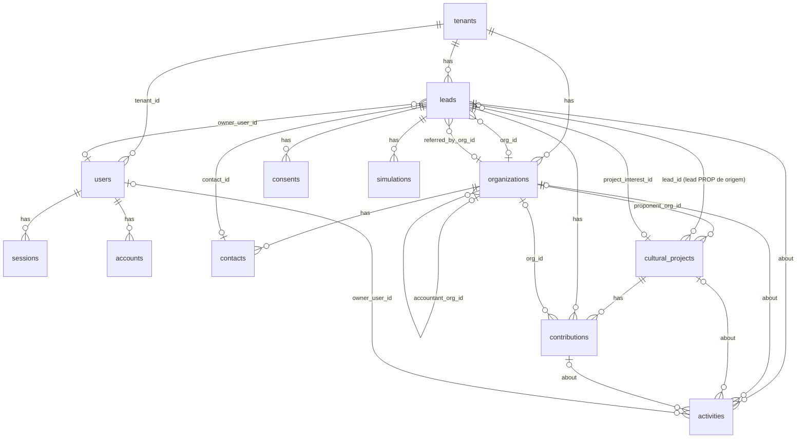

# Modelo de dados da Fase 1

> Deriva de `ADR-001-stack.md` (Drizzle ORM sobre PostgreSQL, Neon em produção e PGlite em desenvolvimento e testes). Estágios de pipeline, campos de lead e enums vêm de `docs/estrategia/personas-e-funis.md` (seções 2, 5, 8 e 9); formulários e seus destinos de `docs/site/estrutura-e-copy.md` (seção 5) e `docs/site/simulador-spec.md` (seções 3, 5 e 6); mecanismos de incentivo e regras de comissão de `docs/dominio/parametros-simulador.json` e `docs/dominio/leis-de-incentivo.md` (seção 2.8). O que não está nesses documentos nem foi verificado recebe [verificar].

## 1. Convenções

| Regra | Valor |
|---|---|
| Nomes de tabela | Plural, `snake_case`, em inglês (`leads`, `cultural_projects`) |
| Nomes de coluna | `snake_case` em inglês no banco; `camelCase` no schema Drizzle (`stageEnteredAt` para `stage_entered_at`) |
| Identificadores de negócio | `uuid`, gerado pelo banco (`gen_random_uuid()`), nunca inteiro sequencial |
| Identificadores de autenticação | `text`, gerados pelo Better Auth (tabelas `users`, `sessions`, `accounts`, `verifications`) |
| Identificador de tenant | `text`, igual ao slug (`prospekto`); imutável; é o que todas as colunas `tenant_id` referenciam (o campo `tenant_id` gerado pelo Better Auth em `users` é `text`, e assim o tipo coincide sem FK gerada) |
| Datas e horas | `timestamptz`; datas de calendário (prazo de captação) em `date` |
| Dinheiro | `numeric(14,2)` em reais, `mode: "number"` no Drizzle; somas e saldos calculados no banco, nunca em JavaScript |
| Variação por segmento | `jsonb` em `leads.attributes`, validado por um schema Zod por segmento (`src/lib/validation/`) |
| Enums estáveis (segmento, origem, tipo de atividade, regime, mecanismo, status de aporte, tipo de aporte, finalidade de consentimento, tipo de organização, temperatura, papel) | `pgEnum` do Postgres; acrescentar valor é `ALTER TYPE ... ADD VALUE`, que o `drizzle-kit generate` emite |
| Estágios de pipeline | `text` com `CHECK` gerado a partir das constantes de `src/lib/domain/pipelines.ts`; a validade do par (pipeline, estágio) é regra de domínio. Motivo: cada pipeline tem seu conjunto e a Fase 2 promove isso a tabela por tenant sem `ALTER TYPE` |
| Multi-tenant | `tenant_id text NOT NULL REFERENCES tenants(id)` com índice em toda tabela de negócio; chaves únicas sempre compostas com `tenant_id`; toda função de `src/lib/repos/` recebe `ctx: { tenantId, userId }` e filtra; `form_attempts` é a única tabela de negócio sem `tenant_id`, de propósito |
| Auditoria | Mudanças de estágio, de dono e de score geram uma `activities` do tipo `sistema` com `data` (`{ from, to, reason }`); tabela `audit_log` fica para a Fase 2 |
| Exclusão | Nunca `DELETE` em `leads`, `consents`, `contributions`, `cultural_projects`; `activities` e `form_attempts` podem ser apagadas pelo cron |

## 2. Diagrama

`form_attempts` não aparece: não se relaciona com nada.

## 3. Entidades

Coluna "Obrig." = `NOT NULL`. Toda tabela de negócio tem `id`, `tenant_id`, `created_at` e, quando é editável, `updated_at`; esses quatro aparecem uma vez em `leads` e ficam implícitos nas demais.

### 3.1 `tenants`

| Campo | Tipo | Obrig. | Descrição |
|---|---|---|---|
| `id` | text PK | sim | Slug imutável (`prospekto`) |
| `name` | text | sim | Nome exibido ("Prospekto Consultoria & Projetos") |
| `settings` | jsonb | sim, padrão `{}` | Vazio na Fase 1; recebe o conteúdo de `src/config/site.ts` quando houver segundo tenant |
| `created_at` | timestamptz | sim | |

### 3.2 `users`, `sessions`, `accounts`, `verifications`

Geradas por `npx auth@1.7.7 generate` com `usePlural: true`; não editar à mão. Campos adicionais declarados em `src/lib/auth.ts` (`user.additionalFields`):

| Campo | Tipo | Obrig. | Descrição |
|---|---|---|---|
| `users.tenant_id` | text | sim | Tenant do usuário; `input: false` (nunca vem do cliente). Sem FK gerada; o seed garante a consistência |
| `users.role` | text | sim, padrão `operator` | `owner` (Daniela) ou `operator` (sócio); `input: false` |

### 3.3 `organizations`

Empresa patrocinadora, escritório contábil, município ou proponente. É o `account` de `personas-e-funis.md`, seção 9.4.

| Campo | Tipo | Obrig. | Descrição |
|---|---|---|---|
| `type` | enum `organization_type` | sim | `empresa`, `contabilidade`, `municipio`, `proponente`, `outro` |
| `name` | text | sim | Razão social ou nome do órgão |
| `trade_name` | text | não | Nome fantasia |
| `cnpj` | text (14 dígitos) | não | Validado com dígitos verificadores no Zod; obrigatório só quando um aporte entra em `termo_assinado` |
| `city`, `uf` | text, text(2) | não | UF validada contra as 27 siglas no Zod |
| `sector` | text | não | Setor de atuação |
| `tax_regime` | enum `tax_regime` | não | Ver seção 4.5 |
| `tax_regime_confirmed_by` | enum `regime_confirmation` | não | `contador`, `ecf`, `declarado` |
| `estimated_irpj` | numeric(14,2) | não | IRPJ devido estimado (base de 15%, sem adicional); alimenta o potencial de 4% |
| `icms_contributor_rs` | boolean | não | Habilita LIC-RS quando o regime não é lucro real |
| `accountant_org_id` | uuid FK `organizations` | não | Escritório contábil que atende esta organização |
| `owner_user_id` | text FK `users` | não | Quem cuida da conta |
| `notes` | text | não | |

### 3.4 `contacts`

Pessoa dentro de uma organização (decisor, contador, secretário). Dado pessoal: a origem é obrigatória para atender pedidos de acesso (LGPD, art. 18).

| Campo | Tipo | Obrig. | Descrição |
|---|---|---|---|
| `org_id` | uuid FK `organizations` | sim | |
| `name` | text | sim | |
| `title` | text | não | Cargo |
| `email` | text | não | Minúsculas |
| `phone` | text | não | E.164 (`+55DDDNNNNNNNNN`) |
| `linkedin_url` | text | não | |
| `is_decision_maker` | boolean | sim, padrão `false` | |
| `source_detail` | text | sim | De onde veio o dado (ex.: `linkedin:busca`, `formulario:diagnostico`) |

### 3.5 `leads`

Uma pessoa interessada, em um segmento, dentro de um pipeline. É a entidade central do CRM.

| Campo | Tipo | Obrig. | Descrição |
|---|---|---|---|
| `id` | uuid PK | sim | |
| `tenant_id` | text FK `tenants` | sim | |
| `segment` | enum `lead_segment` | sim | `PJ`, `PF`, `CONT`, `MUN`, `PROP`, `ALUNO` |
| `pipeline` | text (CHECK) | sim | `patrocinadores`, `contadores`, `municipios`, `projetos`, `alunos`; derivado do segmento na criação (`personas-e-funis.md`, seção 2) |
| `stage` | text (CHECK) | sim | Estágio atual, do conjunto do pipeline (seção 4.2) |
| `stage_entered_at` | timestamptz | sim | Base do SLA |
| `interest` | enum `lead_interest` | sim | `rouanet`, `audiovisual`, `lic_rs`, `lic_municipal`, `pnab_editais`, `consultoria`, `mentoria`, `nao_sei` |
| `name` | text | sim | 2 a 120 caracteres |
| `email` | text | sim | Minúsculas; único por tenant e segmento |
| `phone` | text | não | E.164; obrigatório quando o lead marca WhatsApp como canal |
| `city`, `uf` | text, text(2) | não | Obrigatórios no site, opcionais em importação |
| `message` | text | não | Até 2.000 caracteres |
| `source` | enum `lead_source` | sim | Origem (seção 4.4) |
| `source_detail` | text | não | Página, campanha, nome do evento, `webinar:[data]` |
| `utm_source`, `utm_medium`, `utm_campaign` | text | não | Capturados no formulário |
| `referrer`, `landing_path` | text | não | |
| `score` | integer | sim, padrão 0 | 0 a 100 (`personas-e-funis.md`, seção 5.2) |
| `temperature` | enum `lead_temperature` | sim, padrão `frio` | `frio` (< 40), `morno` (40 a 69), `quente` (70 ou mais); derivada do score |
| `owner_user_id` | text FK `users` | não | Obrigatório ao sair de `novo` (regra R-3) |
| `org_id` | uuid FK `organizations` | não | Empresa, escritório, município ou proponente do lead |
| `contact_id` | uuid FK `contacts` | não | Pessoa correspondente dentro da organização |
| `referred_by_org_id` | uuid FK `organizations` | não | Escritório contábil que indicou (`source = indicacao_contador`); substitui `partner_referrals` |
| `project_id` | uuid FK `cultural_projects` | não | Só `PROP`: o projeto criado a partir deste lead |
| `project_interest_id` | uuid FK `cultural_projects` | não | `PJ` e `PF`: projeto pelo qual o lead chegou ("Quero patrocinar este projeto") |
| `next_action_at` | timestamptz | não | Obrigatório ao sair de `novo`; base do painel "vencidos" |
| `last_contact_at` | timestamptz | não | |
| `lost_reason` | enum `lost_reason` | não | Obrigatório em `perdido` (regra R-4) |
| `lost_reason_detail` | text | não | Texto livre quando `outro` |
| `tags` | text[] | sim, padrão `{}` | `desqualificado_rouanet`, `fora_do_icp`, `sem_projeto`, `perfil_outro`, `triagem`, `avisar_projetos`, `contador_na_reuniao`, `projeto:[slug]` e outras do playbook |
| `attributes` | jsonb | sim, padrão `{}` | Campos por segmento da seção 9.3 de `personas-e-funis.md` (ex.: `regime_tributario`, `irpj_faixa`, `apuracao`, `cargo`, `empresa`, `modelo_declaracao`, `ir_devido_faixa`, `clientes_lucro_real_faixa`, `municipio`, `orgao`, `necessidade`, `projeto_nome`, `status_projeto`, `objetivo`, `experiencia`); chaves em `snake_case` exatamente como no documento; um schema Zod por segmento |
| `email_status` | enum `email_status` | sim, padrão `ok` | `ok`, `bounced`, `complained`; atualizado por webhook do Resend |
| `guide_version` | text | não | Data da edição do guia entregue (`estrutura-e-copy.md`, seção 10.3) |
| `created_at`, `updated_at` | timestamptz | sim | |

### 3.6 `consents`

Registro de consentimento, append-only. Base legal: Lei 13.709/2018, art. 5º, XII, art. 7º, I, art. 8º, §§ 1º e 4º (via `personas-e-funis.md`, seção 9.1, e `estrutura-e-copy.md`, seção 5.1).

| Campo | Tipo | Obrig. | Descrição |
|---|---|---|---|
| `lead_id` | uuid FK `leads` | sim | |
| `contact_id` | uuid FK `contacts` | não | Quando o consentimento é de uma pessoa de organização |
| `purpose` | enum `consent_purpose` | sim | `contato_comercial` (caixa 1), `marketing` (caixa 2) |
| `granted` | boolean | sim | `false` registra revogação |
| `policy_version` | text | sim | Versão da política de privacidade exibida (ex.: `2026-10-03`) |
| `consent_text` | text | sim | Texto integral da caixa marcada, como exibido naquele momento |
| `channels` | text[] | sim, padrão `{}` | `email`, `whatsapp`, `telefone` |
| `source_page` | text | sim | Caminho da página ou `crm` ou `importacao` |
| `ip_hash` | text | não | SHA-256 do IP com sal; só se o advogado confirmar a necessidade [verificar] |
| `user_agent` | text | não | |
| `created_at` | timestamptz | sim | Data e hora do consentimento ou da revogação |

### 3.7 `simulations`

Uma execução do simulador (`docs/site/simulador-spec.md`, seção 5.3).

| Campo | Tipo | Obrig. | Descrição |
|---|---|---|---|
| `lead_id` | uuid FK `leads` | não | Nulo até o visitante passar pelo gate |
| `kind` | enum `taxpayer_kind` | sim | `pj`, `pf` |
| `inputs` | jsonb | sim | `SimulatorInput` validado por Zod (valores exatos ficam só aqui) |
| `outputs` | jsonb | sim | `SimulatorResult` |
| `parameters_version` | text | sim | Campo `atualizado_em` de `parametros-simulador.json` |
| `apply_lc224` | boolean | sim | Interruptor da LC 224/2025 no momento do cálculo |
| `result_token_hash` | text | não | SHA-256 do token do link `/simulador/resultado/[token]` (30 dias) |
| `ip_hash` | text | não | Para o limite por IP [verificar] |
| `created_at` | timestamptz | sim | |

### 3.8 `cultural_projects`

Projeto cultural em carteira ou em avaliação. O pipeline `projetos` acompanha o projeto, não o lead (`personas-e-funis.md`, seção 8.4).

| Campo | Tipo | Obrig. | Descrição |
|---|---|---|---|
| `proponent_org_id` | uuid FK `organizations` | sim | Proponente (`type = proponente`) |
| `lead_id` | uuid FK `leads` | não | Lead `PROP` que originou o projeto |
| `name` | text | sim | |
| `slug` | text | sim | Único por tenant; usado em `/projetos/[slug]` |
| `mechanism` | enum `incentive_mechanism` | sim | Seção 4.6 |
| `process_number` | text | não | Pronac, número Ancine ou Pró-Cultura; obrigatório em `autorizado` |
| `stage` | text (CHECK) | sim | Estágio do pipeline `projetos` |
| `stage_entered_at` | timestamptz | sim | |
| `approved_amount` | numeric(14,2) | não | Valor aprovado na portaria ou CHP; obrigatório em `autorizado` |
| `raised_amount` | numeric(14,2) | sim, padrão 0 | Soma de `contributions.deposited_amount` com status `depositado` ou `recibo_emitido`; recalculada pela Server Action a cada confirmação de depósito (regra R-6) |
| `fundraising_deadline` | date | não | Prazo de captação; obrigatório em `autorizado` |
| `fundraising_fee_amount` | numeric(14,2) | não | Rubrica de captação aprovada no projeto (`rubrica_captacao_valor`); obrigatório em `autorizado` |
| `commission_pct` | numeric(5,2) | não | Percentual contratado com o proponente; no Rouanet, no máximo 10 |
| `city`, `uf` | text, text(2) | não | |
| `cultural_segment` | text | não | Segmento do art. 18 ou outro |
| `summary` | text | não | Texto público |
| `counterparts` | text | não | Contrapartidas oferecidas |
| `deck_url`, `salic_url` | text | não | Links externos (sem upload na Fase 1) |
| `published_on_site` | boolean | sim, padrão `false` | Aparece em `/projetos` quando `true` e `stage = captando` |
| `publish_authorized_by`, `publish_authorized_at` | text, timestamptz | não | Autorização por escrito do proponente (`estrutura-e-copy.md`, seção 10.5); obrigatórios quando `published_on_site = true` |
| `report_due_at` | date | não | `data_limite_relatorio`; obrigatório em `prestacao_contas` |
| `owner_user_id` | text FK `users` | não | |

`saldo_a_captar` não é coluna: é `approved_amount - raised_amount` na consulta (regra R-5).

### 3.9 `contributions`

Oportunidade e aporte na mesma linha (decisão da Proposta C): nasce em `proposta` quando o lead entra no estágio `proposta` com projeto e valor, e avança até `recibo_emitido`.

| Campo | Tipo | Obrig. | Descrição |
|---|---|---|---|
| `project_id` | uuid FK `cultural_projects` | sim | |
| `lead_id` | uuid FK `leads` | sim | Patrocinador (PJ ou PF) |
| `org_id` | uuid FK `organizations` | não | Empresa patrocinadora; obrigatório para PJ em `termo_assinado` |
| `type` | enum `contribution_type` | sim | `patrocinio`, `doacao` |
| `mechanism` | enum `incentive_mechanism` | sim | Mecanismo do aporte (pode diferir do projeto só entre art. 18 e art. 26 do mesmo projeto, regra R-9) |
| `status` | enum `contribution_status` | sim | `proposta`, `termo_assinado`, `depositado`, `recibo_emitido`, `cancelado` |
| `proposed_amount` | numeric(14,2) | sim | `valor_proposto` |
| `expected_close_at` | date | não | |
| `term_signed_at` | date | não | Data da assinatura do termo; obrigatório em `termo_assinado` e para o lead entrar em `aporte` (seção 4.2) |
| `bank_details_sent_at` | date | não | Data em que os dados da conta vinculada do projeto foram enviados ao patrocinador; obrigatório para o lead entrar em `aporte` (seção 4.2) |
| `deposited_amount` | numeric(14,2) | não | Obrigatório em `depositado` |
| `deposited_at` | date | não | Obrigatório em `depositado` |
| `receipt_number` | text | não | Número do recibo de mecenato (SALIC, Ancine ou CHP); obrigatório em `recibo_emitido` |
| `receipt_issued_at` | date | não | Obrigatório em `recibo_emitido` |
| `receipt_sent_to_accountant_at` | date | não | `data_envio_contador` |
| `commission_due` | numeric(14,2) | não | Comissão devida pelo proponente sobre este aporte |
| `commission_paid_at` | date | não | Só aceita valor com `deposited_at` preenchido (regra R-8) |
| `counterparts_delivered` | boolean | sim, padrão `false` | |
| `lost_reason` | enum `lost_reason` | não | Obrigatório em `cancelado` |
| `notes` | text | não | |

### 3.10 `activities`

Interações, tarefas e eventos de sistema. `tarefa` com `due_at` e `done_at` nulo aparece em "Hoje".

| Campo | Tipo | Obrig. | Descrição |
|---|---|---|---|
| `type` | enum `activity_type` | sim | Seção 4.7 |
| `subject` | text | sim | Resumo em uma linha |
| `body` | text | não | |
| `data` | jsonb | não | Payload estruturado (`{ from, to, reason }` em mudanças de estágio, dono e score; `{ asset, version }` em `download`) |
| `occurred_at` | timestamptz | sim | |
| `due_at`, `done_at` | timestamptz | não | Só `tarefa` |
| `lead_id` | uuid FK `leads` | não | Pelo menos um entre `lead_id`, `org_id`, `project_id`, `contribution_id` (CHECK) |
| `org_id` | uuid FK `organizations` | não | |
| `contact_id` | uuid FK `contacts` | não | |
| `project_id` | uuid FK `cultural_projects` | não | |
| `contribution_id` | uuid FK `contributions` | não | |
| `owner_user_id` | text FK `users` | não | Responsável pela tarefa |
| `created_by_user_id` | text FK `users` | não | Nulo quando criada pelo sistema |

### 3.11 `form_attempts`

Limite de 5 envios por IP por hora (`estrutura-e-copy.md`, seção 5.1), sem serviço externo. Sem `tenant_id`. A troca de senha em "Minha conta" (`src/actions/account.ts`) reutiliza a tabela com a chave `senha:<user_id>` no lugar do IP: 5 tentativas por pessoa por hora.

| Campo | Tipo | Obrig. | Descrição |
|---|---|---|---|
| `id` | uuid PK | sim | |
| `ip_hash` | text | sim | SHA-256 do IP com sal (`FORM_SECRET`) |
| `window_start` | timestamptz | sim | Início da janela de uma hora |
| `count` | integer | sim | Envios na janela |

Limpa pelo cron diário (`window_start < now() - interval '1 day'`).

## 4. Enums

Valores literais; o código os declara como `as const` em `src/lib/domain/enums.ts` e o schema Drizzle os reexporta em `pgEnum`.

### 4.1 Segmento, pipeline e temperatura

| Enum | Valores | Fonte |
|---|---|---|
| `lead_segment` | `PJ`, `PF`, `CONT`, `MUN`, `PROP`, `ALUNO` | `personas-e-funis.md`, seção 2 |
| `pipeline` (text + CHECK) | `patrocinadores`, `contadores`, `municipios`, `projetos`, `alunos` | seção 2 |
| Segmento para pipeline | `PJ` e `PF` em `patrocinadores`; `CONT` em `contadores`; `MUN` em `municipios`; `PROP` em `projetos`; `ALUNO` em `alunos` | seção 2 |
| `lead_temperature` | `frio`, `morno`, `quente` | seção 2 |

### 4.2 Estágios por pipeline (text + CHECK)

Exatamente como nomeados em `personas-e-funis.md`, seção 8. O SLA em dias úteis fica em `src/lib/domain/pipelines.ts`, não no banco.

| Pipeline | Estágios, na ordem | Terminais |
|---|---|---|
| `patrocinadores` | `novo`, `qualificado`, `diagnostico`, `proposta`, `termo`, `aporte`, `recibo`, `renovacao`, `perdido` | `perdido` |
| `contadores` | `novo`, `contato`, `apresentacao`, `parceria`, `ativo`, `inativo`, `perdido` | `perdido` |
| `municipios` | `novo`, `contato`, `diagnostico`, `proposta`, `contrato`, `execucao`, `encerrado`, `perdido` | `perdido` |
| `projetos` (em `cultural_projects.stage` e, antes de existir o projeto, em `leads.stage` do lead `PROP`) | `prospeccao`, `avaliacao`, `elaboracao`, `inscrito`, `autorizado`, `captando`, `execucao`, `prestacao_contas`, `encerrado`, `arquivado` | `arquivado` |
| `alunos` | `lista_espera`, `pesquisado`, `inscrito`, `aluno`, `alumni`, `perdido` | `perdido` |

Campos obrigatórios por estágio (validados em `moveLeadStage`, lendo `pipelines.ts`). A coluna "Momento" diz se o campo é exigido para **entrar** no estágio ou para **sair** dele; `moveLeadStage(leadId, to)` valida, na mesma chamada, os campos de saída do estágio atual e os campos de entrada do estágio de destino. Em `patrocinadores`, os campos vêm da `contributions` aberta do lead (a mais recente com `status <> 'cancelado'`); os critérios de entrada e saída seguem `personas-e-funis.md`, seção 8.1.

| Pipeline, estágio | Momento | Campos exigidos |
|---|---|---|
| `patrocinadores`, `proposta` | entrar | uma `contributions` em `proposta` com `project_id` e `proposed_amount` |
| `patrocinadores`, `termo` | entrar | `contributions.type` e `contributions.mechanism`; `organizations.cnpj` quando PJ; `attributes.vinculo_art27_checado = true` (regra R-10) |
| `patrocinadores`, `termo` | sair (entrar em `aporte`) | `contributions.term_signed_at` e `bank_details_sent_at`; `contributions.status` passa a `termo_assinado` |
| `patrocinadores`, `aporte` | sair (entrar em `recibo`) | `contributions.deposited_at` e `deposited_amount > 0`; `contributions.status` passa a `depositado` (regra R-6) |
| `patrocinadores`, `recibo` | sair (entrar em `renovacao`) | `contributions.receipt_number`, `receipt_issued_at` e `receipt_sent_to_accountant_at`; `contributions.status` passa a `recibo_emitido` (regra R-7) |
| `patrocinadores`, `renovacao` | sair (voltar a `proposta`) | nova `contributions` em `proposta` com `project_id` e `proposed_amount`; a anterior permanece em `recibo_emitido` |
| `projetos`, `autorizado` | entrar | `mechanism`, `process_number`, `approved_amount`, `fundraising_deadline`, `fundraising_fee_amount` |
| `projetos`, `captando` | entrar | `approved_amount - raised_amount > 0` |
| `projetos`, `prestacao_contas` | entrar | `report_due_at` |
| qualquer, `perdido` ou `arquivado` ou `cancelado` | entrar | `lost_reason` |
| qualquer, `novo` (ou `lista_espera`, `prospeccao`) | sair | `owner_user_id` e `next_action_at` |

Entrar em `aporte`, portanto, não exige depósito: o lead entra com o termo assinado e os dados da conta enviados e só sai quando o depósito é confirmado. `personas-e-funis.md`, seção 8.1, lista `data_deposito` e `valor_depositado` "em `aporte`" e `numero_recibo` e `data_envio_contador` "em `recibo`"; aqui esses campos são lidos como condição de saída desses estágios, o que é o único sentido compatível com a tabela de entrada e saída da mesma seção.

Mapeamento de nomes: `personas-e-funis.md` cita `mecanismo` em `termo` com os valores `rouanet_18`, `rouanet_26`, `audiovisual_1a`, `lic_rs`, `lic_municipal`; no banco esses valores são, respectivamente, `rouanet_art18`, `rouanet_art26_patrocinio` ou `rouanet_art26_doacao` (conforme `type`), `audiovisual_art1A`, `lic_rs`, `lic_municipal` (seção 4.6). O formulário faz a tradução; o banco só conhece os nomes do JSON.

### 4.3 Motivos de perda

`lost_reason`: `sem_irpj`, `regime_inelegivel`, `sem_decisor`, `sem_interesse`, `prazo_perdido`, `escolheu_outro_captador`, `escolheu_outro_incentivo`, `vinculo_art27`, `vantagem_indevida`, `sem_resposta`, `outro` (`personas-e-funis.md`, seção 8.1). O mesmo enum serve a todos os pipelines e a `contributions.cancelado`; `outro` exige `lost_reason_detail`.

### 4.4 Origem do lead

`lead_source`: `site`, `guia`, `simulador`, `diagnostico`, `linkedin`, `indicacao_contador`, `indicacao_cliente`, `evento`, `campanha`, `whatsapp`, `outro` (`personas-e-funis.md`, seção 2). Importação por CSV usa `linkedin`, `evento` ou `outro` com `source_detail = importacao:[arquivo]`.

### 4.5 Regime tributário e confirmação

`tax_regime`: `lucro_real`, `lucro_presumido`, `lucro_arbitrado`, `simples_nacional`, `nao_sei`. Segue `parametros-simulador.json` (`pj_regimes_elegiveis` e `pj_regimes_nao_elegiveis`) e `simulador-spec.md`, seção 3.2. O valor `simples` dos formulários de `personas-e-funis.md`, seção 9.3, e de `estrutura-e-copy.md`, seção 5.4, é normalizado para `simples_nacional` pelo Zod; só `lucro_real` é elegível à cesta cultural.

`regime_confirmation`: `contador`, `ecf`, `declarado`.

### 4.6 Mecanismo de incentivo

`incentive_mechanism`, com as chaves de `parametros-simulador.json` (`mecanismos`) mais quatro valores de fomento direto que só aparecem em `cultural_projects.mechanism` e não no simulador:

| Valor | Origem | Uso |
|---|---|---|
| `rouanet_art18` | JSON | projetos e aportes |
| `rouanet_art26_patrocinio` | JSON | aportes (`type = patrocinio`) |
| `rouanet_art26_doacao` | JSON | aportes (`type = doacao`) |
| `audiovisual_art1` | JSON | aportes (investimento em cotas) |
| `audiovisual_art1A` | JSON | projetos e aportes |
| `audiovisual_art3`, `audiovisual_art3A` | JSON | referência; não é produto da Prospekto |
| `funcines` | JSON (status `verificar`) | referência |
| `lic_rs` | JSON (status `verificar`) | projetos e aportes |
| `esporte`, `fia`, `idoso`, `pronon`, `pronas` | JSON | comparação no simulador; não são projetos da Prospekto |
| `lic_municipal` | `personas-e-funis.md`, seção 8.1; `leis-de-incentivo.md`, seção 6.3 | projetos e aportes (ex.: LIC Caxias do Sul) |
| `fsa_brde` | `leis-de-incentivo.md`, seção 4 | projetos (fomento direto; sem aporte de incentivador) |
| `pnab` | `leis-de-incentivo.md`, seção 5 | projetos (fomento direto) |
| `edital` | `personas-e-funis.md`, seção 8.4 | projetos (editais FAC-RS, Financiarte e outros) |

Para um projeto Rouanet, `cultural_projects.mechanism` guarda o artigo de enquadramento (`rouanet_art18` ou `rouanet_art26_patrocinio`); o aporte individual pode ser `rouanet_art26_doacao` quando o patrocinador opta por doação no mesmo projeto (regra R-9).

### 4.7 Tipos de atividade, aporte, consentimento, organização e outros

| Enum | Valores | Fonte |
|---|---|---|
| `activity_type` | `ligacao`, `reuniao`, `email`, `whatsapp`, `visita`, `nota`, `tarefa`, `formulario`, `download`, `sistema` | `personas-e-funis.md`, seção 9.4, mais os três últimos de `estrutura-e-copy.md`, seções 5.1 e 10.3, e desta modelagem |
| `contribution_type` | `patrocinio`, `doacao` | seção 9.4 |
| `contribution_status` | `proposta`, `termo_assinado`, `depositado`, `recibo_emitido`, `cancelado` | espelha os estágios `proposta`, `termo`, `aporte`, `recibo` do pipeline `patrocinadores` |
| `consent_purpose` | `contato_comercial`, `marketing` | `estrutura-e-copy.md`, seção 5.1 (caixas 1 e 2) |
| `organization_type` | `empresa`, `contabilidade`, `municipio`, `proponente`, `outro` | seção 9.4 |
| `lead_interest` | `rouanet`, `audiovisual`, `lic_rs`, `lic_municipal`, `pnab_editais`, `consultoria`, `mentoria`, `nao_sei` | seção 9.2 |
| `taxpayer_kind` | `pj`, `pf` | `simulador-spec.md`, seção 3.1 |
| `email_status` | `ok`, `bounced`, `complained` | `estrutura-e-copy.md`, seção 10.2 |
| `user_role` (campo `users.role`, text) | `owner`, `operator` | ADR-001 |

## 5. Índices e restrições

| Tabela | Índice ou restrição | Finalidade |
|---|---|---|
| `leads` | UNIQUE `(tenant_id, email, segment)` | Deduplicação do formulário (`estrutura-e-copy.md`, seção 5.1) |
| `leads` | INDEX `(tenant_id, pipeline, stage)` | Lista por aba e estágio |
| `leads` | INDEX `(tenant_id, next_action_at)` WHERE `next_action_at IS NOT NULL` | Painel "Hoje" e e-mail diário |
| `leads` | INDEX `(tenant_id, owner_user_id)` | Minha carteira |
| `leads` | INDEX `(tenant_id, created_at DESC)` | Leads novos; relatório semanal |
| `leads` | CHECK `pipeline IN (...)` e CHECK `(pipeline, stage)` em pares válidos | Gerado de `pipelines.ts` |
| `leads` | CHECK `stage <> 'perdido' OR lost_reason IS NOT NULL` | Regra R-4 |
| `organizations` | UNIQUE `(tenant_id, cnpj)` WHERE `cnpj IS NOT NULL` | Uma organização por CNPJ |
| `organizations` | INDEX `(tenant_id, type)` | |
| `contacts` | INDEX `(tenant_id, org_id)`; INDEX `(tenant_id, email)` | |
| `consents` | INDEX `(tenant_id, lead_id, purpose, created_at DESC)` | Último estado por finalidade |
| `simulations` | INDEX `(tenant_id, lead_id)`; UNIQUE `(result_token_hash)` WHERE não nulo | Link do resultado |
| `cultural_projects` | UNIQUE `(tenant_id, slug)`; INDEX `(tenant_id, stage)`; INDEX `(tenant_id, published_on_site)` WHERE `published_on_site`; INDEX `(tenant_id, fundraising_deadline)` | Carteira pública e alertas de prazo |
| `cultural_projects` | CHECK `commission_pct IS NULL OR (commission_pct >= 0 AND commission_pct <= 100)`; CHECK `raised_amount >= 0` | |
| `contributions` | INDEX `(tenant_id, project_id, status)`; INDEX `(tenant_id, lead_id)`; INDEX `(tenant_id, expected_close_at)` | Aportes previstos nos próximos 15 dias |
| `contributions` | UNIQUE `(tenant_id, project_id, receipt_number)` WHERE `receipt_number IS NOT NULL` | Um recibo por aporte (regra R-7) |
| `contributions` | CHECK `commission_paid_at IS NULL OR deposited_at IS NOT NULL` | Regra R-8 |
| `contributions` | CHECK `status <> 'termo_assinado' OR term_signed_at IS NOT NULL`; CHECK `status <> 'depositado' OR (deposited_at IS NOT NULL AND deposited_amount > 0)`; CHECK `status <> 'recibo_emitido' OR (receipt_number IS NOT NULL AND receipt_issued_at IS NOT NULL)` | Estados consistentes |
| `activities` | INDEX `(tenant_id, lead_id, occurred_at DESC)`; INDEX `(tenant_id, due_at)` WHERE `done_at IS NULL AND type = 'tarefa'`; CHECK `num_nonnulls(lead_id, org_id, project_id, contribution_id) >= 1` | Linha do tempo; tarefas vencidas |
| `form_attempts` | UNIQUE `(ip_hash, window_start)` | Upsert por janela |
| todas as tabelas de negócio | INDEX em `tenant_id` quando não for o primeiro campo de outro índice | Isolamento e Fase 2 |

## 6. Regras de negócio

| ID | Regra | Onde é aplicada | Fonte |
|---|---|---|---|
| R-1 | Todo lead criado por formulário recebe, na mesma transação: a linha em `leads` (ou atualização da existente), uma `consents` por caixa marcada (`contato_comercial` obrigatória; `marketing` só quando marcada) com `policy_version`, `consent_text`, `channels` e data, e uma `activities` do tipo `formulario` com os dados enviados em `data` | Server Action `createLead` | `estrutura-e-copy.md`, seção 5.1 |
| R-2 | Reenvio do mesmo `email` e `segment` dentro de 10 minutos responde sucesso sem gravar; depois disso atualiza o lead, acrescenta `activities.formulario` e nunca rebaixa `stage` | `createLead` | `estrutura-e-copy.md`, seção 5.1; Proposta C |
| R-3 | Sair de `novo` (ou `lista_espera`, `prospeccao`) exige `owner_user_id` e `next_action_at`; cada mudança de estágio grava `stage_entered_at = now()` e uma `activities.sistema` com `{ from, to }` | `moveLeadStage` | `personas-e-funis.md`, seções 8 e 9.2 |
| R-4 | `perdido`, `arquivado` e `cancelado` exigem `lost_reason`; `outro` exige `lost_reason_detail`; nenhum lead vai para `perdido` automaticamente (desqualificação é tag) | `moveLeadStage`, CHECK | seção 8.1; `simulador-spec.md`, seção 6 |
| R-5 | Saldo a captar = `approved_amount - raised_amount`, calculado na consulta; nunca armazenado | `src/lib/repos/projects.ts` | `personas-e-funis.md`, seção 8.4 |
| R-6 | `raised_amount` é recalculado no banco (`sum(deposited_amount)` dos aportes em `depositado` ou `recibo_emitido`) sempre que um aporte muda de status; o cancelamento de um aporte depositado exige nota e recalcula | `confirmDeposit`, `cancelContribution` | modelagem |
| R-7 | Um aporte gera exatamente um recibo: `receipt_number` único por projeto; `recibo_emitido` exige número e data; o envio ao contador (`receipt_sent_to_accountant_at`) é a saída do estágio `recibo`, validada em `moveLeadStage` ao mover o lead para `renovacao` (seção 4.2) | `issueReceipt`, `moveLeadStage`, UNIQUE parcial | seção 8.1 |
| R-8 | Comissão de captação só pode ser marcada paga com `deposited_at` preenchido; `commission_due` de um aporte não pode exceder 10% de `deposited_amount` nem, somada à dos demais aportes do projeto, exceder `fundraising_fee_amount`; aviso quando a soma por projeto passar de R$ 150.000,00 (por ano, em planos plurianuais) | Zod em `recordCommission`, CHECK para a data | IN MinC 29/2026, art. 19, caput e §§ 1º e 2º (https://www.gov.br/cultura/pt-br/acesso-a-informacao/legislacao-e-normativas/instrucao-normativa-minc-no-29-de-29-de-janeiro-de-2026), via `leis-de-incentivo.md`, seção 2.8, e `parametros-simulador.json` (`captacao.rouanet`); para LIC-RS o limite é [verificar] |
| R-9 | `contributions.mechanism` deve ser compatível com `cultural_projects.mechanism`: projeto `rouanet_art18` aceita aportes `rouanet_art18`; projeto `rouanet_art26_patrocinio` aceita `rouanet_art26_patrocinio` ou `rouanet_art26_doacao` conforme `type`; `audiovisual_art1A` só `audiovisual_art1A`; `lic_rs` só `lic_rs`; projetos de fomento direto (`fsa_brde`, `pnab`, `edital`) não aceitam aportes | Zod em `createContribution` | `leis-de-incentivo.md`, seções 2.2 e 3.1 |
| R-10 | Vínculo entre patrocinador e proponente (Lei 8.313/1991, art. 27) é checado antes de `termo`: a Server Action exige o campo `attributes.vinculo_art27_checado = true` com data e quem checou; não há verificação automática | `moveLeadStage` | `leis-de-incentivo.md`, seção 2.9; `personas-e-funis.md`, seção 8.4 |
| R-11 | Projeto só é publicado em `/projetos` com `stage = captando`, `published_on_site = true`, `publish_authorized_by` e `publish_authorized_at` preenchidos | `publishProject`, consulta pública | `estrutura-e-copy.md`, seção 10.5 |
| R-12 | Score (0 a 100) é recalculado a cada alteração de campo relevante; `temperature` deriva do score; cada mudança gera `activities.sistema` com `{ from, to, reason: "score" }`, que é o `score_history` | `src/lib/domain/scoring.ts` | `personas-e-funis.md`, seções 5.2 e 5.3 |
| R-13 | Alertas diários: `next_action_at` vencido; `activities.tarefa` com `due_at` vencido; projetos em `captando` a menos de 6 meses de `fundraising_deadline` ou com `raised_amount < 10%` de `approved_amount`; aportes com `expected_close_at` nos próximos 15 dias | `/api/cron/daily` e tela "Hoje" | `personas-e-funis.md`, seção 8.4; Proposta C, seção 9 |
| R-14 | Consentimento é append-only: revogar é inserir `granted = false`; o estado vigente é a linha mais recente por `(lead_id, purpose)`; webhook de descadastro do Resend insere revogação de `marketing` | `src/lib/repos/consents.ts` | LGPD, art. 8º, § 5º, e art. 18, IX |
| R-15 | Nenhuma consulta a `db` fora de `src/lib/repos/`, `src/lib/auth.ts`, `scripts/` e `tests/`; toda função de repositório recebe `ctx` e filtra por `tenant_id`; o teste `tests/isolation.test.ts` cria dois tenants e exige que nenhuma função devolva dado do outro | Regra de lint `no-restricted-imports` e teste | ADR-001, seção 4 |
| R-16 | Logs nunca contêm e-mail, telefone, CPF ou CNPJ; só ids | `src/lib/log.ts` | LGPD, art. 6º, VII |
| R-17 | Retenção: leads sem contrato, 24 meses após `last_contact_at` [verificar] (com advogado); `contributions`, `consents` e `cultural_projects`, 5 anos após a prestação de contas; a Fase 1 só registra, não apaga | documentado; cron da Fase 2 | `estrutura-e-copy.md`, seção 5.7 |
| R-18 | Formulário do site: honeypot preenchido ou envio em menos de 3 segundos responde sucesso sem gravar; mais de 5 envios por IP por hora responde erro genérico | `createLead`, `form_attempts` | `estrutura-e-copy.md`, seção 5.1 |

## 7. Como os formulários do site chegam ao modelo

| Formulário (`estrutura-e-copy.md`, seção 5) | `segment`, `pipeline`, `stage` | `source` | Para `attributes` | Outros efeitos |
|---|---|---|---|---|
| Guia | `perfil` define `PJ`, `CONT` ou `PF` (`outro` vira `PJ` com tag `perfil_outro`); `patrocinadores` ou `contadores`; `novo` | `guia` | `empresa` ou `escritorio` | `interest = rouanet`; link assinado do PDF; `activities.download` no acesso; `guide_version` |
| Simulador (gate) | `PJ` ou `PF`; `patrocinadores`; `novo` | `simulador` | `regime_tributario`, `irpj_faixa`, `apuracao`, `cargo`, `empresa`, `contador_escritorio` ou `modelo_declaracao`, `ir_devido_faixa`, `contador_declaracao`, `contribuinte_icms_rs` | `simulations.lead_id` preenchido; `interest` pelo mecanismo em destaque; tag `desqualificado_rouanet` e `interest = lic_rs` quando couber |
| Diagnóstico | `PJ` ou `PF`; `patrocinadores`; `novo` | `diagnostico` | idem, mais `contador_participa`, `disponibilidade` | `project_interest_id` e tag `projeto:[slug]` quando vem de um projeto; `activities.tarefa` de agendamento com SLA de 1 dia útil |
| Contadores (diagnóstico de carteira, webinar) | `CONT`; `contadores`; `novo` | `site` | `escritorio`, `cargo`, `clientes_lucro_real_faixa`, `ja_lancou_incentivo`, `registro_crc` | tag `fora_do_icp` quando `nenhum`; `source_detail = webinar:[data]` |
| Municípios | `MUN`; `municipios`; `novo` | `site` | `municipio`, `orgao`, `cargo`, `necessidade`, `pnab_status`, `lei_incentivo_municipal` | |
| Proponentes | `PROP`; `projetos`; `prospeccao` | `site` | `proponente`, `tipo_proponente`, `projeto_nome`, `mecanismo`, `status_projeto`, `numero_processo`, `valor_aprovado`, `saldo_a_captar`, `prazo_captacao`, `segmento_cultural`, `link_material`, `prestacao_contas_anterior` | O projeto (`cultural_projects`) e o proponente (`organizations.type = proponente`) são criados pela Daniela na `avaliacao`, não pelo formulário |
| Mentoria (lista de espera) | `ALUNO`; `alunos`; `lista_espera` | `site` | `objetivo`, `experiencia`, `faixa_investimento`, `instagram_ou_linkedin`, respostas da pesquisa | |
| Contato | pipeline conforme `assunto`; estágio inicial do pipeline | `site` | `assunto`, `empresa` | tag `triagem` para `imprensa` e `outro` |
| Aviso de novos projetos | `PJ`; `patrocinadores`; `novo` | `site` | | tag `avisar_projetos` |

## 8. O que não está modelado e por quê

| Ausente | Atendido por | Promover quando |
|---|---|---|
| `pipelines`, `pipeline_stages` | Constantes em `src/lib/domain/pipelines.ts` com `CHECK` no banco | Segundo tenant com estágios próprios (Fase 2) |
| `deals` ou `opportunities` | `contributions.status = proposta` | Um lead negociar várias propostas simultâneas para o mesmo projeto |
| `campaigns` | `utm_campaign` e `source_detail` no lead | A Daniela quiser cadastrar campanha com datas e orçamento |
| `partner_referrals` | `leads.referred_by_org_id` e `group by` | Remuneração de parceiro exigir rastro por indicação |
| `waitlist_entries` | Lead `ALUNO` com `attributes` | Turma com vagas e pagamento |
| `downloads` | Link assinado sem estado mais `activities.download` | Nunca, para um único PDF |
| `audit_log` | `activities.sistema` | Fase 2 (exigência de cliente ou RLS) |
| `files`, `events`, `tenant_domains`, `tenant_settings`, `plans`, `subscriptions`, `whatsapp_*`, `email_messages`, `webhook_*` | Fase 2 (Proposta B, seção 6) | Fase 2 |

## 9. Fontes

| Assunto | Fonte |
|---|---|
| Segmentos, origem, temperatura, estágios, SLAs, campos de estágio, motivos de perda, campos por segmento, entidades | `docs/estrategia/personas-e-funis.md`, seções 2, 5, 8 e 9 |
| Formulários, deduplicação, anti-spam, consentimento, política de privacidade, guia, carteira pública | `docs/site/estrutura-e-copy.md`, seções 5 e 10 |
| Simulador: entradas, persistência, gate | `docs/site/simulador-spec.md`, seções 3, 5 e 6 |
| Mecanismos, regimes elegíveis, comissão de captação | `docs/dominio/parametros-simulador.json` (`mecanismos`, `regras_gerais`, `captacao`) |
| Limites de comissão (10%, R$ 150 mil, pagamento proporcional ao captado), art. 27 | IN MinC 29/2026, arts. 19 e 33; Lei 8.313/1991, art. 27; via `docs/dominio/leis-de-incentivo.md`, seções 2.8 e 2.9 |
| LGPD: consentimento, direitos, segurança | Lei 13.709/2018, arts. 5º, 6º, 7º, 8º e 18 (https://www2.camara.leg.br/legin/fed/lei/2018/lei-13709-14-agosto-2018-787077-publicacaooriginal-156212-pl.html, via `personas-e-funis.md`, seção 9.1) |
| Tabelas do Better Auth com `usePlural` e campos adicionais | Saída de `npx auth@1.7.7 generate` neste ambiente em 03/10/2026; https://www.better-auth.com/docs/adapters/drizzle |
| Decisões de stack | `docs/arquitetura/ADR-001-stack.md` |
