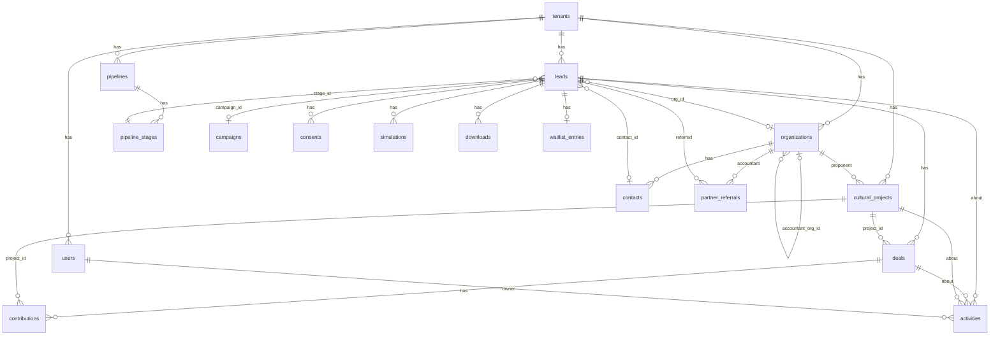

# Proposta A: velocidade e custo zero

> Uma das três propostas do painel de arquitetura. Lente: um desenvolvedor sozinho (Rafael) coloca site, captura de leads, simulador e CRM no ar em três a quatro semanas, com custo de infraestrutura próximo de zero. Contexto de negócio em `docs/visao.md`; convenções de código em `docs/arquitetura/next16-convencoes.md`; entidades e estágios de pipeline em `docs/estrategia/personas-e-funis.md` (seções 8 e 9). Versões e preços conferidos em 03/10/2026; o que não foi confirmado em fonte primária está marcado com [verificar].

## 1. Decisões em uma página

| Tema | Decisão | Alternativa descartada e por quê |
|---|---|---|
| Framework | Next.js 16.3.8, React 19.3.0, Tailwind CSS 4.3.3, TypeScript (decisão dada) | |
| Componentes de UI | shadcn/ui (CLI 4.21.1) só no CRM; site público com Tailwind puro | Biblioteca completa (MUI, Mantine): peso e tema difícil de alinhar com Tailwind 4 |
| Banco | PostgreSQL. Produção: Neon Free (via Vercel Marketplace). Local e testes: PGlite 0.5.8 (Postgres em WASM, sem Docker) | SQLite/Turso: dialeto diferente de produção e migração de esquema fora do fluxo; Supabase Free: projeto pausa após 7 dias sem atividade |
| ORM | Drizzle ORM 0.45.3 + drizzle-kit 0.31.11 | Prisma 7.10: exige driver adapter, `prisma.config.ts`, gerador com `output` obrigatório e a tag `latest` do CLI `prisma` no npm já aponta para `8.0.0-rc.19`, armadilha para `npm i prisma` |
| Autenticação | Better Auth 1.7.7, e-mail e senha, cadastro fechado, cookie de sessão | Auth.js v5 ainda `@beta`; Clerk tem custo e dependência externa; Supabase Auth prende ao Supabase |
| Hospedagem | Vercel. Hobby (grátis) enquanto é desenvolvimento e staging; Pro (US$ 20/mês) quando o site entrar em operação comercial | Cloudflare Workers via OpenNext (US$ 5/mês): plano B para cortar custo; Railway/Fly/VPS: mais operação para uma pessoa só |
| E-mail transacional | Resend (free: 3.000/mês, 100/dia) | Brevo free (300/dia) tem logo da Brevo nos e-mails; SES exige saída do sandbox e mais configuração |
| WhatsApp | Link `wa.me` com mensagem pré-preenchida, por página e por segmento | API oficial da Meta ou Z-API (R$ 99,99/mês/instância, não oficial) só se houver sequências automáticas, o que não é o caso na Fase 1 |
| PDF do guia | Arquivo no repositório fora de `public/` (798 KB), entregue por rota com token assinado após o cadastro | Vercel Blob e R2: desnecessários para um único arquivo de 0,8 MB |
| Analytics | Umami Cloud, plano Hobby (grátis, sem cookie) | Plausible: a partir de US$ 9/mês, sem plano grátis; GA4: consentimento de cookies e peso |
| Formulários e anti-spam | Server Actions + `useActionState`, Zod 4.6.5, Cloudflare Turnstile (grátis), campo honeypot e deduplicação por e-mail | reCAPTCHA (Google, cookies); Upstash para rate limit (mais um serviço) |
| Testes | Vitest 5.0.3 (unidade: simulador, schemas, repositórios sobre PGlite) + Playwright 1.63 (um fluxo de ponta a ponta: formulário de lead) | Jest: mais lento e mais configuração com ESM |
| CI | GitHub Actions (2.000 min/mês grátis em repositório privado): lint, typecheck, vitest, build | |
| Erros em produção | Sentry, plano Developer (grátis: 5 mil erros/mês, 1 usuário) | Logs do Vercel Hobby retêm só 1 hora |
| Repositório | App única na raiz do repositório (sem monorepo) | Monorepo (apps/web, packages/*): custo de configuração sem segundo consumidor de código |
| Multi-tenant | Coluna `tenant_id` em toda tabela de negócio desde a primeira migração; um tenant `prospekto` semeado | Linhas separadas por banco, RLS, domínio por tenant: Fase 2 |

Custo mensal da Fase 1: R$ 0 durante a construção; cerca de R$ 105/mês depois que o site entrar no ar (apenas o Vercel Pro). Detalhes na seção 5.

## 2. O que a lente exige

- Zero serviços que precisem de servidor ligado: tudo serverless ou gerenciado com plano grátis.
- Zero Docker: o ambiente de desenvolvimento em nuvem não tem Docker, e o banco local precisa subir com `npm run dev`.
- Um dialeto de banco só (Postgres), do teste à produção, para não depurar diferenças SQLite/Postgres em semana 3.
- Cada ferramenta precisa ter CLI que gere o esqueleto (create-next-app, shadcn, auth, drizzle-kit, sentry wizard, playwright). O que exige configuração manual longa fica para depois.
- O que puder ser um arquivo no repositório (PDF do guia, parâmetros do simulador, conteúdo das páginas) é um arquivo no repositório, não um serviço.

## 3. Stack decidida, item a item

### 3.1 Next.js 16 e UI

Segue `docs/arquitetura/next16-convencoes.md`: App Router, `src/`, route groups `(site)` e `(app)`, `proxy.ts` para redirecionar `/app/*` sem sessão, Server Actions para formulários e mutações.

shadcn/ui entra só no CRM (`(app)`): tabelas, formulários, diálogos e menus prontos economizam dias. O site público usa Tailwind puro para carregar rápido e não arrastar o tema do CRM. Fonte da CLI: https://ui.shadcn.com/docs/installation/next.

### 3.2 Banco: Postgres no Neon, PGlite local

Decisão: Postgres em todo lugar.

- Produção: Neon, plano Free, criado pelo Vercel Marketplace (integração nativa, cobrança pelo Vercel, "plans starting at $0"; https://vercel.com/marketplace/neon). Limites do Free: 1 GB por projeto, 100 CU-horas por projeto por mês (0,25 CU por cerca de 400 horas), scale-to-zero obrigatório após 5 minutos, restore de 6 horas; https://neon.com/pricing e https://neon.com/docs/introduction/plans. A integração injeta `DATABASE_URL` (pooled) e `DATABASE_URL_UNPOOLED` e cria um branch do banco por preview deployment (https://neon.com/docs/guides/vercel-managed-integration).
- Local e testes: PGlite (`@electric-sql/pglite` 0.5.8), Postgres rodando dentro do processo Node em WASM, persistido em `.pglite/` (ignorado no git). Não precisa de Docker nem de conta em nada para começar a programar. Drizzle tem driver próprio (`drizzle-orm/pglite`) e o drizzle-kit aceita `driver: "pglite"` para `push`, `generate` e `migrate` (https://orm.drizzle.team/docs/connect-pglite e https://orm.drizzle.team/docs/drizzle-config-file).
- Quando o desenvolvedor quiser dados reais, aponta `DATABASE_URL` para um branch `dev` do Neon e nada mais muda.

Por que não SQLite: não roda em função serverless no Vercel sem Turso, e o Turso exige `prisma migrate diff` mais CLI própria para migrar (https://www.prisma.io/docs/orm/overview/databases/sqlite). Por que não Supabase Free: "Free projects are paused after 1 week of inactivity" (https://supabase.com/pricing); um site de captação com tráfego baixo em janeiro pode acordar pausado.

Risco aceito: o Neon posiciona o Free para "prototypes, side projects, and small teams". Para um CRM de uma pessoa com centenas de leads, 1 GB é folga de anos; o cold start de scale-to-zero (primeira consulta após 5 minutos parados) custa frações de segundo no formulário, nunca nas páginas públicas, que são estáticas.

### 3.3 ORM: Drizzle

Motivos, na ordem que importa para a velocidade:

1. Sem etapa de geração de cliente: o schema em TypeScript é o tipo. Prisma 7 exige `generator` com `output` obrigatório, driver adapter obrigatório e `prisma.config.ts` com `dotenv` manual (https://www.prisma.io/docs/orm/more/upgrade-guides/upgrading-versions/upgrading-to-prisma-7).
2. `drizzle-kit push` sincroniza o esquema no PGlite em segundos durante a semana 1; `generate` + `migrate` entram quando o esquema estabiliza (semana 2).
3. Driver PGlite oficial para desenvolvimento e testes; Prisma só cobre PGlite via `prisma dev`, um processo extra (https://pglite.dev/docs/orm-support).
4. Better Auth gera o esquema de autenticação em formato Drizzle com um comando (https://www.better-auth.com/docs/adapters/drizzle).
5. A tag `latest` do CLI `prisma` no npm aponta para `8.0.0-rc.19` enquanto `@prisma/client` está em 7.10.0 (registro npm, consultado em 03/10/2026). Quem rodar `npm i -D prisma` sem fixar versão instala um release candidate.

Versões fixadas: `drizzle-orm@0.45.3` e `drizzle-kit@0.31.11`. O Drizzle 1.0 está em beta (`1.0.0-beta.22`); não usar a tag `@rc`/`@beta` que a documentação às vezes mostra nos exemplos de instalação.

Driver de produção: `pg` (node-postgres) com `Pool` e a URL pooled do Neon (sufixo `-pooler`, PgBouncer em modo transação; prepared statements no nível de protocolo funcionam; https://neon.com/docs/connect/connection-pooling). O `pg` já está na lista de pacotes externos do Next.js, então não precisa de `serverExternalPackages`; o PGlite precisa (seção 8.4).

### 3.4 Autenticação: Better Auth

- Pacote `better-auth@1.7.7`, adaptador Drizzle (`drizzleAdapter(db, { provider: "pg", schema })`).
- `emailAndPassword: { enabled: true, disableSignUp: true }`: não existe cadastro público; o seed cria o usuário da Daniela e o do sócio. `sendResetPassword` envia por Resend (https://www.better-auth.com/docs/authentication/email-password).
- Rota `src/app/api/auth/[...all]/route.ts` com `toNextJsHandler(auth)`; plugin `nextCookies()` para Server Actions que fazem login; sessão em Server Components e Actions com `auth.api.getSession({ headers: await headers() })`; `proxy.ts` usa `getSessionCookie(request)` só como redirecionamento otimista (https://www.better-auth.com/docs/integrations/next e https://www.better-auth.com/docs/installation).
- Variáveis: `BETTER_AUTH_SECRET` (32+ caracteres) e `BETTER_AUTH_URL`.
- CLI: o pacote atual é `auth` (`npx auth@latest generate`), versão 1.7.7 no npm; o antigo `@better-auth/cli` parou em 1.4.21 (março de 2026). Usar o novo.
- Campo adicional `tenantId` no usuário (`user.additionalFields`) desde já; o plugin `organization` (tabelas `organization`, `member`, `invitation`, `activeOrganizationId` na sessão; https://www.better-auth.com/docs/plugins/organization) fica para a Fase 2, quando um usuário puder pertencer a mais de um tenant.

Por que não Auth.js: a instalação oficial ainda é `npm install next-auth@beta` (https://authjs.dev/getting-started/installation). Por que não Clerk: custo e um painel externo a mais para uma equipe de duas pessoas.

### 3.5 Hospedagem: Vercel, com plano B no Cloudflare

Vercel é o caminho de menor atrito para Next.js 16: `git push` faz deploy, preview por PR, Neon integrado, cron jobs, logs, sem configurar nada.

Regra de uso que define o custo: "the Hobby plan restricts users to non-commercial, personal use only" (https://vercel.com/docs/plans/hobby). O site da Prospekto é comercial. Plano:

| Fase | Plano | Custo |
|---|---|---|
| Semanas 1 a 3: construção, previews, staging interno | Hobby | R$ 0 |
| Entrada em operação (formulários recebendo leads de verdade) | Pro, 1 assento | US$ 20/mês (https://vercel.com/pricing) |

Limites do Hobby que importam durante a construção: 1 milhão de invocações de função, 100 GB de transferência, cron só uma vez por dia com precisão de hora (https://vercel.com/docs/cron-jobs/usage-and-pricing), 1 hora de logs. No Pro: cron por minuto, 1 dia de logs, suporte por e-mail.

Plano B (corte de custo, não de prazo): `@opennextjs/cloudflare` 1.20.8 suporta Next.js 16, mas "Node Middleware ... not yet supported" e o worker precisa caber em 3 MiB comprimido no plano Free ou 10 MiB no Paid (US$ 5/mês; https://opennext.js.org/cloudflare e https://developers.cloudflare.com/workers/platform/pricing/). Para um app com CRM, contar com o Paid. Só vale a migração se o Vercel Pro doer no caixa; a arquitetura não depende de nada exclusivo do Vercel além do cron, que o Cloudflare também tem.

Região: função e banco na América do Sul quando disponível (Vercel `gru1`, Neon São Paulo) [verificar disponibilidade das duas regiões nos planos grátis]. Node.js: Vercel usa 24.x por padrão; `engines.node` em `package.json` fixa `>=22.12` porque Vitest 5 exige Node 22.12+ (https://vercel.com/docs/functions/runtimes/node-js/node-js-versions e https://vitest.dev/guide/).

### 3.6 E-mail transacional: Resend

Free: 3.000 e-mails/mês, 100/dia, 3 domínios, retenção de 30 dias; Pro a partir de US$ 20/mês (https://resend.com/pricing). SDK `resend@6.32.0`; remetente `onboarding@resend.dev` serve só para teste, produção exige domínio verificado (https://resend.com/docs/send-with-nextjs).

Usos na Fase 1: entrega do link do guia, aviso interno de novo lead para `projetos@prospekto.com.br`, redefinição de senha. Newsletter e campanhas não passam por aqui (ver `docs/playbooks/campanhas.md` e a ferramenta que a Daniela escolher).

Dependência externa: verificar o domínio `prospekto.com.br` no Resend exige acesso ao DNS (SPF e DKIM). Quem controla o DNS e onde está o e-mail hoje é a pergunta 4 de `docs/visao.md`. Enquanto não houver resposta, o remetente é um subdomínio (`envio.prospekto.com.br`) [verificar com quem administra o domínio].

### 3.7 WhatsApp: link, não API

Fase 1: botão `https://wa.me/5554984032180?text=...` com texto por página (empresa, contador, pessoa física, município, proponente). O número é o que já consta no guia da Prospekto. Custo zero, sem aprovação da Meta, sem risco de bloqueio.

Quando mudar: só se o playbook exigir mensagens disparadas pelo sistema (lembrete de aporte em dezembro, por exemplo). Aí a opção é a API oficial da Meta (preço por mensagem por categoria desde 01/07/2025; mensagens de serviço na janela de 24 h são grátis; contas em BRL para empresas brasileiras desde 01/07/2026; https://developers.facebook.com/docs/whatsapp/pricing). Z-API (R$ 99,99/mês por instância, não oficial; https://www.z-api.io/) fica fora: risco de banimento do número da Daniela.

### 3.8 PDF do guia

O guia tem 798 KB e a apresentação 2,6 MB (`docs/fontes/materiais/`). Ficam em `src/assets/` (fora de `public/`, para não existir URL aberta) e são servidos por `src/app/api/downloads/[token]/route.ts`:

1. Lead envia o formulário com consentimento; a Server Action grava `leads` e `consents`, cria um registro em `downloads` com token HMAC (segredo `DOWNLOAD_TOKEN_SECRET`, validade de 7 dias) e envia o e-mail com o link.
2. A rota valida o token, registra `downloaded_at` e `download_count` e responde com `Content-Disposition: attachment`.

Sem Blob, sem bucket. Vercel Blob (1 GB grátis no Hobby; https://vercel.com/docs/vercel-blob/usage-and-pricing) ou Cloudflare R2 (10 GB grátis, egress zero; https://developers.cloudflare.com/r2/pricing/) entram quando a Fase 2 precisar de upload por tenant (decks de projetos, logos).

### 3.9 Analytics: Umami Cloud

Plano Hobby grátis, sem cookies, script leve; fontes secundárias indicam 100 mil eventos/mês, 1 site e 6 meses de retenção [verificar na página de preços, que não respondeu à consulta automática]; https://umami.is/pricing e https://docs.umami.is/docs/cloud/faq. Eventos personalizados: `lead_enviado`, `simulacao_concluida`, `whatsapp_clique`, `guia_baixado`, com a origem UTM.

Alternativa já incluída na hospedagem: Vercel Web Analytics dá 50 mil eventos/mês no Hobby, mas no Pro cobra US$ 0,03 por 1.000 eventos sem franquia, e UTM só no add-on de US$ 10/mês (https://vercel.com/docs/analytics/limits-and-pricing). Umami cobre UTM de graça.

### 3.10 Formulários, validação e anti-spam

- Server Actions com `useActionState` no cliente; Zod 4.6.5 valida no servidor; um schema por formulário em `src/lib/validation/`.
- Cloudflare Turnstile: grátis, 20 widgets por conta, 10 hostnames por widget, explicitamente adequado a "small to medium businesses" e "most production applications" (https://developers.cloudflare.com/turnstile/plans/). Validação obrigatória no servidor em `POST https://challenges.cloudflare.com/turnstile/v0/siteverify` com `secret` e `response`; token vale 5 minutos e só uma vez (https://developers.cloudflare.com/turnstile/get-started/server-side-validation/). Chaves de teste que sempre passam existem para desenvolvimento e CI.
- Honeypot (`campo website`, oculto por CSS) e deduplicação: mesmo e-mail e segmento em 10 minutos retorna sucesso sem gravar de novo.
- Rate limit sem serviço extra: tabela `form_attempts` (hash do IP, hora, contagem), limpa por cron diário. Suficiente para o volume de uma consultoria; Upstash entra se houver abuso.
- Consentimento LGPD: caixa não pré-marcada, texto com finalidade e link para a política; registro em `consents` com versão do texto, data e hora, hash do IP e canal. Base legal e campos conforme `docs/estrategia/personas-e-funis.md`, seção 9.1 (Lei 13.709/2018, art. 7º, I e art. 8º).

### 3.11 Testes e CI

- Vitest 5.0.3 com `@vitejs/plugin-react` e `vite-tsconfig-paths`. Três camadas: simulador puro (`src/lib/simulador`, sem banco), schemas Zod, repositórios contra PGlite em memória (cada arquivo de teste sobe um banco novo com `drizzle-kit push` programático ou migrações aplicadas via `migrate()`).
- Playwright 1.63: um único spec (`tests/e2e/lead-form.spec.ts`) que abre a página de empresas, preenche o formulário com a sitekey de teste do Turnstile e confere a mensagem de sucesso. Roda só no CI, contra `next build && next start` com PGlite.
- GitHub Actions: um workflow em PR e em `main` com `npm ci`, `lint`, `typecheck`, `test`, `build`. Deploy é do Vercel (integração GitHub), não do Actions. Repositório privado tem 2.000 minutos/mês grátis (https://docs.github.com/en/billing/concepts/product-billing/github-actions).

### 3.12 Monitoramento

Sentry Developer: 5 mil erros/mês, 1 usuário, 30 dias de retenção (https://sentry.io/pricing/). Instalação pelo assistente `npx @sentry/wizard@latest -i nextjs`, que cria `instrumentation.ts`, `instrumentation-client.ts`, `sentry.server.config.ts`, `sentry.edge.config.ts` e `app/global-error.tsx` (https://docs.sentry.io/platforms/javascript/guides/nextjs/). Entra na semana 3, não na 1: antes disso os logs do Vercel bastam.

## 4. Estrutura do repositório: app única na raiz

Decisão: `package.json` na raiz de `aleciomunizrafael/prospekto`, com `src/` ao lado de `docs/`. Sem monorepo.

Motivos:

- Há um consumidor de código (o app) e um desenvolvedor. Monorepo paga configuração (workspaces, pipeline de build, pacotes internos com `exports`) para resolver compartilhamento que ainda não existe.
- O Vercel detecta Next.js na raiz sem configuração de "root directory".
- O hub da Fase 2 é o mesmo app servindo outros tenants, não um segundo app. O que precisa ser separável depois (simulador, regras de domínio) nasce como módulo puro em `src/lib/simulador` e `src/lib/domain`, sem importar nada de Next. Extrair para `packages/domain` é mover uma pasta.
- `create-next-app` aceita a pasta atual porque `docs/` e `.gitignore` estão na sua lista de arquivos tolerados em diretório não vazio [verificar na execução; se recusar, criar em `/tmp/web` e mover o conteúdo].

Quando revisar: se surgir um segundo app (app mobile, worker separado, site do curso em outro domínio) ou se um cliente da Fase 2 precisar do simulador como pacote.

## 5. Custos

Câmbio de referência: dólar comercial a R$ 5,21 em 03/10/2026 (https://boca.com.br/economia/dolar/cotacao-dolar-hoje-mercado-cambio-03-10). Impostos sobre cartão internacional (IOF) não incluídos [verificar alíquota vigente].

| Item | Plano | US$/mês | R$/mês (5,21) | Quando sobe |
|---|---|---|---|---|
| Vercel | Hobby durante a construção; Pro na operação | 0 → 20 | 0 → 104 | Segundo desenvolvedor: +US$ 20 por assento |
| Neon (via Vercel) | Free | 0 | 0 | Launch, pay-as-you-go (US$ 0,106/CU-hora, US$ 0,35/GB-mês) se passar de 1 GB ou 100 CU-horas |
| Resend | Free | 0 | 0 | Pro US$ 20 acima de 3.000 e-mails/mês ou 100/dia |
| Umami Cloud | Hobby | 0 | 0 | [verificar] preço do plano pago |
| Cloudflare Turnstile | Free | 0 | 0 | Nunca para este porte |
| Sentry | Developer | 0 | 0 | Team US$ 26/mês se precisar de 2 usuários |
| GitHub Actions | Free (privado) | 0 | 0 | Acima de 2.000 min/mês |
| Domínio `prospekto.com.br` | Registro.br, anual | | [verificar] cerca de R$ 40/ano | |
| WhatsApp | `wa.me` | 0 | 0 | API oficial: por mensagem |
| Total construção | | 0 | 0 | |
| Total operação Fase 1 | | 20 | cerca de 105 | |
| Plano B hospedagem | Cloudflare Workers Paid | 5 | 26 | |

## 6. Multi-tenant: o que fazer agora e o que deixar

Requisito de `docs/visao.md`: Fase 2 vende o hub para outros consultores com a Daniela como autoridade. Não é requisito da Fase 1, mas algumas decisões são baratas agora e caras depois.

Agora (semana 1, na primeira migração):

| Decisão | Custo hoje | Custo se deixar para depois |
|---|---|---|
| Tabela `tenants` com o tenant `prospekto` semeado | 10 linhas | Migração com backfill em todas as tabelas |
| `tenant_id NOT NULL` com FK em toda tabela de negócio, índice em cada uma | Uma coluna por tabela | Reescrever todas as consultas |
| Chaves únicas compostas (`tenant_id, email, segment` em leads; `tenant_id, cnpj` em organizações; `tenant_id, key` em pipelines) | Nada | Conflito entre tenants no dia 1 da Fase 2 |
| Toda função de acesso a dados recebe `ctx: { tenantId, userId }` como primeiro argumento e filtra por `tenant_id`; nenhuma consulta fora de `src/lib/repos` | Convenção | Auditoria de todo o código |
| `user.tenantId` como campo adicional do Better Auth; sessão expõe `tenantId` | 5 linhas | Troca de modelo de sessão |
| Configuração do site (nome, contatos, WhatsApp, cores) em `src/config/site.ts` lida por um único módulo | Nada | Nada, mas facilita virar tabela `tenant_settings` |
| IDs públicos (`cuid2` ou UUID) em vez de inteiros sequenciais | Nada | URLs enumeráveis entre tenants |
| Parâmetros do simulador em `docs/dominio/parametros-simulador.json` versionados, não hardcoded | Já existe | |

Depois (Fase 2):

- Plugin `organization` do Better Auth (usuário em vários tenants, convites, papéis `owner`, `admin`, `member`).
- Resolução de tenant por domínio ou subdomínio em `proxy.ts` (`hub.prospekto.com.br/<slug>` primeiro; domínio próprio por cliente depois).
- `tenant_settings` em banco e tema por tenant; uploads por tenant (Blob ou R2); cobrança (assinatura).
- Row Level Security no Postgres como segunda barreira. Não agora: o `pg` com PgBouncer em modo transação não mantém `SET` entre consultas (https://neon.com/docs/connect/connection-pooling), o que complica RLS por sessão; na Fase 2 isso se resolve com `SET LOCAL` dentro de transação.
- Banco por tenant: provavelmente nunca; coluna + RLS atendem dezenas de consultorias.

## 7. Modelo de dados

Convenções: tabelas no plural em `snake_case`; identificadores em inglês; valores monetários em centavos (`bigint`); datas em `timestamptz`; `tenant_id` em tudo; enums do Postgres para estágios e tipos, com os valores literais de `docs/estrategia/personas-e-funis.md` (seção 8). Entidades em português só na UI.



| Tabela | Campos principais | Observações |
|---|---|---|
| `tenants` | `id`, `slug` (único), `name`, `created_at` | Semeado com `prospekto` |
| `users`, `sessions`, `accounts`, `verifications` | Geradas pelo Better Auth; `users.tenant_id`, `users.role` (`owner`, `operator`) | Não editar à mão: regenerar com `npx auth generate` |
| `organizations` | `id`, `tenant_id`, `type` (`empresa`, `contabilidade`, `municipio`, `proponente`, `outro`), `name`, `trade_name`, `cnpj`, `city`, `uf`, `sector`, `tax_regime` (`lucro_real`, `lucro_presumido`, `simples`, `nao_sei`), `estimated_irpj_cents`, `accountant_org_id`, `owner_user_id`, `notes` | Único `(tenant_id, cnpj)` quando `cnpj` não nulo. `estimated_irpj_cents` alimenta o cálculo de potencial (4% do IRPJ, `docs/dominio/leis-de-incentivo.md`) |
| `contacts` | `id`, `tenant_id`, `org_id`, `name`, `title`, `email`, `phone`, `linkedin_url`, `is_decision_maker` | Pessoa dentro de uma organização; dado pessoal, origem registrada em `source_detail` |
| `pipelines` | `id`, `tenant_id`, `key` (`patrocinadores`, `contadores`, `municipios`, `projetos`, `alunos`), `name` | Único `(tenant_id, key)`; semeados |
| `pipeline_stages` | `id`, `pipeline_id`, `key`, `name`, `position`, `sla_business_days`, `is_terminal`, `required_fields` (jsonb) | Valores literais da seção 8 de personas-e-funis.md; `required_fields` lista os campos obrigatórios para entrar no estágio |
| `leads` | `id`, `tenant_id`, `segment` (`PJ`, `PF`, `CONT`, `MUN`, `PROP`, `ALUNO`), `interest`, `name`, `email`, `phone`, `city`, `uf`, `message`, `source`, `source_detail`, `utm_source`, `utm_medium`, `utm_campaign`, `campaign_id`, `pipeline_id`, `stage_id`, `stage_entered_at`, `score`, `temperature`, `owner_user_id`, `org_id`, `contact_id`, `next_action_at`, `last_contact_at`, `lost_reason`, `tags` (text[]), `attributes` (jsonb por segmento), `created_at` | Único `(tenant_id, email, segment)`. `attributes` guarda os campos por segmento da seção 9.3 sem uma tabela por persona |
| `campaigns` | `id`, `tenant_id`, `key` (= `utm_campaign`), `name`, `channel` (`linkedin`, `email`, `whatsapp`, `evento`, `parceiro`, `site`, `organico`), `starts_at`, `ends_at`, `notes` | Origem é enum em `leads.source`; campanha é a instância |
| `cultural_projects` | `id`, `tenant_id`, `proponent_org_id`, `name`, `mechanism` (`rouanet_18`, `rouanet_26`, `audiovisual_1`, `audiovisual_1a`, `lic_rs`, `lic_municipal`, `fsa`, `edital`), `process_number` (Pronac, Ancine, Pró-Cultura), `article`, `stage` (enum do pipeline `projetos`), `approved_amount_cents`, `raised_amount_cents`, `fundraising_deadline`, `fundraising_fee_cents` (rubrica de captação aprovada), `commission_pct`, `city`, `cultural_segment`, `counterparts`, `salic_url`, `deck_url`, `published_on_site`, `owner_user_id` | `saldo_a_captar` = `approved - raised`, calculado na consulta; `raised_amount_cents` é cache atualizado por trigger de aplicação ao confirmar depósito. Comissão limitada a 10% e R$ 150 mil (IN MinC 29/2026, art. 19, via `docs/dominio/leis-de-incentivo.md`, seção 2.8): validação no Zod, não no banco |
| `deals` | `id`, `tenant_id`, `lead_id`, `org_id`, `project_id`, `title`, `proposed_amount_cents`, `mechanism`, `contribution_type` (`patrocinio`, `doacao`), `status` (`aberto`, `ganho`, `perdido`), `lost_reason`, `expected_close_at`, `owner_user_id` | Nasce quando o lead entra em `proposta` (projeto e valor definidos). Um lead pode ter vários deals (vários projetos ou anos) |
| `contributions` | `id`, `tenant_id`, `project_id`, `deal_id`, `org_id`, `lead_id`, `type`, `mechanism`, `status` (`promessa`, `termo_assinado`, `depositado`, `recibo_emitido`, `cancelado`), `promised_amount_cents`, `deposited_amount_cents`, `deposited_at`, `receipt_number`, `receipt_issued_at`, `receipt_sent_to_accountant_at`, `commission_due_cents`, `commission_paid_at`, `counterparts_delivered`, `notes` | É o aporte. Comissão só pode ser marcada paga com `deposited_at` preenchido |
| `activities` | `id`, `tenant_id`, `type` (`ligacao`, `reuniao`, `email`, `whatsapp`, `visita`, `nota`, `tarefa`), `subject`, `body`, `occurred_at`, `due_at`, `done_at`, `lead_id`, `org_id`, `contact_id`, `deal_id`, `project_id`, `owner_user_id` | Tarefa = `type = tarefa` com `due_at`; o painel "vencidos" é `due_at < now() and done_at is null` mais `leads.next_action_at` vencido |
| `partner_referrals` | `id`, `tenant_id`, `accountant_org_id`, `lead_id`, `referred_at`, `outcome` | Métrica por escritório parceiro |
| `consents` | `id`, `tenant_id`, `lead_id`, `contact_id`, `purpose` (`contato_comercial`, `marketing`, `whatsapp`), `granted`, `granted_at`, `revoked_at`, `policy_version`, `ip_hash`, `user_agent`, `source_page` | Append-only; revogação é nova linha com `granted = false` |
| `simulations` | `id`, `tenant_id`, `lead_id` (nulo até o lead se identificar), `kind` (`pj`, `pf`), `inputs` (jsonb), `outputs` (jsonb), `parameters_version` (campo `atualizado_em` de `parametros-simulador.json`), `ip_hash`, `created_at` | Simulação anônima é permitida; o resultado por e-mail vincula ao lead |
| `waitlist_entries` | `id`, `tenant_id`, `lead_id` (único), `product` (`mentoria`, `curso`), `survey_answers` (jsonb), `invited_at`, `cohort` | Lista de espera é um lead `ALUNO` no pipeline `alunos` mais esta linha com as respostas da pesquisa |
| `downloads` | `id`, `tenant_id`, `lead_id`, `asset` (`guia_contabilizando_cultura`), `token_hash`, `expires_at`, `sent_at`, `downloaded_at`, `download_count` | Entrega do PDF (seção 3.8) |
| `form_attempts` | `id`, `ip_hash`, `window_start`, `count` | Rate limit sem serviço externo; sem `tenant_id` de propósito |
| `audit_log` (opcional) | `id`, `tenant_id`, `user_id`, `entity`, `entity_id`, `action`, `diff` (jsonb), `at` | 20 linhas no helper de repositório; útil para a Fase 2 |

Exemplo de definição em Drizzle, mostrando as convenções (tenant, enum, único composto):

```ts
// src/lib/db/schema/leads.ts
import { pgTable, pgEnum, text, integer, timestamp, jsonb, uniqueIndex, index } from "drizzle-orm/pg-core";
import { tenants } from "./tenants";
import { pipelineStages, pipelines } from "./pipelines";

export const leadSegment = pgEnum("lead_segment", ["PJ", "PF", "CONT", "MUN", "PROP", "ALUNO"]);

export const leads = pgTable(
  "leads",
  {
    id: text("id").primaryKey(), // cuid2 gerado na aplicação
    tenantId: text("tenant_id").notNull().references(() => tenants.id),
    segment: leadSegment("segment").notNull(),
    name: text("name").notNull(),
    email: text("email").notNull(),
    phone: text("phone"),
    city: text("city"),
    uf: text("uf"),
    source: text("source").notNull(),
    sourceDetail: text("source_detail"),
    pipelineId: text("pipeline_id").notNull().references(() => pipelines.id),
    stageId: text("stage_id").notNull().references(() => pipelineStages.id),
    stageEnteredAt: timestamp("stage_entered_at", { withTimezone: true }).notNull().defaultNow(),
    score: integer("score").notNull().default(0),
    nextActionAt: timestamp("next_action_at", { withTimezone: true }),
    attributes: jsonb("attributes").$type<Record<string, unknown>>().notNull().default({}),
    createdAt: timestamp("created_at", { withTimezone: true }).notNull().defaultNow(),
  },
  (t) => [
    uniqueIndex("leads_tenant_email_segment_uq").on(t.tenantId, t.email, t.segment),
    index("leads_tenant_stage_idx").on(t.tenantId, t.stageId),
    index("leads_tenant_next_action_idx").on(t.tenantId, t.nextActionAt),
  ],
);
```

## 8. Scaffold: comandos e arquivos

### 8.1 Pré-requisitos

Node 22 LTS (ou 24) e npm. npm em vez de pnpm para tirar uma variável do ambiente em nuvem; o Vercel detecta o lockfile. Rodar tudo a partir de `/home/user/prospekto` em árvore limpa, para reverter com `git checkout` se algo sair errado. Não commitar neste passo (regra do projeto).

### 8.2 Comandos

```bash
cd /home/user/prospekto

# 1. Next.js 16 na raiz (docs/ e .gitignore devem ser tolerados pelo create-next-app; ver seção 4)
npx create-next-app@latest . --ts --tailwind --eslint --app --src-dir \
  --import-alias "@/*" --use-npm --disable-git --yes

# 2. Dependências de runtime
npm i drizzle-orm@0.45.3 pg @electric-sql/pglite better-auth zod @paralleldrive/cuid2 \
  @t3-oss/env-nextjs resend server-only

# 3. Dependências de desenvolvimento
npm i -D drizzle-kit@0.31.11 @types/pg tsx dotenv vitest@5 @vitejs/plugin-react \
  vite-tsconfig-paths @playwright/test

# 4. shadcn/ui (defaults) e os componentes do CRM
npx shadcn@latest init -d
npx shadcn@latest add button input label textarea select checkbox badge card table \
  dialog sheet dropdown-menu tabs separator sonner

# 5. Esquema de autenticação gerado pelo Better Auth em formato Drizzle
#    (depois de criar src/lib/auth.ts, seção 8.4)
npx auth@latest generate --config src/lib/auth.ts --output src/lib/db/schema/auth.ts

# 6. Banco local (PGlite) e primeira migração
npm run db:generate   # drizzle-kit generate -> drizzle/0000_*.sql
npm run db:migrate    # aplica no PGlite local (.pglite/) ou no DATABASE_URL
npm run db:seed       # tenant prospekto, pipelines e estágios, usuários iniciais

# 7. Playwright (só o Chromium)
npx playwright install chromium

# 8. Verificação
npm run lint && npm run typecheck && npm test && npm run build
```

Fixar versões: depois do passo 3, conferir em `package.json` que `drizzle-orm`, `drizzle-kit`, `vitest`, `next`, `react` e `react-dom` estão sem `^` nas entradas críticas, ou manter `^` e commitar o `package-lock.json`; o lockfile é o que vale no Vercel e no CI.

### 8.3 Scripts em `package.json`

```json
{
  "engines": { "node": ">=22.12" },
  "scripts": {
    "dev": "next dev",
    "build": "next build",
    "start": "next start",
    "lint": "eslint .",
    "typecheck": "tsc --noEmit",
    "test": "vitest run",
    "test:watch": "vitest",
    "e2e": "playwright test",
    "db:generate": "drizzle-kit generate",
    "db:migrate": "tsx src/lib/db/migrate.ts",
    "db:push": "drizzle-kit push",
    "db:studio": "drizzle-kit studio",
    "db:seed": "tsx src/lib/db/seed.ts",
    "vercel-build": "npm run db:migrate && next build"
  }
}
```

`vercel-build` roda as migrações antes do build em cada deploy (produção e preview; cada preview tem seu branch do Neon). Para um desenvolvedor só é o fluxo mais simples; o risco é um deploy quebrar no meio da migração, aceitável enquanto o esquema é pequeno.

### 8.4 Arquivos iniciais

| Arquivo | Conteúdo |
|---|---|
| `src/app/layout.tsx` | `<html lang="pt-BR">`, fonte, CSS global, script do Umami |
| `src/app/(site)/layout.tsx`, `page.tsx` | Site público: home |
| `src/app/(site)/empresas/page.tsx`, `contadores/`, `pessoas-fisicas/`, `municipios/`, `proponentes/`, `mentoria/` | Uma página por persona, cada uma com formulário e botão de WhatsApp com texto próprio |
| `src/app/(site)/simulador/page.tsx` | Simulador PJ e PF; cálculo no servidor em Server Action usando `src/lib/simulador` |
| `src/app/(site)/guia/page.tsx` | Landing do guia "Contabilizando Cultura" |
| `src/app/(site)/politica-de-privacidade/page.tsx` | Texto da política; versão referenciada em `consents.policy_version` |
| `src/app/(app)/layout.tsx` | Verifica sessão com `auth.api.getSession`, redireciona para `/entrar` |
| `src/app/(app)/app/page.tsx` | Painel: próximas ações vencidas, leads novos, saldo a captar por projeto |
| `src/app/(app)/app/leads/`, `organizacoes/`, `projetos/`, `aportes/`, `atividades/` | Listas e detalhes do CRM |
| `src/app/(site)/entrar/page.tsx` | Login |
| `src/app/api/auth/[...all]/route.ts` | `toNextJsHandler(auth)` |
| `src/app/api/downloads/[token]/route.ts` | Entrega do PDF |
| `src/app/api/cron/daily/route.ts` | Limpa `form_attempts`, marca SLAs vencidos; protegido por `CRON_SECRET` |
| `src/proxy.ts` | `getSessionCookie` para `/app/*` |
| `src/config/site.ts` | Nome, e-mail `projetos@prospekto.com.br`, WhatsApp `5554984032180`, textos de wa.me por página |
| `src/env.ts` | `createEnv` do t3-env com Zod (lista na seção 9) |
| `src/lib/db/schema/*.ts` e `schema/index.ts` | Tabelas da seção 7 |
| `src/lib/db/index.ts` | Conexão (abaixo) |
| `src/lib/db/migrate.ts`, `seed.ts` | Migração e seed via `tsx` |
| `src/lib/repos/*.ts` | Acesso a dados por entidade, sempre com `ctx.tenantId` |
| `src/lib/auth.ts`, `src/lib/auth-client.ts` | Better Auth servidor e cliente |
| `src/lib/validation/*.ts` | Schemas Zod por formulário |
| `src/lib/simulador/` | Cálculo puro; lê `docs/dominio/parametros-simulador.json` (copiado para `src/lib/simulador/parametros.json` no build, ou importado direto por caminho relativo) |
| `src/lib/email/` | Cliente Resend e templates (React Email opcional; HTML simples basta na Fase 1) |
| `src/lib/turnstile.ts` | `verifyTurnstile(token, ip)` |
| `src/assets/contabilizando-cultura-guia.pdf` | Cópia do guia |
| `src/actions/*.ts` | Server Actions (`createLead`, `runSimulation`, `moveLeadStage`, `logActivity`, `recordContribution`) |
| `drizzle.config.ts`, `drizzle/` | Config e migrações |
| `vitest.config.ts`, `src/test/setup.ts`, `src/test/db.ts` | PGlite em memória por arquivo de teste |
| `playwright.config.ts`, `tests/e2e/lead-form.spec.ts` | Um fluxo de ponta a ponta |
| `.github/workflows/ci.yml` | Lint, typecheck, test, build |
| `.env.example` | Todas as variáveis, sem valores |
| `AGENTS.md`, `CLAUDE.md` | Gerados pelo create-next-app; commitar |

Conexão com troca automática entre PGlite e Postgres:

```ts
// src/lib/db/index.ts
import "server-only";
import * as schema from "./schema";

async function createDb() {
  if (process.env.DATABASE_URL) {
    const { drizzle } = await import("drizzle-orm/node-postgres");
    const { Pool } = await import("pg");
    const pool = new Pool({ connectionString: process.env.DATABASE_URL, max: 5 });
    return drizzle({ client: pool, schema });
  }
  const { drizzle } = await import("drizzle-orm/pglite");
  const { PGlite } = await import("@electric-sql/pglite");
  return drizzle({ client: new PGlite(process.env.PGLITE_DIR ?? ".pglite"), schema });
}

const g = globalThis as unknown as { __db?: Awaited<ReturnType<typeof createDb>> };
export const db = g.__db ?? (g.__db = await createDb());
export type Db = typeof db;
```

Configuração do drizzle-kit com a mesma troca:

```ts
// drizzle.config.ts
import "dotenv/config";
import { defineConfig } from "drizzle-kit";

const url = process.env.DATABASE_URL;

export default defineConfig({
  dialect: "postgresql",
  schema: "./src/lib/db/schema/index.ts",
  out: "./drizzle",
  ...(url ? { dbCredentials: { url } } : { driver: "pglite", dbCredentials: { url: "./.pglite" } }),
});
```

`next.config.ts`: `serverExternalPackages: ["@electric-sql/pglite"]` para o WASM não entrar no bundle do servidor (https://nextjs.org/docs/app/api-reference/config/next-config-js/serverExternalPackages). Em produção o `import` do PGlite nunca executa porque `DATABASE_URL` existe.

Better Auth:

```ts
// src/lib/auth.ts
import { betterAuth } from "better-auth";
import { drizzleAdapter } from "better-auth/adapters/drizzle";
import { nextCookies } from "better-auth/next-js";
import { db } from "@/lib/db";
import * as schema from "@/lib/db/schema";

export const auth = betterAuth({
  database: drizzleAdapter(db, { provider: "pg", schema }),
  emailAndPassword: { enabled: true, disableSignUp: true, minPasswordLength: 12 },
  user: { additionalFields: { tenantId: { type: "string", required: true, input: false } } },
  plugins: [nextCookies()],
});
```

Adições ao `.gitignore` existente: `.pglite/`, `playwright-report/`, `test-results/`, `.vercel/`. A pasta `drizzle/` inteira (migrações SQL e `meta/_journal.json`) é commitada.

## 9. Deploy e variáveis de ambiente

### 9.1 Passos

1. Criar o projeto no Vercel importando `aleciomunizrafael/prospekto`; framework detectado; build command `npm run vercel-build`; Node 22.x ou 24.x.
2. Em Storage, adicionar Neon pelo Marketplace (plano Free); a integração cria `DATABASE_URL`, `DATABASE_URL_UNPOOLED` e o branch por preview.
3. Domínio: `prospekto.com.br` e `www` apontando para o Vercel (CNAME/A no DNS atual; pergunta 4 de `docs/visao.md`).
4. Resend: verificar domínio (SPF, DKIM) e criar `RESEND_API_KEY`.
5. Turnstile: criar widget para `prospekto.com.br` e `*.vercel.app`; copiar as chaves.
6. Umami: criar site, copiar `website id`.
7. Sentry (semana 3): rodar o wizard; `SENTRY_AUTH_TOKEN` só no Vercel, para upload de source maps.
8. `vercel.json` com o cron diário: `{ "crons": [{ "path": "/api/cron/daily", "schedule": "0 9 * * *" }] }` (no Hobby, só uma vez por dia; horário com precisão de hora).
9. Rodar `npm run db:seed` uma vez contra produção (`DATABASE_URL` da Vercel no terminal local) para criar o tenant, os pipelines e os dois usuários.
10. Quando o primeiro formulário real for publicado: upgrade para Pro.

### 9.2 Variáveis

| Variável | Onde | Uso |
|---|---|---|
| `DATABASE_URL` | Vercel (Neon, pooled), local opcional | Conexão; ausente = PGlite |
| `DATABASE_URL_UNPOOLED` | Vercel (Neon) | Migrações, se o PgBouncer recusar algum DDL [verificar necessidade] |
| `PGLITE_DIR` | Local, opcional | Pasta do PGlite (padrão `.pglite`) |
| `BETTER_AUTH_SECRET` | Vercel, local | 32+ caracteres (`openssl rand -base64 32`) |
| `BETTER_AUTH_URL` | Vercel, local | `https://prospekto.com.br` em produção; `http://localhost:3000` local |
| `NEXT_PUBLIC_APP_URL` | Todos | Links absolutos em e-mails |
| `RESEND_API_KEY`, `EMAIL_FROM` | Vercel, local | Remetente verificado; local pode usar `onboarding@resend.dev` |
| `LEAD_NOTIFY_EMAIL` | Todos | `projetos@prospekto.com.br` |
| `NEXT_PUBLIC_TURNSTILE_SITE_KEY`, `TURNSTILE_SECRET_KEY` | Todos | Chaves de teste em local e CI |
| `DOWNLOAD_TOKEN_SECRET` | Vercel, local | HMAC dos links do guia |
| `CRON_SECRET` | Vercel | Autoriza `/api/cron/*` |
| `NEXT_PUBLIC_UMAMI_WEBSITE_ID`, `NEXT_PUBLIC_UMAMI_SCRIPT_URL` | Vercel | Analytics; ausentes em local |
| `SENTRY_DSN`, `SENTRY_AUTH_TOKEN` | Vercel | Erros e source maps |
| `DEFAULT_TENANT_SLUG` | Todos | `prospekto`; na Fase 2 é substituído pela resolução por domínio |

`src/env.ts` com `@t3-oss/env-nextjs` (compatível com Zod 4, peer `zod ^3.24 || ^4`) valida tudo no build; variável faltando quebra o deploy, não o formulário em produção.

## 10. Calendário de quatro semanas

| Semana | Entrega | Critério de pronto |
|---|---|---|
| 1 | Scaffold, esquema, seed, simulador (`src/lib/simulador` com testes contra os exemplos da seção 8 de `leis-de-incentivo.md`), página do simulador, página de empresas com formulário, e-mail de lead, preview no Vercel Hobby | `npm test` verde; lead de teste aparece no banco e no e-mail |
| 2 | Demais páginas do site, guia com entrega por token, lista de espera da mentoria, login, CRM de leads (lista, detalhe, mudança de estágio com campos obrigatórios, atividades e próximas ações) | Daniela registra um lead real e um follow-up sem ajuda |
| 3 | Organizações, projetos (carteira com saldo a captar), deals e aportes com recibo e comissão, painel inicial, Sentry, cron diário, domínio e Resend em produção, upgrade para Pro | Primeiro projeto real cadastrado; formulários no ar |
| 4 | Playwright no CI, importação de leads por CSV (planilha do playbook de LinkedIn), relatório de sexta-feira (`docs/playbooks/README.md`), ajustes de UX com a Daniela | Rotina semanal do playbook roda dentro do CRM |

## 11. Riscos desta proposta

| Risco | Probabilidade | Efeito | Mitigação |
|---|---|---|---|
| Vercel Hobby em uso comercial viola o fair use e a conta pode ser pausada | Média se o upgrade atrasar | Site fora do ar | Upgrade para Pro no dia em que o formulário público for publicado; está no calendário |
| Cold start do Neon Free (scale-to-zero em 5 min) deixa o primeiro envio de formulário lento | Alta, efeito pequeno | Centenas de ms a poucos segundos na primeira requisição | Páginas públicas são estáticas; o formulário mostra estado "enviando"; se incomodar, o cron do Pro pode aquecer a cada 5 min; Neon Launch remove o limite |
| Neon Free "não recomendado para produção"; restore de só 6 horas | Baixa | Perda de dados em erro operacional | Dump diário por GitHub Actions (`pg_dump` para artefato, 500 MB grátis) a partir da semana 3; Launch se o volume justificar |
| PGlite e Postgres do Neon divergirem (extensão, versão) | Baixa | Teste passa local e falha no preview | Preview deployment com branch Neon é o teste de integração real; manter o esquema em SQL padrão |
| Drizzle 1.0 muda API (hoje em beta.22) | Média em 12 meses | Refatoração de consultas | Fixar 0.45.x; migrar só na Fase 2 com cobertura de testes de repositório |
| Better Auth lança versões com frequência; CLI mudou de pacote recentemente | Média | Quebra em upgrade | Fixar 1.7.x; regenerar esquema com `npx auth generate` a cada upgrade e revisar o diff |
| Multi-tenant por coluna depende de disciplina; uma consulta sem `tenant_id` vaza dados na Fase 2 | Média | Incidente de privacidade | Toda consulta em `src/lib/repos` com `ctx`; teste de repositório que cria dois tenants e confere isolamento; RLS como segunda barreira na Fase 2 |
| Resend Free limita a 100 e-mails/dia | Baixa na Fase 1 | Guia não entregue em pico de campanha | Alerta de uso; Pro US$ 20 quando uma campanha de dezembro passar de 100 leads/dia |
| Dados pessoais hospedados fora do Brasil (Neon, Vercel, Resend) | Certa | Transferência internacional (LGPD, arts. 33 a 36) exige base e informação ao titular [verificar com advogado] | Regiões em São Paulo quando disponíveis; cláusula na política de privacidade |
| Uma pessoa só constrói e opera | Certa | Qualquer afastamento para o trabalho | Tudo por CLI e documentado aqui; `AGENTS.md` e `CLAUDE.md` no repositório para o próximo desenvolvedor ou agente |
| `create-next-app` recusar a raiz não vazia | Baixa | 10 minutos | Criar em pasta temporária e mover |
| Comissão de captação acima do limite legal registrada no CRM | Baixa | Compliance | Zod rejeita `commission_due_cents` acima de 10% do aporte ou acima do saldo da rubrica; aviso quando `fundraising_fee_cents` passar de R$ 150 mil (`docs/dominio/leis-de-incentivo.md`, seção 2.8) |

## 12. Fontes

| Assunto | Fonte | Consultado em |
|---|---|---|
| Versões de pacotes (next, react, tailwindcss, prisma, @prisma/client, drizzle-orm, drizzle-kit, better-auth, auth, @better-auth/cli, zod, vitest, @playwright/test, @electric-sql/pglite, resend, @sentry/nextjs, shadcn, @opennextjs/cloudflare, @t3-oss/env-nextjs) | https://registry.npmjs.org/ (dist-tags) | 03/10/2026 |
| create-next-app, flags | https://nextjs.org/docs/app/api-reference/cli/create-next-app | 03/10/2026 |
| serverExternalPackages | https://nextjs.org/docs/app/api-reference/config/next-config-js/serverExternalPackages | 03/10/2026 |
| Prisma 7: breaking changes, prisma.config.ts, gerador, SQLite | https://www.prisma.io/docs/orm/more/upgrade-guides/upgrading-versions/upgrading-to-prisma-7 ; https://www.prisma.io/docs/orm/reference/prisma-config-reference ; https://www.prisma.io/docs/orm/prisma-schema/overview/generators ; https://www.prisma.io/docs/orm/overview/databases/sqlite | 03/10/2026 |
| Drizzle: PGlite, config, Postgres | https://orm.drizzle.team/docs/connect-pglite ; https://orm.drizzle.team/docs/drizzle-config-file ; https://orm.drizzle.team/docs/get-started-postgresql | 03/10/2026 |
| PGlite e ORMs | https://pglite.dev/docs/ ; https://pglite.dev/docs/orm-support | 03/10/2026 |
| Better Auth | https://www.better-auth.com/docs/installation ; https://www.better-auth.com/docs/concepts/cli ; https://www.better-auth.com/docs/adapters/drizzle ; https://www.better-auth.com/docs/integrations/next ; https://www.better-auth.com/docs/authentication/email-password ; https://www.better-auth.com/docs/plugins/organization | 03/10/2026 |
| Auth.js em beta | https://authjs.dev/getting-started/installation | 03/10/2026 |
| Vercel: preços, Hobby, Blob, cron, analytics, Node | https://vercel.com/pricing ; https://vercel.com/docs/plans/hobby ; https://vercel.com/docs/vercel-blob/usage-and-pricing ; https://vercel.com/docs/cron-jobs/usage-and-pricing ; https://vercel.com/docs/analytics/limits-and-pricing ; https://vercel.com/docs/functions/runtimes/node-js/node-js-versions ; https://vercel.com/marketplace/neon | 03/10/2026 |
| Neon: preços, planos, integração Vercel, pooling | https://neon.com/pricing ; https://neon.com/docs/introduction/plans ; https://neon.com/docs/guides/vercel-managed-integration ; https://neon.com/docs/connect/connection-pooling | 03/10/2026 |
| Supabase, Turso, Railway, Cloudflare Workers e R2 | https://supabase.com/pricing ; https://turso.tech/pricing ; https://railway.com/pricing ; https://developers.cloudflare.com/workers/platform/pricing/ ; https://developers.cloudflare.com/r2/pricing/ ; https://opennext.js.org/cloudflare | 03/10/2026 |
| Resend, Brevo | https://resend.com/pricing ; https://resend.com/docs/send-with-nextjs ; Brevo via fontes secundárias (https://www.emailtooltester.com/en/reviews/brevo/pricing/) [verificar na página oficial] | 03/10/2026 |
| Turnstile | https://developers.cloudflare.com/turnstile/plans/ ; https://developers.cloudflare.com/turnstile/get-started/server-side-validation/ | 03/10/2026 |
| Umami, Plausible | https://umami.is/pricing ; https://docs.umami.is/docs/cloud/faq ; https://plausible.io/#pricing ; limites do Hobby por fontes secundárias (https://canivibecodeit.com/umami-cloud) [verificar] | 03/10/2026 |
| Sentry | https://sentry.io/pricing/ ; https://docs.sentry.io/platforms/javascript/guides/nextjs/ | 03/10/2026 |
| WhatsApp: Meta e Z-API | https://developers.facebook.com/docs/whatsapp/pricing ; https://www.z-api.io/ | 03/10/2026 |
| GitHub Actions | https://docs.github.com/en/billing/concepts/product-billing/github-actions | 03/10/2026 |
| Vitest, Playwright, shadcn | https://vitest.dev/guide/ ; https://playwright.dev/docs/intro ; https://ui.shadcn.com/docs/installation/next | 03/10/2026 |
| Câmbio | https://boca.com.br/economia/dolar/cotacao-dolar-hoje-mercado-cambio-03-10 | 03/10/2026 |
| Regras de domínio (limites de dedução, comissão de captação, estágios, campos de lead, LGPD) | `docs/dominio/leis-de-incentivo.md` ; `docs/dominio/parametros-simulador.json` ; `docs/estrategia/personas-e-funis.md` | repositório |
