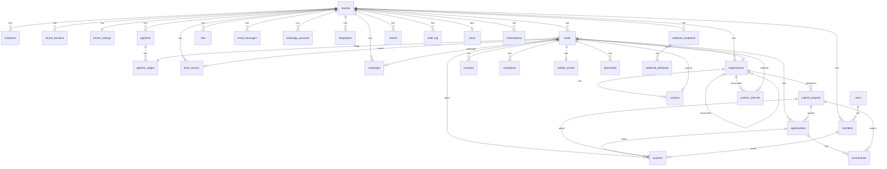

# Proposta B: hub multi-tenant desde o dia 1

> Uma das três propostas do painel de arquitetura. Lente: a Fase 2 (hub de captação vendável para outros consultores e produtoras) é o produto; a Prospekto é o primeiro tenant. Tudo o que for caro de mudar depois (identidade do tenant, isolamento de dados, roteamento por domínio, papéis e convites, filas, armazenamento) nasce no formato final já na primeira migração, e tudo o que for barato de adiar (cobrança, domínios próprios de clientes, WhatsApp automatizado, painel de administração) fica para a Fase 2 sem reescrita.
>
> Contexto de negócio em `docs/visao.md` (não repetido aqui); convenções de código em `docs/arquitetura/next16-convencoes.md`; estágios de pipeline, campos de lead e entidades em `docs/estrategia/personas-e-funis.md` (seções 8 e 9); site e formulários em `docs/site/estrutura-e-copy.md`; simulador em `docs/site/simulador-spec.md`. A Proposta A (`proposta-a-velocidade.md`) é a referência de comparação: onde esta proposta concorda com ela, diz "como na A" e não repete a justificativa; onde diverge, explica o custo da divergência.
>
> Versões, preços e documentação conferidos em 03/10/2026. O que não foi confirmado em fonte primária está marcado com [verificar]. Câmbio de referência: US$ 1 = R$ 5,21 (mesma fonte da Proposta A, seção 5).

## 1. Decisões em uma página

| Tema | Decisão | Por que não a alternativa |
|---|---|---|
| Framework | Next.js 16.3.8, React 19.3.0, Tailwind CSS 4.3.3, TypeScript (decisão dada) | |
| Forma do produto | Uma única aplicação Next.js que serve, pelo cabeçalho `Host`, o site público de cada tenant, o CRM (`app.<hub>/app/*`) e o painel da plataforma (`/admin`) | Duas aplicações (site e CRM) dobram projeto no Vercel, autenticação, deploy e variáveis; o modelo de multi-tenant do Vercel assume "one codebase and one deployment" (https://vercel.com/docs/platforms/multi-tenant-platforms) |
| Repositório | Monorepo pnpm 10 + Turborepo 2.11.7: `apps/web`, `packages/db`, `packages/domain`, `packages/emails`, `packages/ui`, `packages/config` | App única na raiz (A) obriga a extrair pacotes depois, quando o simulador ou o schema precisarem ser consumidos por um worker, por um SDK de parceiro ou por um segundo app; extrair com `exports` e `tsconfig` em uso é refatoração, não "mover uma pasta" |
| Banco | PostgreSQL no Neon (região São Paulo, `aws-sa-east-1`), uma base para todos os tenants, coluna `tenant_id` em toda tabela de negócio e Row Level Security como segunda barreira desde a migração 0 | Schema por tenant e banco por tenant multiplicam migrações e conexões e esbarram em 10 branches por projeto no Neon (seção 4.4); Supabase Free pausa após 1 semana sem uso e Pro custa US$ 25/mês antes do primeiro cliente (https://supabase.com/pricing) |
| Banco local e testes | `embedded-postgres` (binários reais do Postgres, sem Docker; testado neste ambiente em 03/10/2026, seção 4.2) | PGlite não aplica políticas de RLS (issues 138 e 274 do repositório `electric-sql/pglite`); um teste de isolamento que passa no PGlite não prova nada |
| ORM | Drizzle ORM 0.45.3 + drizzle-kit 0.31.11, com `pgRole`, `pgPolicy` e `enableRLS()` no schema | Prisma 7.10 não modela políticas nem roles e exige driver adapter e `prisma.config.ts` (A, seção 3.3); a tag `latest` do CLI `prisma` aponta para `8.0.0-rc.19` (registro npm, 03/10/2026); Kysely não gera migrações a partir do schema; Supabase amarra RLS ao JWT do Supabase Auth |
| Autenticação e organizações | Better Auth 1.7.7 com os plugins `organization` (tenant = organization, membros, convites, papéis) e `admin` (super-admin da plataforma, impersonação) desde o dia 1 | Auth.js v5 ainda `@beta` (A, seção 3.4); Clerk Pro custa US$ 25/mês e o add-on de Organizations para B2B US$ 100/mês (https://clerk.com/pricing); Supabase Auth prende ao Supabase |
| Domínios | Domínio do hub com wildcard (`*.<hub>`) no Vercel; `prospekto.com.br` é o primeiro "domínio personalizado" de tenant, adicionado pela API do Vercel (`@vercel/sdk`), exatamente como será para clientes da Fase 2 | Tratar `prospekto.com.br` como caso especial no código cria o segundo caminho de roteamento que a Fase 2 teria de remover |
| Hospedagem | Vercel Pro (US$ 20/assento/mês) a partir do primeiro formulário público; Hobby só durante a construção | Como na A (https://vercel.com/docs/plans/hobby proíbe uso comercial no Hobby); plano B Cloudflare Workers via OpenNext (A, seção 3.5) continua válido porque nada aqui depende de recurso exclusivo do Vercel além da API de domínios, que tem equivalente no Cloudflare for SaaS [verificar] |
| E-mail | Resend (free: 3.000/mês, 100/dia, 3 domínios; Pro US$ 20/mês com 10 domínios; https://resend.com/pricing). Templates em `packages/emails` (React Email). Um domínio de envio por tenant na Fase 2 | Como na A |
| WhatsApp | Fase 1: links `wa.me` com texto por página (como na A). Fase 2: API oficial da Meta (Cloud API), uma conta WhatsApp Business por tenant, webhooks em `/api/webhooks/whatsapp` | Z-API e similares são não oficiais e arriscam o número da Daniela (A, seção 3.7) |
| Filas e jobs | Inngest 4.21.1 (free: 50 mil execuções/mês, 5 passos concorrentes; https://www.inngest.com/pricing). Dev server local sem Docker (`npx inngest-cli@latest dev`). Integração com o Vercel injeta chaves e sincroniza a cada deploy | Cron do Vercel não tem retry, fan-out nem espera; no Hobby só roda uma vez por dia (https://vercel.com/docs/cron-jobs/usage-and-pricing). BullMQ exige Redis e um worker ligado. Trigger.dev (free: US$ 5 de créditos/mês; https://trigger.dev/pricing) roda o código fora do app, mais um ambiente para manter |
| Arquivos | Cloudflare R2 (10 GB-mês, 1 milhão de operações classe A e 10 milhões classe B grátis, egress zero; https://developers.cloudflare.com/r2/pricing/) via SDK S3, chaves prefixadas por tenant, URLs assinadas | Vercel Blob dá 1 GB no Hobby e no Pro é cobrado por uso (https://vercel.com/docs/vercel-blob/usage-and-pricing); decks de projetos (2,6 MB cada) e logos de 20 tenants passam de 1 GB rápido |
| Analytics | Site: Umami Cloud (Hobby grátis, sem cookies). Produto: tabela `events` própria, por tenant, sem dado pessoal | Como na A para o site; o hub precisa de métricas por tenant (leads por origem, conversão por estágio) que nenhuma ferramenta de terceiros entrega sem enviar dados pessoais |
| Auditoria | Tabela `audit_log` append-only escrita pela camada de repositório na mesma transação da mutação; `consents` e `contributions` também têm trigger de banco | Log só na aplicação perde escritas feitas por script ou migração |
| Backups | PITR do Neon (6 h no Free, 7 dias no Launch; https://neon.com/docs/introduction/plans) mais `pg_dump` diário por GitHub Actions para o R2 e exportação por tenant sob demanda | Só PITR: 6 horas no Free não cobre um erro descoberto no dia seguinte |
| Observabilidade | Sentry Developer (grátis; A, seção 3.12) com tag `tenant_id` em todo evento; logs estruturados (`pino`) com `tenantId` e `requestId`; logs do Vercel | |
| Testes | Vitest 5.0.3 (unidade em `packages/domain`; integração de repositórios e de RLS contra `embedded-postgres`) e Playwright 1.63 (formulário de lead em host de tenant; login e mudança de estágio no CRM) | |
| CI/CD | GitHub Actions (`turbo run lint typecheck test build` com cache remoto do Vercel) e deploy pela integração Git do Vercel; migrações aplicadas no `vercel-build` com a URL direta (não pooled) do Neon | |

Custo mensal: R$ 0 durante a construção; cerca de R$ 105/mês na operação da Fase 1 (só o Vercel Pro, igual à A); entre R$ 320 e R$ 800/mês com dez tenants na Fase 2 (seção 12).

## 2. O que a lente exige

1. O tenant é uma linha, não uma variável de ambiente. `DEFAULT_TENANT_SLUG` existe só para o ambiente local e para previews; em produção, todo request resolve o tenant pelo `Host`.
2. Duas barreiras de isolamento, sempre: a camada de repositório filtra por `tenant_id` e o Postgres recusa, por RLS, qualquer linha de outro tenant. A segunda barreira é o que permite dormir quando alguém esquecer um `where`.
3. O que varia por tenant fica em tabela, não em código: pipelines e estágios, origens de lead, textos e cores do site, remetente de e-mail, parâmetros de comissão, integrações. O código da Prospekto e o de um cliente da Fase 2 são o mesmo deploy.
4. Trabalho assíncrono é evento, não `setTimeout`: lead criado, estágio mudou, depósito confirmado, prazo vencendo. Cada evento carrega `tenantId` e os consumidores rodam dentro do contexto do tenant.
5. Tudo que a plataforma faz por um tenant (criar domínio, convidar usuário, exportar dados, apagar dados) é uma função chamável por API interna hoje e por painel de administração depois.
6. Nenhum serviço que precise de servidor ligado; dev local sem Docker; um dialeto de banco (Postgres) do teste à produção.

## 3. Topologia

```
                 prospekto.com.br  (domínio personalizado do tenant "prospekto")
                 <slug>.<hub>      (subdomínio de cada tenant; wildcard *.<hub>)
                 app.<hub>         (CRM de todos os tenants, /app/*; painel da plataforma, /admin/*)
                        |
                        v
   +--------------------------------------------------------------+
   |  Vercel (1 projeto, Next.js 16)                               |
   |  src/proxy.ts: Host -> tenant (cache em memória + tenant_domains)
   |  /sites/[tenant]/*  (público, cache por tag tenant:<id>)      |
   |  /app/*             (CRM, sessão Better Auth, activeOrganizationId = tenant)
   |  /admin/*           (super-admin, plugin admin, conexão owner)|
   |  /api/inngest       /api/webhooks/*   /api/auth/[...all]      |
   +----------+-----------------+----------------+----------------+
              |                 |                |
              v                 v                v
     Neon Postgres (SP)     Inngest (jobs)     R2 (arquivos)
     RLS por tenant_id      eventos com        tenants/<id>/...
     role app_user          tenantId           URLs assinadas
              |
              +--> Resend (e-mail, domínio por tenant)   Meta Cloud API (WhatsApp, Fase 2)
              +--> Sentry (tag tenant_id)   Umami (site)   pg_dump diário -> R2
```

## 4. Stack decidida, item a item

### 4.1 Next.js 16: uma aplicação, três superfícies

Segue `docs/arquitetura/next16-convencoes.md` (App Router, `src/`, `proxy.ts`, Server Actions com Zod). A árvore de rotas separa as três superfícies por caminho, e o `proxy.ts` decide qual delas um host pode alcançar:

| Superfície | Caminho interno | Host em produção | Observação |
|---|---|---|---|
| Site público do tenant | `src/app/sites/[tenant]/...` | `prospekto.com.br`, `<slug>.<hub>` | O proxy reescreve `/empresas` para `/sites/prospekto/empresas`; o visitante nunca vê `/sites/` |
| CRM | `src/app/(app)/app/...` | `app.<hub>` | Sessão Better Auth; `activeOrganizationId` é o tenant ativo |
| Plataforma | `src/app/(admin)/admin/...` | `app.<hub>` | Só usuários com `role = admin` do plugin `admin`; usa a conexão owner (sem RLS) |
| Autenticação | `src/app/(auth)/entrar`, `convite/[id]` | `app.<hub>` | |
| API | `src/app/api/...` | todos | `auth`, `inngest`, `webhooks`, `downloads`, `health` |

Páginas públicas usam `cacheComponents` com `cacheTag('tenant:<id>')` e `cacheLife('hours')`; uma edição de conteúdo no CRM chama `updateTag('tenant:<id>')` (convenções da seção "Cache" de `next16-convencoes.md`). O CRM é dinâmico por natureza.

shadcn/ui vive em `packages/ui` e é usado pelo CRM e pelo site; o site público do tenant usa só os primitivos (botão, campo, caixa de seleção) para não carregar o tema do CRM.

### 4.2 Banco: Neon em produção, Postgres embutido no desenvolvimento

Produção e previews: Neon, plano Free durante a construção (1 GB por projeto, 100 CU-horas por projeto por mês, 10 branches, scale-to-zero obrigatório após 5 minutos, restore de 6 horas; https://neon.com/pricing e https://neon.com/docs/introduction/plans), região South America (São Paulo), `aws-sa-east-1`, disponível para Postgres em todos os planos (https://neon.com/docs/introduction/regions). Integração pelo Vercel Marketplace, que injeta `DATABASE_URL` (pooled) e `DATABASE_URL_UNPOOLED` e cria um branch por preview (A, seção 3.2). Versão do Postgres: Neon suporta 14 a 18 e a escolha é feita ao criar o projeto (https://neon.com/docs/postgresql/postgres-version-policy); fixar 17 e usar a mesma major localmente.

Quando subir para Launch: no primeiro cliente pago da Fase 2, ou antes se o cold start de 5 minutos incomodar a Daniela no CRM. Launch é pay-as-you-go sem mínimo mensal (US$ 0,106/CU-hora, US$ 0,35/GB-mês, restore de até 7 dias; https://neon.com/pricing).

Local e testes: `embedded-postgres` (pacote npm que baixa binários do Postgres como dependências opcionais por plataforma; Linux x64 e arm64, macOS, Windows; versões 14.23 a 18.4; https://github.com/leinelissen/embedded-postgres). Fixar a versão `17.10.0-beta.17` (o sufixo `beta` é do pacote npm; o binário é o Postgres 17.10). Teste feito em 03/10/2026 neste ambiente de desenvolvimento em nuvem, sem Docker, com a versão `18.4.0-beta.17`: `initialise()` + `start()` subiram o servidor, uma política de RLS com `current_setting('app.tenant_id', true)` deixou o papel `app_user` ver 1 de 2 linhas e o superusuário ver as 2. Duas condições para funcionar aqui: o processo roda como `root`, então a opção `createPostgresUser: true` é obrigatória (o `initdb` recusa rodar como root; o pacote cria o usuário de sistema `postgres`), e o diretório de dados precisa ser legível por esse usuário (falhou em `/root` e no scratchpad, funcionou em `/opt`); no monorepo o diretório é `.postgres/` na raiz com `chmod 755`. Os binários ocupam cerca de 60 MB em `node_modules`.

Por que não PGlite (escolha da A): o PGlite roda com uma única conexão de superusuário e não aplica políticas de RLS (https://github.com/electric-sql/pglite/issues/274, fechada sem correção, referenciando a 138). Um banco local que ignora a segunda barreira faz o teste de isolamento mentir. O PGlite continua útil para testes de unidade muito rápidos de `packages/domain` que não tocam o banco, mas aí não precisa de banco nenhum.

Por que não SQLite, Turso ou Supabase: como na A, seção 3.2.

### 4.3 ORM: Drizzle com políticas no schema

Mesmas razões da A (sem geração de cliente, driver `pg`, Better Auth gera o schema de autenticação em Drizzle), mais a que importa aqui: o Drizzle modela `pgRole`, `pgPolicy` e `enableRLS()` no próprio schema, e o `drizzle-kit generate` emite o `CREATE POLICY` na migração (https://orm.drizzle.team/docs/rls). A política de isolamento é uma função reutilizada por toda tabela de negócio:

```ts
// packages/db/src/schema/_tenancy.ts
import { sql } from "drizzle-orm";
import { pgPolicy, pgRole, text, type PgTableWithColumns } from "drizzle-orm/pg-core";
import { tenants } from "./tenants";

// Papel de aplicação. `.existing()` porque é criado uma vez, por SQL, fora das migrações (seção 4.4).
export const appUser = pgRole("app_user").existing();

export const tenantId = () =>
  text("tenant_id").notNull().references(() => tenants.id, { onDelete: "restrict" });

const currentTenant = sql`current_setting('app.tenant_id', true)`;

export const tenantIsolation = (table: string) =>
  pgPolicy(`${table}_tenant_isolation`, {
    for: "all",
    to: appUser,
    using: sql`tenant_id = ${currentTenant}`,
    withCheck: sql`tenant_id = ${currentTenant}`,
  });
```

```ts
// packages/db/src/schema/leads.ts (trecho)
export const leads = pgTable(
  "leads",
  { id: text("id").primaryKey(), tenantId: tenantId(), /* ... seção 6 */ },
  (t) => [
    uniqueIndex("leads_tenant_email_segment_uq").on(t.tenantId, t.email, t.segment),
    index("leads_tenant_stage_idx").on(t.tenantId, t.stageId),
    tenantIsolation("leads"),
  ],
).enableRLS();
```

`current_setting(name, true)` devolve NULL em vez de erro quando a variável não foi definida (https://www.postgresql.org/docs/current/functions-admin.html); `tenant_id = NULL` é falso, então uma transação sem contexto não vê linha nenhuma. Nomes com ponto (`app.tenant_id`) são "customized options", aceitos pelo Postgres sem extensão (https://www.postgresql.org/docs/current/runtime-config-custom.html).

Drizzle 1.0 está em `rc.4`/`beta.22` e muda a API (`withRLS()` em vez de `enableRLS()`, entre outros); fixar 0.45.x e migrar na Fase 2 com os testes de repositório como rede [verificar diferenças da API de RLS entre 0.45 e 1.0 antes de migrar].

### 4.4 Isolamento de tenants: coluna + RLS + dois papéis de banco

Escolha: uma base, `tenant_id` em toda tabela de negócio, RLS ativa, dois papéis de banco.

| Papel | Quem usa | Como se conecta | O que vê |
|---|---|---|---|
| Owner (o papel criado pelo Neon na integração, membro de `neon_superuser`) | Migrações (`vercel-build`), `/admin/*`, jobs que percorrem todos os tenants, backups | `DATABASE_URL_UNPOOLED` para DDL; pool separado `DATABASE_URL_ADMIN` (pooled) para leitura administrativa | Tudo: `neon_superuser` tem `BYPASSRLS` (https://neon.com/docs/manage/roles) |
| `app_user` | Site público, CRM, Server Actions, consumidores de eventos | `DATABASE_URL` (pooled), por transação com `set_config('app.tenant_id', ..., true)` | Só as linhas do tenant da transação |

Armadilha verificada: "roles created in the Neon Console, API, and CLI are granted membership in the neon_superuser role", e `neon_superuser` tem `BYPASSRLS`. O `app_user` precisa ser criado por SQL (`CREATE ROLE app_user WITH LOGIN PASSWORD '...'`), que "are only granted the basic public schema privileges" (https://neon.com/docs/manage/roles). O script `packages/db/src/bootstrap.ts` faz isso e os `GRANT` de DML, e roda uma vez por branch (idempotente). Localmente, o `embedded-postgres` sobe como superusuário e o mesmo script cria o `app_user`.

O helper que toda consulta de negócio atravessa:

```ts
// packages/db/src/tenant.ts
import { sql } from "drizzle-orm";
import { db } from "./client"; // pool conectado como app_user

export type TenantContext = { tenantId: string; userId?: string };

export async function withTenant<T>(ctx: TenantContext, fn: (tx: Tx) => Promise<T>): Promise<T> {
  return db.transaction(async (tx) => {
    // is_local = true: vale só até o COMMIT; sob PgBouncer em modo transação a conexão
    // fica presa ao cliente durante a transação, então a variável não vaza para outro tenant.
    await tx.execute(sql`select set_config('app.tenant_id', ${ctx.tenantId}, true)`);
    return fn(tx);
  });
}
export type Tx = Parameters<Parameters<typeof db.transaction>[0]>[0];
```

`set_config(..., true)` aplica "only during the current transaction" (https://www.postgresql.org/docs/current/functions-admin.html). O pooler do Neon não suporta `SET`/`RESET` de sessão porque "connections are returned to the pool after each transaction completes" (https://neon.com/docs/connect/connection-pooling); é exatamente por isso que o contexto é por transação e nunca por sessão. Para DDL, a mesma página recomenda conexão direta.

Tabelas sem RLS (camada de plataforma): `users`, `sessions`, `accounts`, `verifications`, `tenants`, `members`, `invitations`, `tenant_domains`, `plans`, `subscriptions`, `audit_log` (esta última só com `INSERT` para `app_user`). O Better Auth precisa ler `users` e `members` antes de existir um tenant ativo; a proteção dessas tabelas é a própria API do Better Auth e o módulo `src/lib/tenancy`, únicos que as consultam. Tudo o mais tem `tenant_id` e política.

Alternativas descartadas:

| Opção | Por que não |
|---|---|
| Schema por tenant | `drizzle-kit` gera uma migração por schema; 20 tenants são 20 execuções por deploy; `search_path` por sessão não sobrevive ao pooler em modo transação; Better Auth e Inngest não conhecem schema dinâmico |
| Banco por tenant | O Neon limita a 10 branches por projeto no Free e no Launch e cobra US$ 1,50 por branch extra (https://neon.com/pricing); 100 projetos por conta é mais operação do que o produto justifica; backup, migração e observabilidade multiplicados por N |
| Só coluna, sem RLS (A) | Uma consulta sem `where tenant_id` vaza dados no dia 1 da Fase 2; a A reconhece o risco e adia a RLS; aqui ela custa um helper e um script de bootstrap |

Teste que prova a barreira (roda em CI contra o `embedded-postgres`): cria dois tenants, insere um lead em cada via `withTenant`, consulta `select * from leads` sem `where` dentro de `withTenant(a)` e exige exatamente 1 linha; tenta `update leads set name = ...` apontando para o id do tenant B e exige 0 linhas afetadas; tenta `insert` com `tenant_id` de B dentro do contexto de A e exige erro de `with check`.

### 4.5 Autenticação, organizações e convites: Better Auth

Better Auth 1.7.7 (CLI atual: pacote `auth`, `npx auth@latest generate`; A, seção 3.4) com dois plugins desde o dia 1:

- `organization`: cria as tabelas `organization`, `member`, `invitation` (e opcionalmente `team`, `teamMember`) e os campos `activeOrganizationId` e `activeTeamId` na sessão; papéis padrão `owner`, `admin`, `member`; `createAccessControl` para papéis próprios; `sendInvitationEmail` obrigatório; convites expiram em 48 h por padrão; `organizationLimit` e `allowUserToCreateOrganization` controlam quem cria organizações; `organizationHooks` (`afterCreateOrganization`) semeia pipelines e configurações; o modelo pode ser renomeado por `schema.organization.modelName` e estendido por `additionalFields` (https://www.better-auth.com/docs/plugins/organization).
- `admin`: papel `admin` global, listar e criar usuários, banir, revogar sessões e impersonar ("create a session that mimics the specified user", 1 h por padrão; https://www.better-auth.com/docs/plugins/admin). É o painel da plataforma na Fase 2 e, na Fase 1, o jeito de o Rafael entrar como a Daniela para reproduzir um problema, com registro em `audit_log`.

Decisão de modelagem: a organização do Better Auth é a tabela `tenants`. `schema.organization.modelName = "tenants"`, `member` vira `members`, `invitation` vira `invitations`. Campos extras do tenant (`plan`, `status`, `locale`, `timezone`, `whatsapp_number`) entram por `additionalFields`; configurações volumosas ficam em `tenant_settings`.

```ts
// apps/web/src/lib/auth.ts
import { betterAuth } from "better-auth";
import { drizzleAdapter } from "better-auth/adapters/drizzle";
import { nextCookies } from "better-auth/next-js";
import { admin, organization } from "better-auth/plugins";
import { adminDb, schema } from "@prospekto/db";
import { ac, roles } from "@prospekto/domain/access-control";
import { sendInvitationEmail } from "@prospekto/emails";

export const auth = betterAuth({
  database: drizzleAdapter(adminDb, { provider: "pg", schema }), // conexão owner: auth é plataforma
  emailAndPassword: { enabled: true, disableSignUp: true, minPasswordLength: 12 },
  plugins: [
    organization({
      ac,
      roles, // owner, admin, operator, viewer (seção 6.1)
      allowUserToCreateOrganization: false, // tenants são criados pelo /admin ou pelo onboarding da Fase 2
      schema: {
        organization: {
          modelName: "tenants",
          additionalFields: {
            plan: { type: "string", required: false, input: false },
            status: { type: "string", required: false, input: false },
            locale: { type: "string", required: false, input: false },
            timezone: { type: "string", required: false, input: false },
          },
        },
        member: { modelName: "members" },
        invitation: { modelName: "invitations" },
      },
      sendInvitationEmail,
      organizationHooks: {
        afterCreateOrganization: async ({ organization }) => {
          await seedTenantDefaults(organization.id); // pipelines, estágios, origens, settings
        },
      },
    }),
    admin(),
    nextCookies(),
  ],
  databaseHooks: {
    session: {
      create: {
        before: async (session) => {
          const first = await firstMembership(session.userId);
          return { data: { ...session, activeOrganizationId: first?.organizationId ?? null } };
        },
      },
    },
  },
  advanced: { useSecureCookies: true },
});
```

Cookies e domínios: o CRM vive em um único host (`app.<hub>`), então o cookie de sessão é host-only, sem atributo `Domain`, com prefixo `__Host-`, `Secure`, `HttpOnly`, `Path=/`. É a recomendação do Vercel para plataformas cujos tenants têm subdomínios no mesmo apex, enquanto o domínio não entra na Public Suffix List (https://vercel.com/docs/platforms/multi-tenant-platforms/configuring-domains). `crossSubDomainCookies` do Better Auth (https://www.better-auth.com/docs/concepts/cookies) fica desligado de propósito: os sites públicos dos tenants não têm sessão. Se um dia o CRM for servido no domínio do próprio cliente (`crm.clientedaniela.com.br`), isso é um segundo host do Better Auth (`trustedOrigins`) e uma sessão separada, não um cookie compartilhado.

Fluxo de convite: owner do tenant abre `/app/configuracoes/equipe`, informa e-mail e papel; `auth.api.createInvitation` grava e `sendInvitationEmail` manda, pelo Resend, o link `app.<hub>/convite/<id>`; o convidado cria a conta (o `disableSignUp` é contornado só nessa rota, validando o convite antes) e `acceptInvitation` cria o `member`. Na Fase 1 isso serve para o sócio e para a Daniela; na Fase 2 serve para cada cliente convidar a própria equipe sem o Rafael.

### 4.6 Domínios por tenant

Três tipos de host, um só mecanismo:

| Host | Como entra | Certificado | Fase |
|---|---|---|---|
| `<slug>.<hub>` | Automático: existe assim que o tenant é criado (wildcard) | Um certificado wildcard para `*.<hub>` (https://vercel.com/docs/platforms/multi-tenant-platforms/configuring-domains) | 1 (o tenant `prospekto` ganha `prospekto.<hub>` como endereço de staging) |
| Domínio personalizado (`prospekto.com.br`, `www.prospekto.com.br`) | `projectsAddProjectDomain` do `@vercel/sdk`; estado em `tenant_domains`; job do Inngest consulta `projectsVerifyProjectDomain` até verificar | Um por domínio, emitido pelo Vercel após verificação | 1 (é o domínio da Prospekto; o cliente da Fase 2 usa o mesmo botão) |
| `app.<hub>` | Fixo, no projeto | Coberto pelo wildcard | 1 |

Pré-requisito de DNS para o wildcard: o Vercel precisa responder ao desafio DNS do certificado wildcard, o que exige os nameservers do Vercel (`ns1.vercel-dns.com`, `ns2.vercel-dns.com`) no domínio do hub ou a delegação do `_acme-challenge` quando o DNS fica em outro provedor (https://vercel.com/docs/platforms/multi-tenant-platforms/limits e a página de configuração de domínios). Por isso o hub não deve ser o apex `prospekto.com.br`: mover os nameservers do domínio principal mexe no e-mail da empresa (pergunta 4 de `docs/visao.md`). Duas opções, decisão do Rafael e do sócio: (a) delegar só a zona `hub.prospekto.com.br` aos nameservers do Vercel com registros NS no DNS atual (sem custo; endereços ficam `app.hub.prospekto.com.br` e `<slug>.hub.prospekto.com.br`) [verificar se o provedor de DNS atual aceita delegação de subzona]; (b) registrar um domínio curto para o hub [verificar nome e custo]. O código não muda entre as duas: `HUB_DOMAIN` é variável de ambiente.

Limites: Hobby aceita 50 domínios por projeto; Pro, ilimitados com soft limit de 100 mil; a API aceita 100 adições de domínio por hora por time (https://vercel.com/docs/platforms/multi-tenant-platforms/limits). Preview URLs por tenant só existem no Enterprise; o fallback para previews está na seção 7.

Public Suffix List: só se tenants puderem publicar código ou cookies em `<slug>.<hub>`. Aqui os sites de tenant são renderizados pela plataforma e não definem cookies; o CRM está em host próprio com cookie `__Host-`. Submeter o hub à PSL fica como item da Fase 2 quando houver conteúdo de terceiros [verificar necessidade com o advogado e os critérios da PSL].

### 4.7 Hospedagem

Como na A, seção 3.5: Vercel, Hobby na construção, Pro (US$ 20/assento/mês, https://vercel.com/pricing) no dia em que o primeiro formulário público for publicado. Um único projeto no Vercel com Root Directory `apps/web`; o Vercel detecta Turborepo e usa `turbo build` com o filtro inferido pelo diretório raiz, e o Ignored Build Step `npx turbo-ignore --fallback=HEAD^1` evita builds quando só `docs/` mudou (https://vercel.com/docs/monorepos/turborepo). Cache remoto do Turborepo é automático no Vercel.

Node.js: `engines.node >= 22.12` (Vitest 5 exige 22.12+; A, seção 3.5). Região das funções: `gru1` [verificar disponibilidade no Pro]; o banco já está em São Paulo.

### 4.8 E-mail

Resend, como na A (seção 3.6), com duas diferenças de estrutura:

- Templates em `packages/emails` com React Email (`@react-email/components` 1.0.12), um por evento (`lead-welcome`, `guide-download`, `invitation`, `stage-sla-overdue`, `contribution-receipt`), recebendo `tenant` como prop para nome, logotipo, cidade do rodapé e remetente.
- Remetente por tenant: Fase 1, `Daniela Sandrin Copat · Prospekto <projetos@prospekto.com.br>` ou subdomínio `envio.prospekto.com.br` [verificar com quem administra o DNS, como na A]. Fase 2, cada tenant verifica o próprio domínio no Resend pela API de domínios (campo `tenant_settings.email.domain_id`), ou usa `<slug>.envio.<hub>` enquanto não verifica. O Free tem 3 domínios; o Pro, 10 (https://resend.com/pricing): o upgrade acontece no quarto tenant com domínio próprio, não antes.

Webhooks do Resend (`/api/webhooks/resend`): bounce e reclamação viram `email_messages.status` e `consents` (revogação de marketing), por tenant.

### 4.9 WhatsApp

Fase 1: botão `https://wa.me/5554984032180?text=...` por página e segmento, como na A (seção 3.7). O número é o que já consta no guia da Prospekto; fica em `tenant_settings.whatsapp.number`, não em código. O CRM gera o link "Abrir WhatsApp" com mensagem pré-preenchida por estágio (`docs/site/estrutura-e-copy.md`, seção 10.1).

Fase 2: WhatsApp Business Platform (Cloud API) da Meta, uma conta WhatsApp Business (WABA) por tenant, conectada pelo Embedded Signup [verificar requisitos de Tech Provider para conectar WABAs de terceiros]. Modelo de cobrança da Meta: por mensagem entregue, desde 01/07/2025, em quatro categorias; mensagens de serviço (resposta dentro da janela de 24 h) são gratuitas; utilidade dentro da janela também; empresas brasileiras elegíveis podem ser cobradas em BRL desde 01/07/2026, com nova tabela em 01/10/2026 (https://developers.facebook.com/docs/whatsapp/pricing). Valores por mensagem no Brasil citados por fontes secundárias: cerca de US$ 0,0625 por mensagem de marketing e US$ 0,0068 por mensagem de utilidade [verificar na tabela oficial, que exige download no site da Meta].

O que se constrói agora para não reescrever depois: `whatsapp_accounts` (por tenant, com `phone_number_id`, `waba_id`, tokens criptografados, status), `messages` com `channel = 'whatsapp'` e `template_name`, rota `/api/webhooks/whatsapp` que valida assinatura e publica evento `whatsapp/message.received` no Inngest. Na Fase 1 a tabela fica vazia e o botão `wa.me` registra uma `activity` do tipo `whatsapp` com `direction = 'outbound_manual'`.

### 4.10 Filas, eventos e jobs: Inngest

Inngest 4.21.1: cliente em `apps/web/src/inngest/client.ts`, funções em `apps/web/src/inngest/functions/*`, rota `src/app/api/inngest/route.ts` com `serve({ client, functions })` exportando `GET`, `POST` e `PUT` (https://www.inngest.com/docs/getting-started/nextjs-quick-start). A integração do Vercel Marketplace define `INNGEST_SIGNING_KEY` e `INNGEST_EVENT_KEY` e sincroniza o app a cada deploy, com branch environments para previews (https://www.inngest.com/docs/deploy/vercel). Local: `npx inngest-cli@latest dev` (UI em `localhost:8288`), sem Docker.

Plano Free: 50 mil execuções/mês, 5 passos concorrentes, 5 assentos, 24 h de histórico; Pro a partir de US$ 99/mês (https://www.inngest.com/pricing). Conta de ordem de grandeza: 40 leads/mês (`personas-e-funis.md`, seção 10) geram, com 5 passos por lead e varreduras diárias, algumas centenas de execuções; dez tenants na Fase 2 ficam na casa dos milhares. O Free dura até o hub ter dezenas de clientes.

Convenção: todo evento tem `data.tenantId`; toda função abre `withTenant({ tenantId })` no primeiro passo; funções de plataforma (varredura de SLAs, backups, verificação de domínios) listam tenants pela conexão owner e fazem fan-out de um evento por tenant (`step.sendEvent`).

| Evento | Produtor | Consumidores (funções) | Fase |
|---|---|---|---|
| `lead/created` | Server Action do formulário | Pontuar (`score`), notificar operador por e-mail, enviar guia ou resultado do simulador, criar atividade "primeiro contato" com `next_action_at` pelo SLA do estágio | 1 |
| `lead/stage.changed` | Server Action do CRM | Validar campos obrigatórios do estágio, registrar `audit_log`, recalcular `next_action_at`, disparar sequência de e-mail do estágio quando houver `consent_marketing` | 1 |
| `contribution/deposited` | Server Action | Atualizar `raised_amount_cents` do projeto, abrir tarefa de recibo com prazo, avisar contador do patrocinador | 1 |
| `platform/daily` (cron do Inngest) | Agenda | Fan-out `tenant/daily` por tenant | 1 |
| `tenant/daily` | Fan-out | Atividades vencidas, projetos com menos de 6 meses de prazo ou abaixo de 10% captado (`personas-e-funis.md`, seção 8.4), limpeza de `form_attempts`, resumo de sexta-feira | 1 |
| `tenant/domain.added` | Server Action ou `/admin` | Adicionar no Vercel, consultar verificação a cada 10 min por até 48 h, marcar `active` ou `failed` | 1 (usado pelo próprio `prospekto.com.br`) |
| `webhook/deliver` | Qualquer mutação com assinatura ativa | Entregar a `webhook_endpoints` do tenant com retry exponencial, registrar `webhook_deliveries` | 2 (tabelas na 1) |
| `tenant/export.requested`, `tenant/erasure.requested` | `/app/configuracoes/dados` ou `/admin` | Exportar JSON/CSV do tenant para o R2 com URL assinada; apagar ou anonimizar titular (LGPD, art. 18) | 1 (exportação), 2 (fluxo completo) |
| `platform/backup.nightly` | Agenda | Dispara o workflow do GitHub Actions (`workflow_dispatch`) ou roda `pg_dump` em função com tempo estendido [verificar limite de duração de função no Pro] | 1 |

Cron do Vercel não é usado: no Hobby só roda uma vez por dia com precisão de hora e, em qualquer plano, não tem retry nem fan-out (https://vercel.com/docs/cron-jobs/usage-and-pricing). Se o Inngest sair da equação, o plano B é tabela `outbox` processada por cron do Pro a cada minuto, sem mudar os produtores de eventos (eles chamam `events.publish(...)`, uma função nossa que hoje delega ao Inngest).

### 4.11 Arquivos: Cloudflare R2

R2 com o SDK S3 (`@aws-sdk/client-s3`): bucket `prospekto-hub`, chaves `tenants/<tenantId>/<kind>/<fileId>`, upload por URL pré-assinada gerada em Server Action (o arquivo não passa pela função), download por URL assinada com validade curta. Tabela `files` registra dono, tamanho, tipo, hash e finalidade. Free: 10 GB-mês, 1 milhão de operações classe A e 10 milhões classe B por mês, egress gratuito; depois, US$ 0,015/GB-mês (https://developers.cloudflare.com/r2/pricing/).

Usos na Fase 1: guia "Contabilizando Cultura" (798 KB) e apresentação (2,6 MB) servidos por `/api/downloads/[token]` após consentimento, como na A, só que lidos do R2 em vez de `src/assets/`; decks de projetos da carteira; logotipo do tenant. Fase 2: anexos de termos e recibos, exportações de dados, backups.

Por que não Vercel Blob: 1 GB e 10 GB de transferência incluídos no Hobby; no Pro tudo é por uso, com custo de transferência e de operações (https://vercel.com/docs/vercel-blob/usage-and-pricing). O R2 custa mais um painel, mas zero egress é o que importa quando cada visitante baixa um deck de 2,6 MB.

### 4.12 Analytics

Site: Umami Cloud, como na A (Hobby grátis, sem cookies; limites citados por fontes secundárias de 100 mil eventos/mês, 1 site e 6 meses de retenção [verificar na página oficial, que não respondeu à consulta automática]). Na Fase 2 cada tenant precisa de um `website_id` próprio, o que leva ao plano pago do Umami ou a um Umami auto-hospedado (é MIT) sobre o mesmo Neon [verificar custo e esforço]. `tenant_settings.analytics.umami_website_id` já existe para não hardcodar.

Produto: tabela `events` por tenant (`name`, `properties` jsonb sem dado pessoal, `lead_id` opcional, `occurred_at`), escrita pelas Server Actions e pelos consumidores de eventos. Alimenta os painéis do CRM (leads por origem, conversão por estágio, KPIs da seção 10 de `personas-e-funis.md`) e, na Fase 2, o painel da plataforma. Nunca enviar nome, e-mail, telefone ou valores exatos a terceiros (`docs/site/estrutura-e-copy.md`, seção 9.1).

### 4.13 Auditoria

`audit_log` (`tenant_id`, `actor_user_id`, `actor_type` em `user`, `system`, `admin_impersonating`, `entity`, `entity_id`, `action`, `before` e `after` em jsonb, `request_id`, `ip_hash`, `at`), append-only (`app_user` só tem `INSERT`). A camada de repositório escreve na mesma transação da mutação; `consents` e `contributions` têm também trigger `AFTER INSERT OR UPDATE` que grava no log, para cobrir escrita por script. Impersonação do plugin `admin` registra `actor_type = admin_impersonating` com o id do administrador (`session.impersonatedBy`).

Retenção: 5 anos para `contributions` e `consents` (guarda exigida ao projeto, `docs/site/estrutura-e-copy.md`, seção 5.7), 24 meses para o resto [verificar com o advogado, como na política de privacidade].

### 4.14 Backups e portabilidade

| Camada | O quê | Fonte |
|---|---|---|
| PITR do Neon | 6 h no Free; até 7 dias no Launch (US$ 0,20/GB-mês de histórico); até 30 dias no Scale | https://neon.com/docs/introduction/plans |
| Dump diário | GitHub Actions agendado roda `pg_dump` (URL direta) e envia para `backups/<data>.sql.gz` no R2; retenção de 30 diários e 12 mensais; restauração testada uma vez por trimestre em um branch do Neon | Minutos grátis do Actions em repositório privado (A, seção 3.11) |
| Exportação por tenant | Job `tenant/export.requested`: JSON e CSV de todas as tabelas filtradas por `tenant_id`, mais os arquivos do prefixo no R2, zipado no R2 com URL assinada de 7 dias | Portabilidade (LGPD, art. 18, V, via `personas-e-funis.md`, seção 9.1) e saída de cliente na Fase 2 |

### 4.15 Observabilidade

- Sentry Developer (grátis; A, seção 3.12), instalado pelo wizard, com `Sentry.setTag("tenant_id", ...)` no `proxy.ts` e nas Server Actions e `scope.setUser({ id })` sem e-mail.
- Logs estruturados com `pino` 10.4 em JSON, campos fixos `tenantId`, `userId`, `requestId` (gerado no proxy e propagado por header `x-request-id`), lidos nos logs do Vercel (1 dia de retenção no Pro; A).
- Rota `/api/health` que verifica banco (`select 1` como `app_user`) e versão do deploy; `/admin/status` mostra, por tenant, último lead, último job e último e-mail entregue.
- OpenTelemetry (`@vercel/otel` 2.1.3) só quando houver para onde mandar os traces; não na Fase 1.

### 4.16 Testes

| Camada | Ferramenta | O que cobre | Onde roda |
|---|---|---|---|
| Unidade | Vitest 5.0.3 | `packages/domain`: simulador (`simulate(input, params)` contra os exemplos de `parametros-simulador.json`), regras de comissão (10% e R$ 150 mil, IN MinC 29/2026, art. 19, via `docs/dominio/leis-de-incentivo.md`), score, SLAs, schemas Zod | local e CI, sem banco |
| Integração | Vitest + `embedded-postgres` | Repositórios com `withTenant`; teste dos dois tenants (seção 4.4); migrações aplicadas do zero; seed | local e CI (binário baixado pelo npm; cache do `node_modules`) |
| Ponta a ponta | Playwright 1.63 | (1) `prospekto.localhost:3000/empresas`: envia formulário com chave de teste do Turnstile e vê a página de obrigado; (2) `app.localhost:3000/entrar`: login, abre lead, muda de estágio com campo obrigatório | CI, contra `next build && next start` com `embedded-postgres` |
| Isolamento de rota | Vitest | `proxy.ts` com `Host` de tenant tentando `/app/leads` recebe redirecionamento; host desconhecido em produção recebe 404 | local e CI |

### 4.17 CI/CD

GitHub Actions, um workflow em PR e em `main`: `pnpm install --frozen-lockfile`, `turbo run lint typecheck test build` com cache remoto do Vercel (token `TURBO_TOKEN` e `TURBO_TEAM`; https://vercel.com/docs/monorepos/turborepo), Playwright só em `main` e em PR com rótulo `e2e`. Deploy pela integração Git do Vercel; o `vercel-build` de `apps/web` roda `pnpm --filter @prospekto/db migrate` com `DATABASE_URL_UNPOOLED` e depois `next build`. Preview deployments recebem branch do Neon (A, seção 3.2) e branch environment do Inngest.

## 5. Estrutura do repositório

```
prospekto/
  docs/                         (como está)
  apps/
    web/                        Next.js 16: sites de tenant, CRM, admin, API
      src/app/sites/[tenant]/   site público (home, empresas, contadores, pessoa-fisica, municipios, proponentes, mentoria, simulador, guia, privacidade, obrigado)
      src/app/(app)/app/        CRM (painel, leads, organizacoes, projetos, aportes, atividades, campanhas, configuracoes)
      src/app/(admin)/admin/    plataforma (tenants, dominios, usuarios, status)
      src/app/(auth)/           entrar, convite/[id], redefinir-senha
      src/app/api/              auth/[...all], inngest, webhooks/{resend,whatsapp,vercel}, downloads/[token], health
      src/proxy.ts              resolução de tenant por Host (seção 7)
      src/lib/tenancy/          resolveTenant, requireTenant, cache de hosts
      src/lib/auth.ts, auth-client.ts
      src/actions/              Server Actions (lead, simulação, estágio, atividade, aporte, projeto, domínio, equipe)
      src/inngest/              client.ts, functions/*
      src/env.ts                t3-env + Zod
  packages/
    db/                         Drizzle: schema, migrações, políticas, client (app_user e owner), withTenant, seed, bootstrap, migrate
    domain/                     puro, sem Next e sem banco: simulador, comissão, score, SLAs, enums de estágios, access-control (papéis)
    emails/                     React Email: templates e função send() sobre o Resend
    ui/                         shadcn/ui gerado aqui; componentes compartilhados (formulários de lead, tabela, kanban)
    config/                     tsconfig base, eslint flat config, tailwind preset
  turbo.json
  pnpm-workspace.yaml
  package.json                  scripts de raiz: dev, build, lint, typecheck, test, db:*
  .github/workflows/ci.yml, backup.yml
```

Justificativa, pacote a pacote:

| Pacote | Por que existe já na Fase 1 | O que aconteceria sem ele |
|---|---|---|
| `packages/domain` | O simulador e as regras de comissão são a propriedade intelectual do hub; na Fase 2 viram SDK para parceiros (contadores com simulação de carteira) e rodam também em jobs | Importar `apps/web/src/lib/simulador` de um worker ou de um pacote publicado exige mover e reconfigurar `tsconfig`, `exports` e testes |
| `packages/db` | Schema, políticas e `withTenant` são usados pelo app, pelos jobs, pelos scripts de backup e exportação e pelos testes | Scripts fora do app importando `src/` do Next funcionam até o primeiro `server-only` |
| `packages/emails` | React Email tem CLI própria de preview (`react-email dev`) e seus templates não dependem do Next | Preview dentro do app ou nenhum preview |
| `packages/ui` | shadcn/ui em monorepo é o fluxo documentado pela própria CLI (`components.json` por pacote); o site do hub (Fase 2) reaproveita | Copiar componentes entre apps |
| `packages/config` | Um `tsconfig.base.json`, um `eslint.config.mjs`, um preset do Tailwind | Três cópias divergentes em seis meses |
| `apps/site` (não criado) | Site de marketing do próprio hub ("venda o hub para consultores"), Fase 2; é um segundo deploy porque tem ritmo e SEO próprios | Nada hoje; criar quando a Fase 2 tiver página de vendas |

Turbopack transpila pacotes de workspace automaticamente; `transpilePackages` só seria necessário para dependência em `node_modules` que envie TypeScript cru (https://nextjs.org/docs/app/api-reference/config/next-config-js/transpilePackages). Os pacotes internos exportam `src/index.ts` diretamente (`"exports": { ".": "./src/index.ts" }`), sem passo de build.

Custo do monorepo para um desenvolvedor só: cerca de meio dia de configuração inicial (workspaces, `turbo.json`, `tsconfig` com `paths`, ESLint) e a disciplina de rodar `pnpm --filter`. Em troca, `turbo run test` roda só o que mudou, e o `turbo-ignore` evita deploy quando só `docs/` mudou.

## 6. Modelo de dados

Convenções: tabelas no plural em `snake_case`; identificadores em inglês; ids `cuid2` gerados na aplicação; dinheiro em centavos (`bigint`); `timestamptz`; `tenant_id` + política em toda tabela de negócio; enums do Postgres só para valores que o código precisa conhecer (segmento, tipo de atividade, status de aporte); o que é configurável por tenant (estágios, origens, campos extras) é linha, não enum. Valores literais de estágios e campos vêm de `docs/estrategia/personas-e-funis.md`, seções 8 e 9, e são semeados por tenant.



### 6.1 Plataforma (sem RLS; acesso só via Better Auth e `src/lib/tenancy`)

| Tabela | Campos principais | Observações |
|---|---|---|
| `tenants` | `id`, `name`, `slug` (único), `logo`, `metadata`, `created_at` (modelo `organization` do Better Auth) + `plan_id`, `status` (`trial`, `active`, `suspended`, `closed`), `locale` (`pt-BR`), `timezone` (`America/Sao_Paulo`), `trial_ends_at` | Semeado com `prospekto`. `status = suspended` faz o proxy responder 503 no site e bloquear o CRM |
| `users`, `sessions`, `accounts`, `verifications` | Geradas pelo Better Auth (`npx auth generate`); `users.role` (`user`, `admin`) do plugin `admin`; `sessions.active_organization_id`, `sessions.impersonated_by` | Não editar à mão |
| `members` | `id`, `user_id`, `organization_id` (= tenant), `role` (texto, pode ter vários separados por vírgula), `created_at` | Papéis do hub: `owner` (tudo, inclusive cobrança e exclusão), `admin` (tudo menos exclusão e cobrança), `operator` (CRM completo, sem configurações), `viewer` (leitura). Definidos com `createAccessControl` em `packages/domain/access-control.ts`; recursos: `lead`, `project`, `contribution`, `settings`, `team`, `billing`, `export` |
| `invitations` | `id`, `email`, `organization_id`, `role`, `inviter_id`, `status`, `expires_at` | 48 h por padrão |
| `tenant_domains` | `id`, `tenant_id`, `hostname` (único global), `kind` (`subdomain`, `custom`), `is_primary`, `status` (`pending_dns`, `verifying`, `active`, `failed`, `removed`), `vercel_verification` (jsonb com o TXT pedido), `verified_at`, `last_checked_at` | O proxy consulta esta tabela (com cache) para resolver o host |
| `tenant_settings` | `tenant_id` (PK), `site` (jsonb: nome público, cores, contatos, textos da home, `whatsapp.number`, páginas ativas, redes), `email` (jsonb: `from_name`, `from_address`, `resend_domain_id`, `notify_to`), `commission` (jsonb: percentual padrão, teto), `analytics` (jsonb: `umami_website_id`), `policy_version`, `features` (jsonb de flags) | Lido pelo site com cache por tag; validado por Zod em `packages/domain/settings.ts` |
| `plans`, `subscriptions` | `plans`: `id`, `key`, `name`, `price_cents`, `limits` (jsonb: usuários, leads, domínios). `subscriptions`: `tenant_id`, `plan_id`, `provider` (`stripe`, `asaas`, `manual`), `external_id`, `status`, `current_period_end` | Fase 2. Na Fase 1 existe um plano `interno` e a assinatura `manual` da Prospekto, para o código de limites já existir |
| `audit_log` | `id`, `tenant_id` (nulo para ações de plataforma), `actor_user_id`, `actor_type`, `entity`, `entity_id`, `action`, `before`, `after`, `request_id`, `ip_hash`, `at` | Append-only; índice `(tenant_id, entity, entity_id, at)` |

### 6.2 Negócio (com `tenant_id` e política `tenant_isolation`)

| Tabela | Campos principais | Observações |
|---|---|---|
| `pipelines` | `id`, `tenant_id`, `key`, `name`, `segment_default`, `position` | Semeados: `patrocinadores`, `contadores`, `municipios`, `projetos`, `alunos` (seção 8 de `personas-e-funis.md`). Único `(tenant_id, key)`. Tenant pode criar outros |
| `pipeline_stages` | `id`, `tenant_id`, `pipeline_id`, `key`, `name`, `position`, `sla_business_days`, `sla_rule` (jsonb para regras sazonais, ex.: 2 dias úteis em novembro e dezembro), `is_terminal`, `is_won`, `required_fields` (jsonb: lista de caminhos em `attributes` ou colunas), `lost_reasons` (jsonb) | Valores literais da seção 8; reordenáveis e renomeáveis por tenant |
| `lead_sources` | `id`, `tenant_id`, `key` (`site`, `simulador`, `guia`, `linkedin`, `evento`, `indicacao_contador`, `campanha_email`, `importacao`, ...), `name`, `is_active` | "Origem" vira linha; `leads.source_id` referencia |
| `campaigns` | `id`, `tenant_id`, `key` (= `utm_campaign`), `name`, `channel`, `starts_at`, `ends_at`, `budget_cents`, `notes` | Como na A |
| `organizations` | `id`, `tenant_id`, `type` (`empresa`, `contabilidade`, `municipio`, `proponente`, `outro`), `name`, `trade_name`, `cnpj`, `city`, `uf`, `sector`, `tax_regime`, `estimated_irpj_cents`, `icms_contributor_rs`, `accountant_org_id`, `owner_member_id`, `attributes` (jsonb), `notes` | Único `(tenant_id, cnpj)` quando não nulo |
| `contacts` | `id`, `tenant_id`, `org_id`, `name`, `title`, `email`, `phone`, `linkedin_url`, `is_decision_maker`, `source_detail` | Dado pessoal; origem registrada |
| `leads` | `id`, `tenant_id`, `segment` (enum `PJ`, `PF`, `CONT`, `MUN`, `PROP`, `ALUNO`), `interest`, `name`, `email`, `phone`, `city`, `uf`, `message`, `source_id`, `source_detail`, `utm_source`, `utm_medium`, `utm_campaign`, `referrer`, `landing_path`, `campaign_id`, `pipeline_id`, `stage_id`, `stage_entered_at`, `score`, `temperature`, `owner_member_id`, `org_id`, `contact_id`, `next_action_at`, `last_contact_at`, `lost_reason`, `tags` (text[]), `attributes` (jsonb por segmento, seção 9.3), `email_status` (`ok`, `bounced`, `complained`), `created_at`, `updated_at` | Único `(tenant_id, email, segment)`; índices `(tenant_id, stage_id)`, `(tenant_id, next_action_at)`, `(tenant_id, owner_member_id)` |
| `lead_field_definitions` | `id`, `tenant_id`, `segment`, `key`, `label`, `type`, `options` (jsonb), `required_at_stage_id`, `position` | Fase 2: tenant define campos extras; Fase 1: semeado com os campos da seção 9.3 para que o formulário do CRM já seja gerado a partir daqui |
| `cultural_projects` | `id`, `tenant_id`, `proponent_org_id`, `name`, `slug`, `mechanism` (`rouanet_18`, `rouanet_26`, `audiovisual_1`, `audiovisual_1a`, `lic_rs`, `lic_municipal`, `fsa`, `edital`), `article`, `process_number`, `stage` (chave do pipeline `projetos`), `approved_amount_cents`, `raised_amount_cents`, `fundraising_deadline`, `fundraising_fee_cents`, `commission_pct`, `city`, `uf`, `cultural_segment`, `summary`, `counterparts` (jsonb), `salic_url`, `deck_file_id`, `published_on_site`, `owner_member_id` | `saldo_a_captar` calculado; comissão validada no Zod contra 10% e R$ 150 mil (IN MinC 29/2026, art. 19, via `docs/dominio/leis-de-incentivo.md`, seção 2.8) |
| `opportunities` | `id`, `tenant_id`, `lead_id`, `org_id`, `project_id`, `title`, `proposed_amount_cents`, `mechanism`, `contribution_type` (`patrocinio`, `doacao`), `status` (`aberta`, `ganha`, `perdida`), `lost_reason`, `expected_close_at`, `owner_member_id` | O "deal" da A; nasce em `proposta` |
| `contributions` | `id`, `tenant_id`, `project_id`, `opportunity_id`, `org_id`, `lead_id`, `type`, `mechanism`, `status` (`promessa`, `termo_assinado`, `depositado`, `recibo_emitido`, `cancelado`), `promised_amount_cents`, `deposited_amount_cents`, `deposited_at`, `receipt_number`, `receipt_issued_at`, `receipt_sent_to_accountant_at`, `commission_due_cents`, `commission_paid_at`, `counterparts_delivered` (jsonb), `term_file_id`, `receipt_file_id`, `notes` | Comissão só pode ser paga com `deposited_at` preenchido (regra no Zod e `CHECK`) |
| `activities` | `id`, `tenant_id`, `type` (`ligacao`, `reuniao`, `email`, `whatsapp`, `visita`, `nota`, `tarefa`), `direction` (`inbound`, `outbound`, `outbound_manual`), `subject`, `body`, `occurred_at`, `due_at`, `done_at`, `lead_id`, `org_id`, `contact_id`, `opportunity_id`, `project_id`, `message_id`, `owner_member_id` | `message_id` liga a `email_messages` ou `whatsapp_messages` |
| `partner_referrals` | `id`, `tenant_id`, `accountant_org_id`, `lead_id`, `referred_at`, `outcome` | Métrica por escritório parceiro |
| `consents` | `id`, `tenant_id`, `lead_id`, `contact_id`, `purpose` (`contato_comercial`, `marketing`, `whatsapp`, `lista_espera`), `granted`, `granted_at`, `revoked_at`, `policy_version`, `text_hash` (hash do texto da caixa), `ip_hash`, `user_agent`, `source_page`, `channel` | Append-only; base legal e campos conforme `personas-e-funis.md`, seção 9.1 |
| `simulations` | `id`, `tenant_id`, `lead_id` (nulo até identificar), `kind` (`pj`, `pf`), `inputs`, `outputs`, `parameters_version`, `result_token_hash`, `ip_hash`, `created_at` | Resultado por link com token (`simulador-spec.md`) |
| `waitlist_entries` | `id`, `tenant_id`, `lead_id` (único), `product` (`mentoria`, `curso`), `survey_answers`, `invited_at`, `cohort` | Lista de espera = lead `ALUNO` + esta linha |
| `downloads` | `id`, `tenant_id`, `lead_id`, `file_id`, `token_hash`, `expires_at`, `sent_at`, `downloaded_at`, `download_count` | Entrega do guia |
| `files` | `id`, `tenant_id`, `kind` (`guide`, `deck`, `logo`, `term`, `receipt`, `export`, `backup`), `key` (R2), `name`, `mime`, `size`, `sha256`, `uploaded_by_member_id`, `created_at` | Nunca expor `key`; sempre URL assinada |
| `email_messages` | `id`, `tenant_id`, `lead_id`, `contact_id`, `template`, `to`, `from`, `subject`, `provider_id` (id do Resend), `status` (`queued`, `sent`, `delivered`, `bounced`, `complained`), `sent_at`, `events` (jsonb) | Atualizada pelo webhook do Resend |
| `whatsapp_accounts`, `whatsapp_messages` | `whatsapp_accounts`: `tenant_id`, `phone_number_id`, `waba_id`, `display_number`, `access_token_enc`, `status`. `whatsapp_messages`: `tenant_id`, `account_id`, `lead_id`, `direction`, `template_name`, `body`, `provider_id`, `status`, `sent_at` | Vazias na Fase 1 |
| `integrations` | `id`, `tenant_id`, `provider` (`resend_domain`, `whatsapp`, `umami`, `stripe`, `asaas`, `google_calendar`), `status`, `config` (jsonb), `secrets_enc` (bytea, criptografado com chave da aplicação), `connected_at` | Segredos nunca em `config` |
| `webhook_endpoints`, `webhook_deliveries` | `webhook_endpoints`: `tenant_id`, `url`, `secret_enc`, `events` (text[]), `is_active`. `webhook_deliveries`: `endpoint_id`, `event`, `payload`, `attempt`, `status_code`, `delivered_at`, `next_retry_at` | Fase 2 (API pública do hub); tabelas criadas na 1 |
| `events` | `id`, `tenant_id`, `name`, `properties` (jsonb), `lead_id`, `member_id`, `occurred_at` | Analytics de produto; sem dado pessoal em `properties` |
| `form_attempts` | `id`, `ip_hash`, `hostname`, `window_start`, `count` | Rate limit; plataforma, sem `tenant_id` |

Campos obrigatórios por estágio (`pipeline_stages.required_fields`) são validados na Server Action `moveLeadStage` lendo a definição do tenant, não um `switch` no código: é o que permite ao cliente da Fase 2 ter um pipeline diferente do da Prospekto.

## 7. Como o site público de cada tenant é servido

### 7.1 Resolução do tenant no `proxy.ts`

Regras que o Vercel documenta e que o código segue: o cabeçalho de tenant vem sempre do proxy, nunca do cliente; o proxy apaga qualquer `x-tenant-*` recebido antes de definir o seu; rotas excluídas pelo `matcher` (como `/api`) não podem confiar nesses cabeçalhos (https://vercel.com/docs/platforms/multi-tenant-platforms/proxy-and-routing).

```ts
// apps/web/src/proxy.ts
import { NextRequest, NextResponse } from "next/server";
import { resolveHost } from "@/lib/tenancy/resolve-host";

const HUB = process.env.HUB_DOMAIN!;            // ex.: hub.prospekto.com.br
const APP_HOST = process.env.APP_HOST!;          // ex.: app.hub.prospekto.com.br
const DEFAULT_TENANT = process.env.DEFAULT_TENANT_SLUG ?? "prospekto";

export async function proxy(request: NextRequest) {
  const host = (request.headers.get("host") ?? "").toLowerCase().split(":")[0];
  const { pathname } = request.nextUrl;
  const headers = new Headers(request.headers);
  for (const h of ["x-tenant-id", "x-tenant-slug", "x-tenant-host"]) headers.delete(h);
  headers.set("x-request-id", crypto.randomUUID());

  const isAppHost = host === APP_HOST || host === "app.localhost";
  const wantsApp = pathname.startsWith("/app") || pathname.startsWith("/admin") || isAuthPath(pathname);

  // 1. CRM e plataforma: só no host do app (em produção). Em local e preview, qualquer host serve.
  if (wantsApp) {
    if (process.env.VERCEL_ENV === "production" && !isAppHost) {
      return NextResponse.redirect(new URL(pathname, `https://${APP_HOST}`));
    }
    return NextResponse.next({ request: { headers } });
  }
  if (isAppHost) return NextResponse.redirect(new URL("/app", request.url));

  // 2. Site público: host -> tenant (subdomínio do hub, domínio personalizado, ou fallback fora de produção).
  const tenant = await resolveHost(host, { hub: HUB, fallbackSlug: isProductionHost(host) ? null : DEFAULT_TENANT });
  if (!tenant) return new NextResponse("Site não encontrado", { status: 404 });
  if (tenant.status === "suspended") return new NextResponse("Site temporariamente indisponível", { status: 503 });
  if (pathname.startsWith("/sites/")) return new NextResponse(null, { status: 404 }); // nunca acessar o caminho interno direto

  headers.set("x-tenant-id", tenant.id);
  headers.set("x-tenant-slug", tenant.slug);
  headers.set("x-tenant-host", host);
  const url = request.nextUrl.clone();
  url.pathname = `/sites/${tenant.slug}${pathname === "/" ? "" : pathname}`;
  return NextResponse.rewrite(url, { request: { headers } });
}

export const config = {
  matcher: ["/((?!api|_next/static|_next/image|favicon.ico|robots.txt|sitemap.xml).*)"],
};
```

`resolveHost` (em `src/lib/tenancy/resolve-host.ts`): se `host` termina com `.${HUB}`, o primeiro rótulo é o `slug` e a consulta é `tenants.slug`; senão consulta `tenant_domains.hostname` com `status = active`; em ambos os casos o resultado fica em um `Map` em memória com TTL de 60 s (uma função do Vercel atende muitos requests; o cache evita uma consulta por request). Invalidação: a Server Action que altera domínio ou status chama `updateTag('hosts')` e o cache em memória expira sozinho em 1 minuto. Alternativa, se a latência da primeira consulta incomodar: espelhar `tenant_domains` no Vercel Global Config (`@vercel/global-config` 1.5.1), que lê em menos de 1 ms e está disponível em todos os planos (https://vercel.com/docs/global-config) [verificar limites de tamanho e escrita do plano Pro].

`robots.txt` e `sitemap.xml` ficam fora do matcher e são route handlers que leem o `Host` diretamente, como recomenda a página "Serving static files" do Vercel.

### 7.2 Árvore de páginas do tenant

```
src/app/sites/[tenant]/
  layout.tsx          lê tenant_settings.site (cache por tag), define <html lang="pt-BR">, tema, cabeçalho e rodapé com contatos do tenant
  page.tsx            home
  empresas/page.tsx   contadores/  pessoa-fisica/  municipios/  proponentes/  mentoria/
  simulador/page.tsx  guia/page.tsx  projetos/[slug]/page.tsx  sobre/  contato/  privacidade/  obrigado/[tipo]/
```

O parâmetro `[tenant]` é o slug colocado pelo proxy; a página valida que `params.tenant` bate com `x-tenant-slug` (defesa contra acesso direto) e carrega conteúdo com `withTenant`. Formulários são os de `docs/site/estrutura-e-copy.md`, seção 5, gerados por `packages/ui/forms/lead-form.tsx` a partir de `lead_field_definitions` e criando o lead com `tenant_id` do contexto, nunca de um campo do formulário.

### 7.3 Ambientes

| Ambiente | Hosts | Como o tenant é resolvido |
|---|---|---|
| Local | `prospekto.localhost:3000` (site), `app.localhost:3000` (CRM); navegadores modernos resolvem `*.localhost` para a própria máquina [verificar no navegador usado; Chrome e Firefox sim] | Subdomínio de `localhost` como se fosse do hub; `HUB_DOMAIN=localhost` |
| Preview no Vercel | `<deploy>.vercel.app` | Host desconhecido fora de produção cai no `DEFAULT_TENANT_SLUG`; `/app` funciona no mesmo host. Preview URL por tenant é recurso Enterprise (https://vercel.com/docs/platforms/multi-tenant-platforms/limits), por isso o fallback |
| Produção | `prospekto.com.br`, `<slug>.<hub>`, `app.<hub>` | Sem fallback: host desconhecido é 404 |

### 7.4 Cache e conteúdo

Páginas do site usam `cacheComponents` com `cacheTag(`tenant:${id}`)`; edição de `tenant_settings.site` ou de projeto publicado chama `updateTag`. Um tenant que edita a home não invalida o cache dos outros. Imagens de tenant (logotipo, capa de projeto) vêm do R2 por URL pública de leitura com cache longo e nome versionado (`logo-<sha>.png`), configurado em `images.remotePatterns`.

## 8. Plano de evolução

| Capacidade | Fase 1 (Prospekto, 1 tenant) | Fase 2 (hub) | O que já nasce na Fase 1 para evitar reescrita |
|---|---|---|---|
| Tenant | 1 linha semeada; sem onboarding | Onboarding self-service ou pelo `/admin`; trial; suspensão | Tabela, settings, seed por `afterCreateOrganization` |
| Isolamento | Coluna + RLS + teste de dois tenants | Igual | Tudo |
| Usuários | Daniela (`owner`), sócio (`admin`), Rafael (`admin` da plataforma) | Equipe por tenant; convites; papéis `operator` e `viewer` | Plugins `organization` e `admin`; convite por e-mail já funciona |
| Domínios | `prospekto.com.br` via API; `prospekto.<hub>` | Botão "usar meu domínio" no CRM; instruções de DNS; verificação automática | Tabela `tenant_domains`, job de verificação, proxy multi-host |
| Site | Páginas e formulários da `estrutura-e-copy.md` com conteúdo da Prospekto em `tenant_settings.site` | Editor de conteúdo no CRM (textos, cores, páginas ativas); temas | Conteúdo em tabela desde o início; nada hardcoded fora de `seed` |
| CRM | Pipelines e estágios semeados; kanban; atividades; projetos; aportes; comissão | Pipelines editáveis; campos extras; relatórios por tenant; importação CSV; API pública | Estágios e campos em tabela; `lead_field_definitions`; `webhook_endpoints` |
| Simulador | PJ e PF com `parametros-simulador.json` | Simulação de carteira para contadores; parâmetros versionados por tenant (leis estaduais) | `packages/domain` puro; `simulations.parameters_version` |
| E-mail | Resend, remetente da Prospekto, templates | Domínio por tenant; sequências editáveis | `packages/emails` com `tenant` como prop; `tenant_settings.email` |
| WhatsApp | `wa.me` | Cloud API por tenant; templates; caixa de entrada no CRM | `whatsapp_accounts`, `whatsapp_messages`, rota de webhook |
| Jobs | Inngest: lead, estágio, aporte, diário, domínio, backup | Sequências, webhooks, exportação e exclusão LGPD, cobrança | `events.publish` como única porta; `tenantId` em todo evento |
| Arquivos | R2: guia, decks, logotipo | Anexos, exportações, backups por tenant | `files` com prefixo por tenant |
| Cobrança | Plano `interno`, assinatura `manual` | Stripe Billing (cartão e boleto com assinatura; Pix só avulso e por convite no Brasil, sem Pix Automático) ou Asaas (Pix, boleto e cartão, taxa por transação, sem mensalidade) [verificar os dois com fontes primárias antes de decidir]; `@better-auth/stripe` 1.7.7 existe para o caminho Stripe | `plans`, `subscriptions`, limites lidos de `plans.limits` |
| Admin | `/admin/tenants` e `/admin/status` mínimos; impersonação com auditoria | Painel completo: uso, cobrança, suporte | Plugin `admin`, conexão owner, `audit_log` |
| Analytics | Umami (1 site) + `events` | `website_id` por tenant; painel de plataforma | `tenant_settings.analytics`; `events` |
| Compliance | Política de privacidade, consentimento, auditoria, exportação | Exclusão/anonimização por titular; PSL; contrato de operador por tenant [verificar com advogado: a plataforma é operadora dos dados dos tenants, LGPD art. 5º, VII] | `consents` append-only, `audit_log`, job de exportação |

Regra de corte: nada da coluna "Fase 2" entra no calendário da Fase 1 além das tabelas vazias e dos pontos de extensão citados na última coluna.

## 9. Scaffold

### 9.1 Pré-requisitos

Node 22.12 ou superior (o ambiente tem 22.22), pnpm 10 (o ambiente tem 10.28; `corepack` ou `npm i -g pnpm@10`). Sem Docker. Rodar a partir de `/home/user/prospekto` em árvore limpa; não commitar neste passo (regra do projeto).

### 9.2 Comandos

```bash
cd /home/user/prospekto

# 1. Raiz do monorepo
cat > pnpm-workspace.yaml <<'EOF'
packages:
  - "apps/*"
  - "packages/*"
EOF
pnpm init
pnpm add -D -w turbo@2.11.7 typescript@5 prettier
mkdir -p apps packages/{db,domain,emails,ui,config}

# 2. App Next.js 16 em apps/web
pnpm dlx create-next-app@latest apps/web --ts --tailwind --eslint --app --src-dir \
  --import-alias "@/*" --use-pnpm --disable-git --yes

# 3. Dependências do app
pnpm --filter web add better-auth@1.7.7 zod@4.6.5 @t3-oss/env-nextjs inngest@4.21.1 \
  @vercel/sdk @aws-sdk/client-s3 @aws-sdk/s3-request-presigner resend@6.32.0 pino server-only \
  @paralleldrive/cuid2 @sentry/nextjs
pnpm --filter web add -D @playwright/test@1.63.0 vitest@5.0.3 @vitejs/plugin-react vite-tsconfig-paths

# 4. packages/db
cd packages/db && pnpm init && cd ../..
pnpm --filter @prospekto/db add drizzle-orm@0.45.3 pg @paralleldrive/cuid2
pnpm --filter @prospekto/db add -D drizzle-kit@0.31.11 @types/pg tsx dotenv embedded-postgres@17.10.0-beta.17 vitest@5.0.3

# 5. packages/domain, emails, ui, config
pnpm --filter @prospekto/domain add zod@4.6.5
pnpm --filter @prospekto/domain add -D vitest@5.0.3
pnpm --filter @prospekto/emails add resend@6.32.0 @react-email/components react react-dom
pnpm --filter @prospekto/emails add -D react-email
cd packages/ui && pnpm dlx shadcn@latest init -d && pnpm dlx shadcn@latest add button input label textarea select checkbox badge card table dialog sheet dropdown-menu tabs separator sonner && cd ../..

# 6. Esquema de autenticação (depois de escrever apps/web/src/lib/auth.ts)
pnpm --filter web exec auth@latest generate --config src/lib/auth.ts --output ../../packages/db/src/schema/auth.ts

# 7. Banco local, bootstrap do papel app_user, migrações e seed
pnpm db:start        # sobe o embedded-postgres em .postgres/ (porta 54329)
pnpm db:bootstrap    # CREATE ROLE app_user ... + GRANTs (idempotente)
pnpm db:generate     # drizzle-kit generate -> packages/db/drizzle/0000_*.sql (inclui CREATE POLICY)
pnpm db:migrate      # aplica com a URL do owner
pnpm db:seed         # tenant prospekto, settings, pipelines e estágios, origens, campos, usuários, domínios

# 8. Dev
pnpm dev             # turbo run dev: next dev (apps/web) + inngest-cli dev + react-email dev
# abrir http://prospekto.localhost:3000 e http://app.localhost:3000/app

# 9. Verificação
pnpm lint && pnpm typecheck && pnpm test && pnpm build
pnpm --filter web exec playwright install chromium
```

Fixar versões sem `^` nas entradas críticas (`next`, `react`, `drizzle-orm`, `drizzle-kit`, `better-auth`, `inngest`, `embedded-postgres`) ou confiar no `pnpm-lock.yaml`, que é o que vale no Vercel e no CI.

### 9.3 Arquivos de raiz

```json
// package.json (raiz)
{
  "name": "prospekto",
  "private": true,
  "packageManager": "pnpm@10.28.0",
  "engines": { "node": ">=22.12" },
  "scripts": {
    "dev": "turbo run dev",
    "build": "turbo run build",
    "lint": "turbo run lint",
    "typecheck": "turbo run typecheck",
    "test": "turbo run test",
    "e2e": "pnpm --filter web e2e",
    "db:start": "pnpm --filter @prospekto/db start",
    "db:bootstrap": "pnpm --filter @prospekto/db bootstrap",
    "db:generate": "pnpm --filter @prospekto/db generate",
    "db:migrate": "pnpm --filter @prospekto/db migrate",
    "db:seed": "pnpm --filter @prospekto/db seed",
    "db:studio": "pnpm --filter @prospekto/db studio"
  }
}
```

```json
// turbo.json
{
  "$schema": "https://turborepo.com/schema.json",
  "globalEnv": ["NODE_ENV", "VERCEL_ENV"],
  "tasks": {
    "build": {
      "dependsOn": ["^build"],
      "env": ["DATABASE_URL", "DATABASE_URL_UNPOOLED", "DATABASE_URL_ADMIN", "BETTER_AUTH_SECRET", "BETTER_AUTH_URL", "HUB_DOMAIN", "APP_HOST", "DEFAULT_TENANT_SLUG", "NEXT_PUBLIC_*", "RESEND_API_KEY", "INNGEST_*", "R2_*", "VERCEL_*", "SENTRY_*", "TURNSTILE_SECRET_KEY", "APP_ENCRYPTION_KEY"],
      "outputs": [".next/**", "!.next/cache/**"]
    },
    "dev": { "cache": false, "persistent": true },
    "lint": {},
    "typecheck": { "dependsOn": ["^build"] },
    "test": { "dependsOn": ["^build"], "env": ["DATABASE_URL", "DATABASE_URL_ADMIN", "PG_EMBEDDED_PORT"] }
  }
}
```

### 9.4 Arquivos por pacote

`packages/db`:

| Arquivo | Conteúdo |
|---|---|
| `drizzle.config.ts` | `dialect: "postgresql"`, `schema: "./src/schema/index.ts"`, `out: "./drizzle"`, `dbCredentials: { url: process.env.DATABASE_URL_UNPOOLED ?? process.env.DATABASE_URL_ADMIN }`, `entities: { roles: { provider: "neon" } }` para o drizzle-kit ignorar os papéis do Neon [verificar opção na versão 0.31] |
| `src/schema/_tenancy.ts` | `appUser`, `tenantId()`, `tenantIsolation()` (seção 4.3) |
| `src/schema/auth.ts` | Gerado pelo `auth generate` (users, sessions, accounts, verifications, tenants, members, invitations) |
| `src/schema/platform.ts` | `tenant_domains`, `tenant_settings`, `plans`, `subscriptions`, `audit_log`, `form_attempts` |
| `src/schema/crm.ts`, `projects.ts`, `marketing.ts`, `messaging.ts`, `integrations.ts`, `analytics.ts` | Tabelas da seção 6.2, cada uma com `tenantIsolation` e `.enableRLS()` |
| `src/client.ts` | Dois pools `pg`: `db` (`DATABASE_URL`, usuário `app_user`, `max: 5`) e `adminDb` (`DATABASE_URL_ADMIN`, owner, `max: 2`); ambos `Pool` com a URL pooled do Neon |
| `src/tenant.ts` | `withTenant`, `requireTenant` (lança se `ctx.tenantId` vazio) |
| `src/repos/*.ts` | Um módulo por entidade; toda função recebe `(tx, ctx, ...)`; nenhuma consulta fora daqui |
| `src/audit.ts` | `recordAudit(tx, ctx, entry)` chamado pelos repositórios |
| `src/bootstrap.ts` | `CREATE ROLE app_user LOGIN PASSWORD ...` se não existir; `GRANT USAGE ON SCHEMA public`; `GRANT SELECT, INSERT, UPDATE, DELETE ON ALL TABLES` e `ALTER DEFAULT PRIVILEGES`; `GRANT INSERT` apenas em `audit_log`; `REVOKE` em tabelas de plataforma |
| `src/migrate.ts` | `migrate(adminDb, { migrationsFolder })` |
| `src/seed.ts` | Tenant `prospekto`, `tenant_settings.site` com os contatos públicos (`projetos@prospekto.com.br`, `(54) 98403-2180`), pipelines e estágios da seção 8 de `personas-e-funis.md`, origens, campos por segmento, plano `interno`, domínios `prospekto.com.br` e `www.prospekto.com.br` em `pending_dns`, usuários iniciais com senha temporária |
| `src/local.ts` | Sobe o `embedded-postgres` (`databaseDir: ".postgres"`, `port: 54329`, `createPostgresUser: process.getuid?.() === 0`) e imprime as URLs |
| `test/rls.test.ts`, `test/repos/*.test.ts` | Teste dos dois tenants e testes de repositório |

`apps/web`:

| Arquivo | Conteúdo |
|---|---|
| `next.config.ts` | `cacheComponents: true`, `images.remotePatterns` (R2), `serverExternalPackages: ["pg", "pino"]` [verificar se `pg` já está na lista padrão, como a A afirma] |
| `src/proxy.ts` | Seção 7.1 |
| `src/lib/tenancy/{resolve-host,current,require}.ts` | `resolveHost` com cache; `currentTenant()` lê `x-tenant-id` dos `headers()` (site) ou `activeOrganizationId` da sessão (CRM); `requireTenant()` lança |
| `src/lib/auth.ts`, `auth-client.ts` | Seção 4.5; cliente com `organizationClient()` e `adminClient()` |
| `src/env.ts` | `createEnv` com todas as variáveis da seção 10 |
| `src/actions/*.ts` | `createLead`, `runSimulation`, `moveLeadStage`, `logActivity`, `recordContribution`, `upsertProject`, `addDomain`, `inviteMember`, `updateSiteSettings`; todas começam com `const ctx = await requireTenant()` e abrem `withTenant` |
| `src/inngest/client.ts`, `functions/*.ts`, `src/app/api/inngest/route.ts` | Seção 4.10 |
| `src/app/sites/[tenant]/**` | Seção 7.2 |
| `src/app/(app)/app/**` | Painel, leads (lista, kanban, detalhe), organizações, projetos, aportes, atividades, campanhas, configurações (site, equipe, domínios, e-mail, dados) |
| `src/app/(admin)/admin/**` | Tenants, domínios, status, usuários (impersonar) |
| `src/app/(auth)/**` | `entrar`, `convite/[id]`, `redefinir-senha` |
| `src/app/api/{auth/[...all],webhooks/resend,webhooks/whatsapp,webhooks/vercel,downloads/[token],health}/route.ts` | |
| `src/app/robots.ts`, `sitemap.ts` | Leem `Host` e `tenant_settings` |
| `vitest.config.ts`, `playwright.config.ts`, `tests/e2e/*.spec.ts` | Seção 4.16 |
| `instrumentation.ts`, `sentry.*.config.ts`, `app/global-error.tsx` | Gerados pelo wizard do Sentry na semana 3 |
| `AGENTS.md`, `CLAUDE.md` | Gerados pelo `create-next-app`; commitar |

`packages/domain`: `simulator/` (lê `docs/dominio/parametros-simulador.json` por caminho relativo no build), `commission.ts`, `score.ts`, `sla.ts` (dias úteis, regras sazonais), `stages.ts` (chaves e metadados padrão para o seed), `access-control.ts` (`ac`, `roles`), `settings.ts` (Zod de `tenant_settings`), `validation/` (schemas dos formulários).

`packages/emails`: `templates/*.tsx`, `send.ts` (Resend, grava `email_messages`), `index.ts`.

`packages/config`: `tsconfig.base.json`, `eslint.config.mjs` (flat config com `eslint-config-next/core-web-vitals` e `/typescript`), `tailwind.preset.ts`.

`.github/workflows/ci.yml`: `pnpm install --frozen-lockfile`, `turbo run lint typecheck test build`, Playwright condicional. `.github/workflows/backup.yml`: cron diário, `pg_dump` com `DATABASE_URL_UNPOOLED` do segredo, upload para o R2 com `aws s3 cp` e endpoint do R2.

Adições ao `.gitignore`: `.postgres/`, `.turbo/`, `playwright-report/`, `test-results/`, `.vercel/`, `apps/web/.next/`.

## 10. Deploy e variáveis

### 10.1 Passos

1. Vercel: importar `aleciomunizrafael/prospekto`, Root Directory `apps/web`, framework Next.js detectado; Build Command padrão (`turbo build`); Ignored Build Step `npx turbo-ignore --fallback=HEAD^1`.
2. Neon pelo Marketplace (Free, região São Paulo, Postgres 17): a integração cria `DATABASE_URL` e `DATABASE_URL_UNPOOLED` para o papel owner. Renomear a primeira para `DATABASE_URL_ADMIN` nas variáveis do projeto e criar `DATABASE_URL` com o `app_user` (mesma host pooled, usuário e senha do `bootstrap`).
3. `pnpm db:bootstrap` e `pnpm db:seed` uma vez contra produção (URL unpooled no terminal local).
4. Inngest pelo Marketplace: define `INNGEST_SIGNING_KEY` e `INNGEST_EVENT_KEY` e sincroniza a cada deploy.
5. Domínio do hub: decidir entre delegar `hub.prospekto.com.br` ou registrar domínio novo (seção 4.6); apontar nameservers ao Vercel; adicionar apex do hub, `*.<hub>` e `app.<hub>` ao projeto.
6. Domínio da Prospekto: no `/admin/tenants/prospekto/dominios`, "adicionar `prospekto.com.br`"; o job chama a API do Vercel e mostra os registros (A/CNAME e TXT) para configurar no DNS atual; quando verificar, `status = active` e `is_primary = true`.
7. Resend: verificar domínio de envio; `RESEND_API_KEY`; webhook para `/api/webhooks/resend`.
8. R2: bucket, token de API com escopo no bucket; `R2_ACCOUNT_ID`, `R2_ACCESS_KEY_ID`, `R2_SECRET_ACCESS_KEY`, `R2_BUCKET`; enviar o guia e a apresentação com um script (`pnpm --filter @prospekto/db exec tsx scripts/upload-guide.ts`).
9. Turnstile, Umami, Sentry: como na A, seção 9.1.
10. GitHub: segredos `TURBO_TOKEN`, `TURBO_TEAM`, `DATABASE_URL_UNPOOLED` (para o backup), credenciais do R2.
11. Upgrade para o Vercel Pro no dia do primeiro formulário público.

### 10.2 Variáveis

| Variável | Onde | Uso |
|---|---|---|
| `DATABASE_URL` | Vercel, local | Pool `app_user` (pooled) |
| `DATABASE_URL_ADMIN` | Vercel, local | Pool owner (pooled) para auth, `/admin`, fan-out |
| `DATABASE_URL_UNPOOLED` | Vercel (build), GitHub (backup), local | Migrações, bootstrap, `pg_dump` |
| `PG_EMBEDDED_PORT`, `PG_EMBEDDED_DIR` | Local | Padrão `54329`, `.postgres` |
| `HUB_DOMAIN`, `APP_HOST`, `DEFAULT_TENANT_SLUG` | Todos | Roteamento (seção 7) |
| `BETTER_AUTH_SECRET`, `BETTER_AUTH_URL` | Vercel, local | `https://app.<hub>` em produção |
| `APP_ENCRYPTION_KEY` | Vercel, local | AES-GCM para `integrations.secrets_enc`, `whatsapp_accounts.access_token_enc`, `webhook_endpoints.secret_enc` |
| `RESEND_API_KEY`, `RESEND_WEBHOOK_SECRET` | Vercel, local | E-mail |
| `INNGEST_SIGNING_KEY`, `INNGEST_EVENT_KEY` | Vercel (integração) | Jobs; local usa `INNGEST_DEV=1` |
| `R2_ACCOUNT_ID`, `R2_ACCESS_KEY_ID`, `R2_SECRET_ACCESS_KEY`, `R2_BUCKET`, `R2_PUBLIC_BASE_URL` | Vercel, GitHub, local | Arquivos e backups |
| `VERCEL_TOKEN`, `VERCEL_PROJECT_ID`, `VERCEL_TEAM_ID` | Vercel (servidor) | API de domínios; token com escopo mínimo |
| `NEXT_PUBLIC_TURNSTILE_SITE_KEY`, `TURNSTILE_SECRET_KEY` | Todos | Anti-spam; chaves de teste local e CI |
| `DOWNLOAD_TOKEN_SECRET` | Vercel, local | Links do guia |
| `NEXT_PUBLIC_UMAMI_WEBSITE_ID`, `NEXT_PUBLIC_UMAMI_SCRIPT_URL` | Vercel | Padrão de plataforma; por tenant em `tenant_settings.analytics` |
| `SENTRY_DSN`, `SENTRY_AUTH_TOKEN` | Vercel | Erros e source maps |
| `WHATSAPP_APP_SECRET`, `WHATSAPP_VERIFY_TOKEN` | Vercel (Fase 2) | Webhook da Meta |

`src/env.ts` com `@t3-oss/env-nextjs` 0.13.11 valida tudo no build (como na A).

## 11. Calendário e o custo da lente

Estimativa para o Rafael sozinho, comparada à A (quatro semanas):

| Semana | Entrega | Diferença em relação à A |
|---|---|---|
| 1 | Monorepo, `packages/db` com schema completo, políticas, `withTenant`, bootstrap, seed, `embedded-postgres`, teste de dois tenants; `packages/domain` com simulador e testes; `proxy.ts` com resolução por host; Better Auth com `organization` e `admin`; página de empresas e simulador no site do tenant; preview no Vercel | +3 a 4 dias (monorepo, RLS, proxy multi-host, plugins) |
| 2 | Demais páginas do site; guia via R2; lista de espera; login, convite e equipe; CRM de leads (lista, kanban, detalhe, estágio com campos obrigatórios lidos da tabela, atividades); Inngest com `lead/created`, `lead/stage.changed`, `tenant/daily` | +2 dias (Inngest, R2, campos por tabela) |
| 3 | Organizações, projetos, oportunidades, aportes com recibo e comissão; painel; `tenant_domains` com API do Vercel e job de verificação; `prospekto.com.br` apontado; Resend em produção; Sentry; backup diário; `/admin` mínimo; upgrade para Pro | +2 dias (domínios por API, admin, backup) |
| 4 | Playwright no CI; importação CSV; relatório de sexta; exportação por tenant; ajustes com a Daniela | igual |
| 5 (reserva) | O que escorregar das semanas 1 a 3 | A lente custa cerca de uma semana a mais; se não houver reserva, cortar pela lista da seção 12 |

## 12. Riscos

| Risco | Probabilidade | Efeito | Mitigação |
|---|---|---|---|
| Complexidade prematura para um desenvolvedor só: monorepo, RLS, dois pools, proxy multi-host e plugins consomem a primeira semana sem nada visível para a Daniela | Alta | Atraso de 1 a 2 semanas na Fase 1; desânimo do sócio | Ordem de corte se atrasar, do mais barato ao mais caro de repor depois: (1) `/admin` vira script CLI; (2) domínio por API vira cadastro manual no painel do Vercel, mantendo `tenant_domains`; (3) R2 volta a arquivo no repositório (A, seção 3.8), mantendo `files`; (4) Inngest vira `outbox` + cron do Pro, mantendo `events.publish`. Não cortar: monorepo, `tenant_id` + RLS, plugin `organization`, proxy por host. Esses quatro são a razão desta proposta |
| Uma consulta esquece `withTenant` e, sem contexto, não vê nada (falha fechada) ou, com o pool owner por engano, vê tudo (falha aberta) | Média | Bug silencioso ou vazamento | Regra de lint própria: `adminDb` só pode ser importado em `src/lib/auth.ts`, `(admin)/`, `inngest/functions/platform-*.ts` e `packages/db/src/{migrate,seed,bootstrap}.ts`; teste de dois tenants; Sentry com `tenant_id` para detectar leitura vazia inesperada |
| `app_user` criado pelo console do Neon herda `neon_superuser` e `BYPASSRLS`; as políticas deixam de valer sem erro | Média (erro de operação) | Vazamento total | `bootstrap.ts` cria o papel por SQL e o teste de CI em preview (branch do Neon) verifica `select rolbypassrls from pg_roles where rolname = 'app_user'` e `pg_has_role('app_user','neon_superuser','member')` [verificar nome exato do papel na versão atual do Neon] |
| Pooler em modo transação e o `set_config` local: uma consulta executada fora da transação (por exemplo `db.select()` direto, sem `tx`) roda sem contexto | Média | Leitura vazia, nunca vazamento | `db` exporta só `transaction`; o objeto de consulta é o `tx` recebido em `withTenant`; o tipo impede o uso direto |
| `embedded-postgres` falha no ambiente de um colaborador (permissões, antivírus no Windows, root em contêiner) | Média | Dev local parado | Opção `createPostgresUser` documentada; fallback `DATABASE_URL` apontando para um branch `dev` do Neon, que é o que a A já previa; nunca PGlite para testes de RLS |
| Latência do proxy: consulta ao banco por host em cada request novo da função | Média | Dezenas de ms no primeiro acesso | Cache em memória de 60 s; Global Config como segundo passo; páginas públicas com cache por tag não chegam ao banco depois do primeiro render |
| Wildcard exige nameservers do Vercel; mexer no DNS de `prospekto.com.br` afeta e-mail | Alta se o hub for o apex | E-mail da empresa fora do ar | Hub em subzona delegada ou domínio próprio (seção 4.6); `prospekto.com.br` só recebe registros A/CNAME e TXT, como qualquer domínio personalizado de cliente |
| Previews não resolvem tenant por host (recurso Enterprise) | Certa | Preview mostra sempre o tenant padrão | Fallback `DEFAULT_TENANT_SLUG` fora de produção; teste de outro tenant em preview via query `?tenant=<slug>` que grava cookie de escolha, só quando `VERCEL_ENV !== "production"` |
| Drizzle 1.0 e Better Auth mudam APIs com frequência | Média em 12 meses | Refatoração | Fixar versões; testes de repositório e de RLS como rede; regenerar schema de auth a cada upgrade |
| Dados pessoais em provedores fora do Brasil (Vercel, Inngest, Resend, R2; o banco fica em São Paulo) | Certa | Transferência internacional (LGPD, arts. 33 a 36) exige base e informação ao titular [verificar com advogado] | Banco em `aws-sa-east-1`; cláusula na política; R2 com "jurisdiction" ou localização [verificar opções de região do R2]; na Fase 2, o hub é operador dos dados dos tenants e precisa de contrato de tratamento [verificar] |
| Comissão de captação acima do limite legal registrada no CRM | Baixa | Compliance | Zod e `CHECK` em `contributions` (10% e teto da rubrica; IN MinC 29/2026, art. 19, via `docs/dominio/leis-de-incentivo.md`) |
| Inngest Free pausa no limite de 50 mil execuções sem cobrança extra | Baixa na Fase 1 | Jobs parados até o mês virar | Alerta de uso; funções idempotentes para reprocessar; Pro só quando o hub tiver clientes pagando |

## 13. Custos

| Item | Plano | US$/mês Fase 1 | R$/mês Fase 1 | Fase 2 com dez tenants (US$/mês) | Fonte |
|---|---|---|---|---|---|
| Vercel | Hobby na construção; Pro com 1 assento na operação | 0 → 20 | 0 → 104 | 20 (um assento; uso de funções e transferência dentro do crédito incluído [verificar crédito do Pro]) | https://vercel.com/pricing ; https://vercel.com/docs/plans/hobby |
| Neon | Free; Launch na Fase 2 | 0 | 0 | cerca de 20 a 30: 0,25 CU sempre ligado são 182 CU-h × US$ 0,106 = US$ 19,30, mais storage de 5 GB × US$ 0,35 = US$ 1,75 e histórico de restore | https://neon.com/pricing |
| Inngest | Free | 0 | 0 | 0 até 50 mil execuções; Pro US$ 99 depois | https://www.inngest.com/pricing |
| Resend | Free; Pro quando passar de 3 domínios ou 100 e-mails/dia | 0 | 0 | 20 | https://resend.com/pricing |
| Cloudflare R2 | Free | 0 | 0 | 0 a 2 | https://developers.cloudflare.com/r2/pricing/ |
| Cloudflare Turnstile | Free | 0 | 0 | 0 | A, seção 3.10 |
| Umami Cloud | Hobby | 0 | 0 | plano pago para vários sites [verificar preço] ou auto-hospedado | https://umami.is/pricing [verificar] |
| Sentry | Developer | 0 | 0 | 26 (Team) [verificar] | https://sentry.io/pricing/ (A) |
| GitHub Actions | Free em repositório privado | 0 | 0 | 0 | A, seção 3.11 |
| Domínio do hub | Registro | 0 | 0 | [verificar] | |
| WhatsApp Cloud API | Por mensagem | 0 | 0 | Variável, repassado ao tenant; serviço grátis na janela de 24 h | https://developers.facebook.com/docs/whatsapp/pricing |
| Cobrança (Stripe ou Asaas) | Por transação | 0 | 0 | Percentual sobre as assinaturas [verificar taxas] | |
| Total construção | | 0 | 0 | | |
| Total operação Fase 1 | | 20 | cerca de 105 | | |
| Total Fase 2 (dez tenants) | | | | cerca de 60 a 150, ou R$ 310 a 780, sem WhatsApp e sem taxas de cobrança | |

Impostos sobre cartão internacional não incluídos [verificar IOF vigente]. Com dez tenants pagando qualquer assinatura mensal de três dígitos em reais, a infraestrutura fica abaixo de 10% da receita do hub.

## 14. Comparação com a Proposta A

| Tema | A | B | Custo de ir de A para B depois |
|---|---|---|---|
| Repositório | App na raiz | Monorepo | 1 a 2 dias quando houver `src/` grande e imports relativos; meio dia hoje |
| Banco local | PGlite | `embedded-postgres` | Pequeno, mas A nunca testou RLS |
| Isolamento | `tenant_id` por convenção; RLS "na Fase 2" | `tenant_id` + RLS + dois papéis | Em A, ativar RLS depois exige auditar cada consulta e introduzir o `withTenant` em código já escrito: dias a semanas |
| Auth | Better Auth, `user.tenantId` | Better Auth + `organization` + `admin` | Migrar de `user.tenantId` para `members` com backfill: 1 dia, mais troca de todo lugar que lê `session.user.tenantId` |
| Roteamento | Um domínio, `DEFAULT_TENANT_SLUG` | Host → tenant, wildcard, domínios por API | Em A, o site nasce sem `[tenant]` na árvore; mover páginas e reescrever links: 2 a 3 dias |
| Jobs | Cron diário do Vercel | Inngest | Em A, lógica de "o que fazer com um lead novo" fica na Server Action; extrair para eventos: 1 a 2 dias |
| Arquivos | PDF no repositório | R2 | Pequeno |
| Site e CRM | Mesmos | Mesmos, com conteúdo em `tenant_settings` em vez de `src/config/site.ts` | Em A, `site.ts` vira tabela com migração de conteúdo: meio dia |
| Prazo Fase 1 | 4 semanas | 5 semanas | |

Em uma frase: a B custa uma semana a mais agora e evita de duas a quatro semanas de retrabalho na virada para a Fase 2, além de eliminar a classe de incidente "consulta sem `where tenant_id`".

## 15. Perguntas em aberto

1. Domínio do hub: delegar `hub.prospekto.com.br` aos nameservers do Vercel ou registrar um domínio novo? Quem administra o DNS de `prospekto.com.br` hoje e onde está o e-mail (pergunta 4 de `docs/visao.md`)?
2. A Daniela terá mais alguém operando o CRM na Fase 1 (define se convites e papéis são testados com usuários reais já no primeiro mês)?
3. fomento.ai (pergunta 1 de `docs/visao.md`): se for marca-irmã, é o segundo tenant e o teste real do hub antes de qualquer cliente externo.
4. Provedor de cobrança da Fase 2: Stripe (cartão e boleto com assinatura; Pix só avulso e por convite) ou Asaas (Pix, boleto e cartão, sem mensalidade)? Depende de o cliente típico pagar por cartão corporativo ou boleto.
5. Advogado: transferência internacional de dados (LGPD, arts. 33 a 36), contrato de operador entre hub e tenants (art. 5º, VII), registro de IP no consentimento, retenção de 24 meses.
6. O "CRM que a gente fez" (pergunta 2 de `docs/visao.md`): se tiver estágios ou campos que a Daniela já usa, entram no seed.
7. Aceita-se a quinta semana no calendário da Fase 1 em troca da arquitetura final, ou a Fase 1 precisa caber em quatro semanas a qualquer custo (nesse caso, aplicar a ordem de corte da seção 12)?

## 16. Fontes

| Assunto | Fonte | Consultado em |
|---|---|---|
| Versões de pacotes (next, react, tailwindcss, prisma, @prisma/client, drizzle-orm e dist-tags, drizzle-kit, better-auth, auth, @better-auth/cli, @better-auth/stripe, inngest, @trigger.dev/sdk, resend, turbo, pnpm, vitest, playwright, @neondatabase/serverless, postgres, kysely, @supabase/supabase-js, next-auth, @clerk/nextjs, @sentry/nextjs, @electric-sql/pglite, embedded-postgres, @vercel/sdk, @vercel/global-config, @vercel/blob, @aws-sdk/client-s3, @react-email/components, @t3-oss/env-nextjs, zod, @paralleldrive/cuid2, shadcn, pino, @vercel/otel, @opennextjs/cloudflare) | https://registry.npmjs.org/ (`npm view`) | 03/10/2026 |
| Teste local de `embedded-postgres` com RLS, `set_config` e `SET LOCAL ROLE` | Executado neste ambiente (Node 22.22, root, sem Docker), pacote `embedded-postgres@18.4.0-beta.17`, Postgres 18.4 | 03/10/2026 |
| Vercel multi-tenant: visão, proxy e roteamento, domínios, limites | https://vercel.com/docs/platforms/multi-tenant-platforms ; https://vercel.com/docs/platforms/multi-tenant-platforms/proxy-and-routing ; https://vercel.com/docs/platforms/multi-tenant-platforms/configuring-domains ; https://vercel.com/docs/platforms/multi-tenant-platforms/limits | 03/10/2026 |
| Vercel Platforms Starter Kit (Next.js 16, proxy, subdomínios) | https://github.com/vercel/platforms | 03/10/2026 |
| Vercel: Turborepo, cron, Blob, Global Config, Hobby, preços | https://vercel.com/docs/monorepos/turborepo ; https://vercel.com/docs/cron-jobs/usage-and-pricing ; https://vercel.com/docs/vercel-blob/usage-and-pricing ; https://vercel.com/docs/global-config ; https://vercel.com/docs/plans/hobby ; https://vercel.com/pricing | 03/10/2026 |
| Next.js 16: proxy, transpilePackages | https://nextjs.org/docs/app/getting-started/proxy ; https://nextjs.org/docs/app/api-reference/config/next-config-js/transpilePackages ; `docs/arquitetura/next16-convencoes.md` | 03/10/2026 |
| Neon: preços, planos, regiões, versões, pooling, papéis e `neon_superuser` | https://neon.com/pricing ; https://neon.com/docs/introduction/plans ; https://neon.com/docs/introduction/regions ; https://neon.com/docs/postgresql/postgres-version-policy ; https://neon.com/docs/connect/connection-pooling ; https://neon.com/docs/manage/roles | 03/10/2026 |
| PostgreSQL: RLS, `set_config`/`current_setting`, opções customizadas | https://www.postgresql.org/docs/current/ddl-rowsecurity.html ; https://www.postgresql.org/docs/current/functions-admin.html ; https://www.postgresql.org/docs/current/runtime-config-custom.html | 03/10/2026 |
| Drizzle RLS | https://orm.drizzle.team/docs/rls | 03/10/2026 |
| PGlite não aplica RLS | https://github.com/electric-sql/pglite/issues/274 (referencia a 138) ; https://pglite.dev/docs/ | 03/10/2026 |
| embedded-postgres | https://github.com/leinelissen/embedded-postgres | 03/10/2026 |
| Better Auth: organization, admin, cookies | https://www.better-auth.com/docs/plugins/organization ; https://www.better-auth.com/docs/plugins/admin ; https://www.better-auth.com/docs/concepts/cookies | 03/10/2026 |
| Clerk, Supabase (alternativas) | https://clerk.com/pricing ; https://supabase.com/pricing | 03/10/2026 |
| Inngest: preços, Next.js, Vercel | https://www.inngest.com/pricing ; https://www.inngest.com/docs/getting-started/nextjs-quick-start ; https://www.inngest.com/docs/deploy/vercel | 03/10/2026 |
| Trigger.dev | https://trigger.dev/pricing | 03/10/2026 |
| Turborepo | https://turborepo.dev/docs/getting-started/installation | 03/10/2026 |
| Resend | https://resend.com/pricing | 03/10/2026 |
| Cloudflare R2 | https://developers.cloudflare.com/r2/pricing/ | 03/10/2026 |
| WhatsApp Business Platform: modelo de preço | https://developers.facebook.com/docs/whatsapp/pricing ; https://whatsappbusiness.com/products/platform-pricing/ ; valores por mensagem no Brasil via fontes secundárias (https://www.messagecentral.com/blog/whatsapp-business-api-pricing-in-brazil) [verificar] | 03/10/2026 |
| Umami Cloud | https://umami.is/pricing (página não respondeu); limites via https://canivibecodeit.com/umami-cloud [verificar] | 03/10/2026 |
| Stripe no Brasil (Pix por convite e sem recorrência; boleto com assinatura) e Asaas | https://support.stripe.com/questions/how-to-enable-pix-as-a-payment-method-in-brazil ; https://docs.stripe.com/payments/boleto/accept-a-payment ; https://www.asaas.com/pix-asaas e fontes secundárias [verificar taxas] | 03/10/2026 |
| Sentry, Turnstile, GitHub Actions, câmbio, Vitest, Playwright, shadcn, OpenNext | Via `proposta-a-velocidade.md`, seção 12 | 03/10/2026 |
| Regras de domínio (estágios, campos, LGPD, comissão de captação) | `docs/estrategia/personas-e-funis.md` ; `docs/dominio/leis-de-incentivo.md` ; `docs/site/estrutura-e-copy.md` ; `docs/site/simulador-spec.md` | repositório |
