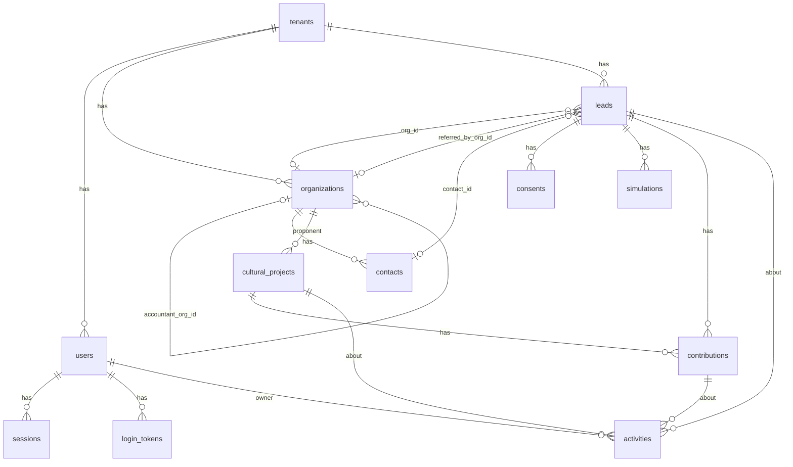

# Proposta C: simplicidade operacional e manutenção de longo prazo

> Uma das três propostas do painel de arquitetura. Lente: o sistema precisa ser mantido por um desenvolvedor sozinho durante anos, e a Daniela precisa operar o CRM sem suporte. Cada serviço, biblioteca e configuração a mais é uma coisa a mais para quebrar, atualizar e explicar. Contexto de negócio em `docs/visao.md`; convenções de código em `docs/arquitetura/next16-convencoes.md`; estágios de pipeline e campos de lead em `docs/estrategia/personas-e-funis.md` (seções 8 e 9); formulários e integrações do site em `docs/site/estrutura-e-copy.md`. Versões, preços e documentação conferidos em 03/10/2026; o que não foi confirmado em fonte primária está marcado com [verificar].

## 1. Tese

Um sistema que uma pessoa mantém por anos tem três inimigos: dependências que mudam de API, serviços externos com plano grátis que muda de regra, e configuração que só o autor entende. A proposta ataca os três:

- Nove dependências de runtime, todas estáveis há anos ou mantidas pelo próprio fornecedor do framework. Nenhuma em beta ou release candidate.
- Dois fornecedores com login: Vercel (hospedagem, banco pelo Marketplace, cron, analytics, logs) e Resend (e-mail). GitHub guarda o código e roda a CI e o backup. Nada mais.
- Zero Docker, zero serviço rodando em máquina própria, zero painel de terceiros para a Daniela: ela usa o CRM e o e-mail.
- Tudo que puder ser um arquivo no repositório é um arquivo no repositório: parâmetros do simulador, estágios de pipeline, textos do site, o PDF do guia, as migrações SQL.
- O CRM tem quatro telas e um e-mail diário. O que não couber nisso não entra na Fase 1.

O custo dessa postura é menos velocidade em alguns pontos (sem biblioteca de componentes, sem gerador de migração, sem Sentry) e mais código próprio em dois lugares (autenticação, cerca de 200 linhas; migrações SQL escritas à mão). A seção 11 lista o que isso custa em risco.

## 2. Decisões em uma página

| Tema | Decisão | O que foi descartado e por quê |
|---|---|---|
| Framework | Next.js 16.3.8, React 19.3.0, Tailwind CSS 4.3.3, TypeScript (decisão dada) | |
| UI | Tailwind puro e elementos HTML nativos (`select`, `dialog`, `details`, `table`); seis componentes próprios em `src/components/ui/` | shadcn/ui e Radix: 10 a 20 pacotes a mais para um CRM de duas pessoas; pode entrar depois para um componente específico (combobox) |
| Banco | PostgreSQL no Neon, criado e cobrado pelo Vercel Marketplace; região São Paulo (`aws-sa-east-1`). Local e testes: PGlite 0.5.8 (Postgres em WASM, sem Docker) | SQLite: não roda em função serverless sem Turso; Supabase: pausa projeto grátis após 7 dias sem uso [verificar na página de preços] e empurra para Auth e Storage próprios; VPS: sistema operacional, TLS e backups viram tarefa do desenvolvedor |
| Acesso ao banco | Kysely 0.29.6 (query builder tipado, API estável, dialeto PGlite embutido desde a 0.29) e migrações em SQL puro executadas pelo `Migrator` do próprio Kysely | Prisma 7.10: exige driver adapter, `prisma.config.ts`, gerador com `output`, e a tag `latest` do CLI já é `8.0.0-rc.19`; Drizzle 0.45: bom, mas a 1.0 está em `rc.4` com API em mudança e o `drizzle-kit` guarda snapshots em `drizzle/meta/` que confundem em conflito; SQL puro sem tipos: refatoração às cegas |
| Autenticação | Própria: link mágico por e-mail, sessão em tabela, cookie `httpOnly`. Dois usuários (Daniela e sócio) criados por seed; sem cadastro público, sem senha | Better Auth 1.7.7: boa, mas é uma dependência grande que lança versão toda semana e trocou de pacote de CLI em 2026; Auth.js: instalação oficial ainda `next-auth@beta`; Clerk: painel e custo externos |
| Hospedagem | Vercel. Hobby durante a construção; Pro (US$ 20/mês) no dia em que o primeiro formulário público entrar no ar, porque o Hobby proíbe uso comercial | Cloudflare Workers via OpenNext: middleware Node não suportado na versão atual; Railway (US$ 5/mês + uso): bom, mas sem região no Brasil e com segundo painel |
| E-mail transacional | Resend 6.32.0 (free: 3.000/mês, 100/dia) atrás de uma função `sendEmail()` de 20 linhas | SMTP do provedor atual de `projetos@prospekto.com.br` via Nodemailer: só se o domínio não puder ser verificado no Resend (pergunta 4 de `docs/visao.md`) |
| WhatsApp | Link `wa.me/5554984032180` com texto por página; no CRM, botão "Abrir WhatsApp" com mensagem pronta | API oficial da Meta ou intermediários: custo, aprovação de templates e risco de bloqueio do número; só quando houver envio automático no playbook |
| Armazenamento | Nenhum serviço. PDF do guia no repositório, fora de `public/`, servido por rota com link assinado | Vercel Blob (1 GB grátis no Hobby) entra na Fase 2, quando houver upload por tenant |
| Analytics | Vercel Web Analytics (`@vercel/analytics` 2.0.1): mesmo painel, sem cookie, eventos personalizados no Pro | Umami Cloud e Plausible: um login a mais; GA4: banner de cookies e peso |
| Anti-spam | Honeypot, tempo mínimo de preenchimento, deduplicação por e-mail e segmento | Cloudflare Turnstile: grátis e bom, mas é mais um painel e duas chaves; entra em uma hora se o spam aparecer |
| Testes | Vitest 5.0.3: simulador puro, schemas Zod, repositórios e Server Actions contra PGlite em memória | Playwright: binário de navegador, flakiness e minutos de CI; entra quando houver regressão de UI que justifique |
| CI | GitHub Actions, um workflow: `npm ci`, lint, typecheck, test, build. Deploy é a integração Git do Vercel | |
| Backups | Neon (restore de 6 h no Free) mais `pg_dump` semanal por GitHub Actions guardado como artefato (90 dias) mais botão "Exportar CSV" no CRM | Neon Launch (restore de até 7 dias, pago por uso) quando a base justificar |
| Migrações | Arquivos `migrations/NNNN_nome.ts` com SQL puro; `npm run db:migrate` roda no `buildCommand` do Vercel antes do `next build`; regra expand/contract | `drizzle-kit push` em produção; migração manual "quando lembrar" |
| Logs e erros | `console` em JSON nos logs do Vercel (1 dia de retenção no Pro) mais e-mail para o desenvolvedor em exceção não tratada, com deduplicação de 10 minutos | Sentry: entra quando um erro não for diagnosticável só com log; o wizard adiciona cinco arquivos |
| Validação e env | Zod 4.6.5 nos formulários; `src/env.ts` com Zod (20 linhas) validando variáveis no build | `@t3-oss/env-nextjs`: faz o mesmo com um pacote a mais |
| Repositório | App na raiz, sem monorepo | |
| Multi-tenant | `tenant_id NOT NULL` em toda tabela de negócio, chaves únicas compostas, um tenant `prospekto` semeado, todo acesso a dados em `src/lib/repos/` recebendo `tenantId` | RLS, domínio por tenant, plugin de organização: Fase 2 |

Custo mensal da Fase 1: R$ 0 durante a construção; cerca de R$ 105/mês em operação (só o Vercel Pro), mais R$ 40/ano de domínio. Detalhes na seção 12.

## 3. Construir CRM próprio ou usar um pronto

Avaliação honesta, com os limites verificados nas páginas oficiais em 03/10/2026.

| Opção | Custo para 2 usuários | O que resolve bem | Onde quebra para este caso |
|---|---|---|---|
| HubSpot Free | R$ 0 | Contatos, empresas, negócios, formulários, e-mail com marca HubSpot; estável e documentado | "1 HubSpot-provided pipeline per object type", "10 custom properties in total", "Up to 1,000 contacts", 2 usuários (https://legal.hubspot.com/hubspot-product-and-services-catalog). Precisamos de 5 pipelines com campos obrigatórios por estágio e cerca de 40 campos por segmento (`personas-e-funis.md`, seção 9). Starter: a partir de US$ 20 por assento por mês na cobrança mensal [verificar o preço anual na página de preços] |
| RD Station CRM | Free: R$ 0 (até 4 usuários, 1 funil, 5 campos personalizados); Basic: R$ 73 por usuário por mês mensal ou R$ 65,70 anual, com múltiplos funis e campos ilimitados (https://www.rdstation.com/planos/crm/) | Brasileiro, suporte em português, WhatsApp integrado, integra com o RD Marketing | Basic para duas pessoas: R$ 146/mês, mais que toda a infraestrutura desta proposta. Não modela projeto cultural, aporte, recibo nem comissão limitada por lei; isso viraria campo personalizado solto |
| Pipedrive | Essential cerca de US$ 24 por usuário por mês mensal, US$ 14,90 anual [verificar na página oficial, que recusou a consulta automática] | Pipeline visual muito bom; atividades e lembretes | Preço por assento em dólar; mesmo problema de modelagem de projeto e aporte |
| Notion | Free para uso individual com limite de blocos quando há mais de um membro; Plus US$ 10 por membro por mês (https://www.notion.com/pricing) | Flexível, a Daniela provavelmente já conhece | Sem validação de campo, sem registro de consentimento, sem integração nativa com formulário do site; vira planilha bonita |
| Google Sheets | R$ 0 | Zero curva de aprendizado; exportável | Sem consentimento LGPD estruturado, sem SLA, sem campos obrigatórios por estágio; integração com o site exige Apps Script, que é outro código para manter |
| CRM próprio (esta proposta) | R$ 0 além da hospedagem já necessária para o site | Modelo de domínio exato (projeto, aporte, recibo, comissão com limite legal, consentimento versionado); mesmo banco do site; base da Fase 2 | É código: alguém precisa mantê-lo; não existe no dia 1; sem app de celular |

Quando o CRM pronto vence: se a Fase 2 for abandonada; se ninguém puder manter código por mais de um ano; se o prazo para a Daniela começar a registrar leads for de dias, não semanas. Nesses três casos, RD Station CRM Free (1 funil, 4 usuários) resolve o pipeline de patrocinadores por R$ 0 e o site manda o lead por e-mail.

Quando o CRM próprio vence: quando o produto da Fase 2 é o próprio CRM (`docs/visao.md`); quando as entidades não cabem em "contato e negócio" (projeto com saldo a captar, aporte com recibo de mecenato, comissão limitada a 10% e R$ 150 mil pela IN MinC 29/2026, art. 19, conforme `docs/dominio/leis-de-incentivo.md`); quando o consentimento LGPD precisa estar no mesmo lugar que o lead; quando o custo por assento em dólar incomoda.

Recomendação: construir o CRM próprio, com duas salvaguardas que custam pouco.

1. A semana 1 entrega site, tabela de leads e um e-mail diário ("hoje: 3 leads novos, 2 follow-ups vencidos", com links). A Daniela consegue trabalhar a partir do e-mail antes de o CRM ter tela.
2. "Exportar CSV" existe desde a primeira versão do CRM, para leads, organizações, projetos e aportes. Se o CRM próprio falhar, migrar para o RD Station é uma tarde de importação, não um projeto.

Sobre o "CRM que a gente fez" (pergunta 2 de `docs/visao.md`): reaproveitar as lições (telas que a equipe usou de verdade, campos que ninguém preencheu), não o código, a menos que seja Next.js com Postgres e tenha testes. Código antigo em outra stack vira uma segunda base para manter.

## 4. Stack, item a item

### 4.1 Next.js 16, UI e formulários

Segue `docs/arquitetura/next16-convencoes.md`: App Router, `src/`, route groups `(site)` e `(app)`, `proxy.ts` só para redirecionar `/app/*` sem cookie, Server Actions com Zod no servidor e `useActionState` no cliente.

UI sem biblioteca de componentes. O CRM é usado por duas pessoas em desktop; elementos nativos cobrem o necessário e não quebram em atualização:

| Necessidade | Solução |
|---|---|
| Seleção de estágio, motivo de perda, mecanismo | `<select>` nativo estilizado com Tailwind |
| Confirmar ação (marcar perdido, registrar depósito) | `<dialog>` nativo aberto por um componente cliente de 15 linhas |
| Seções recolhíveis no detalhe do lead | `<details>` e `<summary>` |
| Listas | `<table>` com cabeçalho fixo via CSS `sticky` |
| Notificação de sucesso | Mensagem na própria página após `redirect` com `searchParams` |
| Kanban | Não há. Lista agrupada por estágio com "Mover para" em `<select>`. Arrastar e soltar exige biblioteca e não funciona bem em celular |

Seis componentes em `src/components/ui/`: `Button`, `Input`, `Select`, `Field` (rótulo, ajuda e erro com `aria-describedby`), `Table`, `Dialog`. Quando um componente nativo não bastar (combobox com busca para escolher organização), adicionar o do shadcn/ui só para aquele caso.

Formulários públicos e anti-spam, sem serviço externo:

- Honeypot: campo `website` escondido por CSS; preenchido, a Action responde sucesso e não grava.
- Tempo mínimo: o formulário carrega com um carimbo de tempo assinado (HMAC com `FORM_SECRET`); envio em menos de 3 segundos é descartado como robô.
- Deduplicação: `email` e `segment` únicos por tenant; reenvio em 10 minutos retorna sucesso sem gravar; reenvio depois disso atualiza o lead e registra uma `activity` do tipo `formulario` (`docs/site/estrutura-e-copy.md`, seção 5).
- Quando o spam passar de 10 por semana, adicionar Cloudflare Turnstile (grátis; validação no servidor em `siteverify`, https://developers.cloudflare.com/turnstile/get-started/server-side-validation/). É uma tarefa de uma hora e não muda a arquitetura.

### 4.2 Banco: Postgres no Neon pelo Vercel, PGlite local

Decisão: Postgres em todos os ambientes, com um único dialeto SQL do teste à produção.

- Produção: Neon criado pelo Vercel Marketplace. "Billing handled entirely inside Vercel"; a integração injeta `DATABASE_URL` (pooled) e `DATABASE_URL_UNPOOLED` e cria um branch do banco para cada preview deployment, apagado junto com o deployment (https://neon.com/docs/guides/vercel-managed-integration). Para a Daniela e para o sócio existe um login só: o do Vercel.
- Região: São Paulo (`aws-sa-east-1`) está disponível para Postgres em todos os planos (https://neon.com/docs/introduction/regions). Reduz latência e simplifica a conversa sobre transferência internacional de dados na política de privacidade (LGPD, arts. 33 a 36) [verificar com advogado]. Função do Vercel em `gru1` [verificar disponibilidade da região no plano Pro].
- Plano Free do Neon: 1 GB por projeto, 100 CU-horas por projeto por mês, restore de 6 horas limitado a 1 GB de histórico (https://neon.com/pricing e https://neon.com/docs/postgres/backup-restore/history-window). Um CRM com milhares de leads e centenas de aportes ocupa dezenas de megabytes; o limite que importa é o restore de 6 horas, coberto pelo backup da seção 4.10. Launch (pago por uso: US$ 0,106 por CU-hora e US$ 0,35 por GB-mês; restore de até 7 dias) é a troca de plano quando o volume justificar [verificar se há mínimo mensal no Launch].
- Local e testes: PGlite 0.5.8 (`@electric-sql/pglite`), Postgres compilado para WASM rodando dentro do processo Node, persistido em `.pglite/` (ignorado no git). `npm run dev` funciona sem Docker, sem conta em serviço nenhum e sem internet. Para desenvolver com dados reais, basta definir `DATABASE_URL` apontando para um branch `dev` do Neon.
- Driver de produção: `pg` 8.23.1 (node-postgres), que o Next.js já trata como pacote externo do servidor (https://nextjs.org/docs/app/api-reference/config/next-config-js/serverExternalPackages). O PGlite precisa entrar em `serverExternalPackages` para o WASM não ser empacotado.

Dinheiro: colunas `numeric(14,2)` em reais. Os dois drivers devolvem `numeric` como string; a camada de repositório converte com `Number()` na saída e envia string formatada na entrada. Somas e saldos são calculados no banco (`sum`, `approved_amount - raised_amount`), nunca em JavaScript. Centavos em `bigint` seriam igualmente string no driver e menos legíveis em exportação e SQL manual.

Identificadores: `uuid` gerado pelo banco (`gen_random_uuid()`), sem pacote de id. Datas em `timestamptz`.

### 4.3 Acesso ao banco: Kysely e migrações em SQL puro

Kysely é um query builder tipado: as consultas são TypeScript com autocomplete e verificação de tipos, o SQL gerado é previsível, não há geração de cliente nem etapa de build. Motivos pela lente desta proposta:

1. API estável. A biblioteca está na série 0.2x há anos sem rupturas comparáveis às do Prisma 7 ou às da Drizzle 1.0 em preparação; `0.29.6` é a `latest` no npm (publicada em 16/09/2026). Exige Node 22 ou superior (`engines` do pacote).
2. Dialeto PGlite embutido: `PGliteDialect` faz parte do núcleo desde a 0.29 (conferido em `node_modules/kysely/dist/dialect/pglite/` da versão 0.29.6; https://pglite.dev/docs/orm-support). Nenhum pacote de terceiros para rodar testes e desenvolvimento local.
3. Migrações sem CLI: a classe `Migrator` com `FileMigrationProvider` lê a pasta `migrations/`, aplica em ordem alfanumérica com lock no banco e registra em `kysely_migration` e `kysely_migration_lock` (nomes padrão no código da 0.29.6; https://kysely.dev/docs/migrations). Cada arquivo tem `up` e `down` e, nesta proposta, contém SQL puro dentro de `sql\`...\``, legível por qualquer pessoa que saiba SQL.
4. Tipos escritos à mão em `src/lib/db/types.ts` (uma `interface` por tabela; 12 tabelas dão cerca de 250 linhas). A fonte da verdade é o SQL da migração; o arquivo de tipos é revisado no mesmo commit. `kysely-codegen` 0.20.0 pode gerar esse arquivo a partir do banco local se a mão cansar, mas não é obrigatório.
5. Se um dia entrar o Better Auth, ele usa Kysely internamente e aceita a instância diretamente (https://www.better-auth.com/docs/installation); nada a jogar fora.

O que se perde em relação ao Drizzle: `drizzle-kit generate` escreve o SQL da migração a partir do schema TypeScript. Aqui o desenvolvedor escreve o SQL. Para um esquema de 12 tabelas que muda algumas vezes por ano, é um custo pequeno e o resultado é um histórico em SQL que qualquer ferramenta lê.

Exemplo de migração:

```ts
// migrations/0001_tenants_users.ts
import { sql, type Kysely } from "kysely";

export async function up(db: Kysely<unknown>) {
  await sql`
    create table tenants (
      id uuid primary key default gen_random_uuid(),
      slug text not null unique,
      name text not null,
      settings jsonb not null default '{}',
      created_at timestamptz not null default now()
    )`.execute(db);
  await sql`
    create table users (
      id uuid primary key default gen_random_uuid(),
      tenant_id uuid not null references tenants(id),
      email text not null,
      name text not null,
      role text not null default 'operator' check (role in ('owner','operator')),
      created_at timestamptz not null default now(),
      unique (tenant_id, email)
    )`.execute(db);
}

export async function down(db: Kysely<unknown>) {
  await sql`drop table users`.execute(db);
  await sql`drop table tenants`.execute(db);
}
```

Uma instrução por `execute()`: o driver PGlite do Kysely chama `pglite.query()`, que usa o protocolo estendido e executa uma única instrução por chamada (https://pglite.dev/docs/api). Vale a mesma regra no Postgres de verdade, então o arquivo roda igual nos dois.

Exemplo de consulta tipada em repositório:

```ts
// src/lib/repos/leads.ts
import "server-only";
import { db } from "@/lib/db";

export async function listOverdueLeads(tenantId: string) {
  return db
    .selectFrom("leads")
    .select(["id", "name", "segment", "stage", "next_action_at"])
    .where("tenant_id", "=", tenantId)
    .where("next_action_at", "<", new Date())
    .where("stage", "not in", ["perdido", "arquivado"])
    .orderBy("next_action_at")
    .execute();
}
```

### 4.4 Autenticação própria: link mágico e sessão em tabela

Para dois usuários que não se cadastram sozinhos, uma biblioteca de autenticação resolve problemas que não existem aqui (OAuth, cadastro, verificação de e-mail, 2FA, organizações) e traz atualizações semanais. O fluxo abaixo tem cerca de 200 linhas, usa só `node:crypto`, `next/headers` e a função `sendEmail()`, e não muda por anos.

| Passo | Implementação |
|---|---|
| Pedir acesso | Página `/entrar` com um campo de e-mail. Server Action: procura `users` pelo e-mail; se existir, gera 32 bytes aleatórios, grava `sha256(token)` em `login_tokens` com validade de 15 minutos e envia o link `/entrar/confirmar?token=...`. A resposta é a mesma existindo ou não o e-mail |
| Confirmar | Route handler `GET /entrar/confirmar`: calcula o hash, busca token não usado e não expirado, marca `used_at`, cria linha em `sessions` (id aleatório de 32 bytes, hash gravado, validade de 30 dias), grava o cookie `session` (`httpOnly`, `secure`, `sameSite=lax`, `path=/`) e redireciona para `/app` |
| Ler sessão | `getSession()` em `src/lib/auth/session.ts`: lê o cookie, busca por hash com `join` em `users`, devolve `{ userId, tenantId, role }` ou `null`. Renova a validade quando faltam menos de 15 dias. Toda Server Action do CRM chama `requireSession()` na primeira linha |
| Sair | Apaga a linha de `sessions` e o cookie |
| Proteção de rota | `src/proxy.ts` redireciona `/app/*` sem cookie para `/entrar`; a autorização real é o `requireSession()` nas páginas e Actions, nunca o proxy (`next16-convencoes.md`) |
| Abuso | Máximo de 5 tokens por e-mail por hora (contagem em `login_tokens`); tokens e sessões expirados são apagados pelo cron diário |
| Emergência | `npm run auth:link -- daniela@...` imprime um link válido no terminal de quem tem `DATABASE_URL`, para quando o e-mail falhar |

Por que não senha: sem senha não há hash a escolher, reset a implementar nem vazamento a temer; o e-mail já é o fator que a Daniela usa todo dia. Dependência aceita: se o Resend estiver fora, ninguém entra até voltar, salvo pelo comando de emergência. CSRF: Server Actions só aceitam `POST` e o Next.js compara o cabeçalho `Origin` com `Host`, abortando quando diferem (https://nextjs.org/docs/app/guides/data-security); o link de confirmação é de uso único.

Quando trocar por Better Auth: na Fase 2, se um usuário precisar pertencer a mais de um tenant com convites e papéis. O adaptador Kysely facilita; o campo `users.tenant_id` continua.

### 4.5 Hospedagem: Vercel, um provedor

- Durante a construção: Hobby, grátis (1 milhão de invocações, 100 GB de transferência, cron só diário com precisão de hora, 1 hora de logs; https://vercel.com/docs/plans/hobby).
- Operação: Pro, US$ 20/mês por assento de desenvolvedor; assentos de visualização são grátis (https://vercel.com/docs/plans/hobby, seção de upgrade). A regra que obriga: "Hobby teams are restricted to non-commercial personal use only. All commercial usage of the platform requires either a Pro or Enterprise plan", e "Advertising the sale of a product or service" é uso comercial (https://vercel.com/docs/limits/fair-use-guidelines). O site da Prospekto anuncia serviços; o upgrade acontece no dia em que o primeiro formulário público for publicado.
- O que o Pro dá e esta proposta usa: cron por minuto (https://vercel.com/docs/cron-jobs/usage-and-pricing), 1 dia de logs, eventos personalizados no Web Analytics, suporte por e-mail.
- Node.js: `engines.node >= 22.12` em `package.json`, porque Kysely exige 22 e o Vitest 5 exige 22.12 ou superior [verificar na página de requisitos do Vitest].

Plano B se o Vercel Pro doer no caixa: Railway, Hobby US$ 5/mês com US$ 5 de uso incluído (https://railway.com/pricing), rodando `next start` com Postgres do próprio Railway. Custa menos, mas é um segundo painel, sem região no Brasil [verificar lista de regiões] e com o processo Node sob responsabilidade do desenvolvedor. A arquitetura não depende de nada exclusivo do Vercel além do cron e do analytics, ambos substituíveis.

### 4.6 E-mail: Resend atrás de uma função

Free: 3.000 e-mails por mês, 100 por dia, 3 domínios, 30 dias de retenção; Pro US$ 20/mês (https://resend.com/pricing). O remetente `onboarding@resend.dev` serve só para teste; produção exige domínio verificado (SPF e DKIM no DNS de `prospekto.com.br`; https://resend.com/docs/send-with-nextjs).

Todo envio passa por `src/lib/email/send.ts`:

```ts
import "server-only";
import { Resend } from "resend";
import { env } from "@/env";

const resend = new Resend(env.RESEND_API_KEY);

export async function sendEmail(input: { to: string; subject: string; html: string; text: string }) {
  const { error } = await resend.emails.send({ from: env.EMAIL_FROM, ...input });
  if (error) throw new Error(`email: ${error.message}`);
}
```

Trocar de provedor é reescrever essas 10 linhas. Se o DNS do domínio não puder ser alterado (pergunta 4 de `docs/visao.md`), a mesma função usa Nodemailer 10.0.14 com o SMTP do provedor atual de `projetos@prospekto.com.br` [verificar limites diários desse provedor].

Usos na Fase 1: link do guia, aviso de novo lead para `projetos@prospekto.com.br`, link de acesso ao CRM, e-mail diário de pendências (seção 9), alerta de erro para o desenvolvedor. Templates em HTML simples com versão texto, sem React Email.

### 4.7 WhatsApp: link, não API

Botões `https://wa.me/5554984032180?text=...` com texto por página e por segmento, usando o número que já consta no guia da Prospekto. No CRM, cada lead com telefone tem "Abrir WhatsApp" com a primeira mensagem do playbook pré-preenchida, enviada manualmente dentro do SLA (`docs/site/estrutura-e-copy.md`, seção 5.6). Sem custo, sem aprovação de template, sem risco de bloqueio.

A API oficial da Meta só entra se um playbook exigir mensagem disparada pelo sistema; aí é um projeto próprio, com template aprovado e preço por mensagem [verificar tabela vigente em https://developers.facebook.com/docs/whatsapp/pricing].

### 4.8 Armazenamento: nenhum serviço na Fase 1

- O guia (798 KB) fica em `src/assets/`, fora de `public/`, e é servido por `GET /api/downloads/guia?lead=...&exp=...&sig=...`: a rota confere a assinatura HMAC (`FORM_SECRET`), registra uma `activity` do tipo `download` no lead e responde com `Content-Disposition: attachment`. Sem tabela de downloads, sem token armazenado.
- Proponentes mandam deck por link externo (`estrutura-e-copy.md`, seção 5.5: "sem upload de arquivo na Fase 1").
- Fase 2 (upload de deck e logo por tenant): Vercel Blob, mesmo painel e mesma fatura; Hobby inclui 1 GB e Pro cobra por uso (https://vercel.com/docs/vercel-blob/usage-and-pricing).

### 4.9 Analytics: o do próprio Vercel

`@vercel/analytics` 2.0.1 com `<Analytics />` no layout raiz. Sem cookies, sem painel extra. Hobby: 50 mil eventos por mês incluídos, 1 mês de janela, sem eventos personalizados. Pro: US$ 0,03 por mil eventos sem franquia, 12 meses de janela, eventos personalizados com 2 propriedades; UTM só no add-on Web Analytics Plus, US$ 10/mês (https://vercel.com/docs/analytics/limits-and-pricing).

Para um site de consultoria regional, 20 mil visualizações por mês custam US$ 0,60. Os eventos de `estrutura-e-copy.md` (seção 9) viram `track("lead_submitted", { segment, source })`, sempre sem dado pessoal. A atribuição por UTM não precisa do add-on: `utm_source`, `utm_medium` e `utm_campaign` são gravados no próprio lead e o relatório sai do CRM.

### 4.10 Backups e restauração

Três camadas, cada uma com um responsável claro:

| Camada | O que é | Quem aciona | Cobre |
|---|---|---|---|
| Restore do Neon | Restaurar um branch para um ponto no tempo; Free: 6 horas; Launch: até 7 dias; cria automaticamente um branch `_old_` com o estado anterior (https://neon.com/docs/introduction/branch-restore) | Desenvolvedor, no painel | Erro operacional percebido no mesmo dia |
| Dump semanal | GitHub Actions, domingo 3h (horário de Brasília): `pg_dump -Fc` com `DATABASE_URL_UNPOOLED` (o Neon recomenda a URL sem `-pooler` e cliente na mesma versão major do servidor; https://neon.com/docs/manage/backup-pg-dump), gravado com `actions/upload-artifact` e retenção de 90 dias (padrão do GitHub; 500 MB de armazenamento no plano Free, https://docs.github.com/en/billing/concepts/product-billing/github-actions). Um dump deste CRM tem poucos megabytes | Automático | Perda de dados, bug de migração, saída do Neon |
| Exportação CSV | Menu "Exportar" no CRM: leads, contatos, organizações, projetos, aportes e atividades em CSV com cabeçalho em português (colunas na seção 9.4) | Daniela, quando quiser | A cópia que a dona do negócio entende e guarda onde quiser |

Restauração, testada uma vez por trimestre (tarefa no calendário do desenvolvedor):

```bash
# 1. criar um branch "restauracao" no painel do Neon e copiar a URL unpooled
# 2. baixar o último artefato "db-dump" no GitHub Actions
pg_restore -v --no-owner --no-privileges -d "$RESTORE_URL" prospekto.dump
# 3. apontar um preview do Vercel para o branch e conferir leads e aportes
# 4. se precisar promover: trocar DATABASE_URL em produção para o branch restaurado
```

O que não há: backup em S3 (o guia do Neon sugere; é mais um serviço e credenciais), replicação, snapshot de disco. Quando a base passar de 100 MB ou o negócio exigir restore de dias, trocar o Neon para Launch e manter o dump.

### 4.11 Migrações: SQL puro, aplicadas no deploy

- Arquivo por mudança em `migrations/`, nome `NNNN_descricao.ts`, com `up` e `down` em SQL. Nunca editar uma migração já aplicada em produção.
- `npm run db:migrate` executa `scripts/migrate.ts` (seção 8.5) contra `DATABASE_URL` ou, na ausência dela, contra o PGlite local. O mesmo comando roda nos testes, em memória.
- No Vercel, `vercel.json` define `"buildCommand": "npm run db:migrate && next build"` (o Vercel usa o script `build` do `package.json` por padrão e aceita `buildCommand` no `vercel.json` para sobrescrever; https://vercel.com/docs/builds/configure-a-build). As variáveis do Neon já estão no ambiente de build. Previews migram seu próprio branch do Neon; produção migra antes de o novo código subir.
- Regra expand/contract: adicionar coluna ou tabela em um deploy; só remover em um deploy posterior, quando nenhum código a usa. Assim um deploy que falha no meio nunca deixa o código antigo sem coluna.
- Tipos em `src/lib/db/types.ts` mudam no mesmo commit; `tsc --noEmit` na CI pega consulta que ficou desalinhada.

### 4.12 Logs e erros

- `src/lib/log.ts`: `log.info()`, `log.warn()`, `log.error()` escrevem uma linha JSON (`level`, `msg`, `tenantId`, `requestId`, campos extras) em `console`. O Vercel indexa e permite filtrar; retenção de 1 dia no Pro (https://vercel.com/docs/plans/hobby, tabela comparativa). Sem Pino, sem drain.
- `src/app/error.tsx` e `src/app/global-error.tsx` mostram mensagem em português e chamam `reportError()`.
- `reportError(err, context)` escreve `log.error` e envia um e-mail para `DEV_ALERT_EMAIL` com stack e contexto, no máximo um por tipo de erro a cada 10 minutos (memória do processo; em serverless isso significa "por instância", suficiente). Server Actions do CRM envolvem a lógica em `try/catch` que chama `reportError` e devolve erro amigável.
- Nunca registrar e-mail, telefone, CPF ou CNPJ em log; só ids.
- Sentry (Developer, grátis até 5 mil erros/mês, https://sentry.io/pricing/) entra quando um erro em produção não puder ser diagnosticado com log e e-mail. Até lá é um SDK, cinco arquivos de configuração e um painel a menos.

### 4.13 Testes e CI

Vitest 5.0.3, três grupos, todos sem navegador:

| Grupo | O que cobre | Banco |
|---|---|---|
| Puro | `src/lib/simulator/` contra os exemplos de `docs/site/simulador-spec.md`, seção 9; regras de domínio (`commissionWithinLegalLimit`, `potentialDeduction`); schemas Zod de cada formulário | Nenhum |
| Repositórios | Cada função de `src/lib/repos/` contra um PGlite em memória novo por arquivo, com as migrações aplicadas pelo mesmo `Migrator` da produção | PGlite |
| Isolamento | Um teste cria dois tenants e garante que nenhuma função de repositório devolve dado do outro | PGlite |

Server Actions são funções: o teste chama `createLead(formData)` diretamente, sem HTTP, e confere o lead, o consentimento e a atividade gravados.

Alias `@/`: configurado em `vitest.config.ts` com `resolve.alias`, sem plugin de tsconfig.

CI em `.github/workflows/ci.yml`, um job: `npm ci`, `npm run lint`, `npm run typecheck`, `npm test`, `npm run build`. 2.000 minutos por mês no GitHub Free para repositório privado (https://docs.github.com/en/billing/concepts/product-billing/github-actions); cada execução leva poucos minutos. Deploy é a integração Git do Vercel, não a CI.

Verificação pós-deploy sem Playwright: `scripts/smoke.ts` recebe a URL do deployment, faz `GET` em `/`, `/simulador`, `/empresas` e `/api/health` (consulta `select 1` e conta de leads) e falha se algum não responder 200. Roda à mão depois de um deploy de produção; pode virar passo da CI contra o preview quando houver tempo.

## 5. Estrutura do repositório

App única na raiz de `aleciomunizrafael/prospekto`, `src/` ao lado de `docs/`. Sem monorepo, sem workspaces, sem pacotes internos.

```
prospekto/
  docs/                      documentação (já existe)
  migrations/                0001_*.ts ... SQL puro, commitado
  scripts/                   migrate.ts, seed.ts, auth-link.ts, smoke.ts
  src/
    app/
      layout.tsx             <html lang="pt-BR">, fonte, CSS, <Analytics />
      error.tsx, global-error.tsx
      (site)/                site público: home, empresas, contadores, pessoas-fisicas,
                             municipios, proponentes, projetos, simulador, guia, mentoria,
                             contato, privacidade, obrigado/[tipo], entrar
      (app)/app/             CRM: hoje, leads, leads/[id], organizacoes, projetos,
                             projetos/[id], exportar
      api/
        auth/confirm/        GET: confirma link mágico
        downloads/guia/      GET: entrega do PDF com link assinado
        cron/daily/          GET: e-mail diário, limpeza, SLAs; protegido por CRON_SECRET
        health/              GET: select 1
    actions/                 Server Actions: leads.ts, crm.ts, auth.ts, simulator.ts
    components/
      ui/                    Button, Input, Select, Field, Table, Dialog
      site/                  cabeçalho, rodapé, blocos de página, formulários
      crm/                   lista de leads, detalhe, mudança de estágio
    config/site.ts           nome, e-mail, WhatsApp, textos de wa.me, versão da política
    env.ts                   validação das variáveis com Zod
    lib/
      db/                    index.ts (conexão), create.ts, types.ts
      repos/                 leads.ts, organizations.ts, projects.ts, contributions.ts,
                             activities.ts, consents.ts, simulations.ts, users.ts
      auth/                  session.ts, tokens.ts
      domain/                pipelines.ts (estágios e campos obrigatórios), scoring.ts,
                             commission.ts, parameters.ts (lê o JSON do simulador)
      simulator/             simulate.ts (função pura) e testes
      validation/            um schema Zod por formulário
      email/                 send.ts e templates/*.ts
      log.ts, errors.ts, csv.ts, signing.ts
    assets/                  contabilizando-cultura-guia.pdf
    proxy.ts
  tests/                     helpers: db.ts (PGlite em memória com migrações)
  .github/workflows/         ci.yml, backup.yml
  next.config.ts, vitest.config.ts, tsconfig.json, eslint.config.mjs, package.json
  .env.example, AGENTS.md, CLAUDE.md
```

Justificativas:

- Um consumidor de código, um desenvolvedor: monorepo seria configuração sem cliente. O hub da Fase 2 é o mesmo app servindo outros tenants.
- `src/lib/domain/` e `src/lib/simulator/` não importam nada de Next nem de banco; são o que a Fase 2 pode extrair para um pacote, movendo pastas.
- `migrations/` e `scripts/` fora de `src/` porque não são código do app: rodam com `tsx` e nunca são importados por páginas.
- Estágios de pipeline em `src/lib/domain/pipelines.ts`, não em tabela: a Fase 1 tem um tenant e os estágios vêm de `personas-e-funis.md`, seção 8. Mudar um estágio é um commit, não uma tela de configuração. Quando um segundo tenant precisar de estágios próprios (Fase 2), promover para tabela com uma migração que copia as constantes.
- `docs/dominio/parametros-simulador.json` é importado por `src/lib/domain/parameters.ts` por caminho relativo; não há cópia.

## 6. Modelo de dados mínimo

Doze tabelas de negócio mais duas do `Migrator`. Convenções: nomes no plural em `snake_case`, identificadores em inglês, `tenant_id` em toda tabela de negócio, `uuid` do banco, `timestamptz`, `numeric(14,2)` para dinheiro, `jsonb` para o que varia por segmento. Valores de estágio, segmento, mecanismo e tipo são `text` com `check` no banco e enum no Zod, para evitar `alter type` em Postgres a cada estágio novo.



| Tabela | Campos | Observações |
|---|---|---|
| `tenants` | `id`, `slug` único, `name`, `settings` jsonb, `created_at` | Semeado com `prospekto`. `settings` guarda o que hoje está em `src/config/site.ts` quando a Fase 2 chegar |
| `users` | `id`, `tenant_id`, `email`, `name`, `role` (`owner`, `operator`), `created_at` | Único `(tenant_id, email)`. Daniela `owner`, sócio `operator` [verificar quem mais opera; pergunta 5 de `docs/visao.md`] |
| `sessions` | `id` (hash), `user_id`, `expires_at`, `created_at`, `last_seen_at` | Cookie guarda o id em claro; a tabela guarda o hash |
| `login_tokens` | `id`, `user_id`, `token_hash`, `expires_at`, `used_at`, `created_at` | Uso único; limpeza diária |
| `organizations` | `id`, `tenant_id`, `type` (`empresa`, `contabilidade`, `municipio`, `proponente`, `outro`), `name`, `cnpj`, `city`, `uf`, `sector`, `tax_regime`, `estimated_irpj`, `accountant_org_id`, `notes`, `created_at` | Único `(tenant_id, cnpj)` quando não nulo. O escritório contábil parceiro é uma `organizations.type = contabilidade`; o estágio de parceria (`contadores`, seção 8.2) fica no lead CONT ligado a ela |
| `contacts` | `id`, `tenant_id`, `org_id`, `name`, `title`, `email`, `phone`, `linkedin_url`, `is_decision_maker`, `source_detail`, `created_at` | Pessoa dentro de uma organização; dado pessoal com origem registrada |
| `leads` | `id`, `tenant_id`, `segment` (`PJ`, `PF`, `CONT`, `MUN`, `PROP`, `ALUNO`), `pipeline` (`patrocinadores`, `contadores`, `municipios`, `projetos`, `alunos`), `stage`, `stage_entered_at`, `interest`, `name`, `email`, `phone`, `city`, `uf`, `message`, `source`, `source_detail`, `utm_source`, `utm_medium`, `utm_campaign`, `score`, `temperature`, `owner_user_id`, `org_id`, `contact_id`, `referred_by_org_id`, `next_action_at`, `last_contact_at`, `lost_reason`, `tags` text[], `attributes` jsonb, `created_at`, `updated_at` | Único `(tenant_id, email, segment)`. `attributes` guarda os campos por segmento da seção 9.3 (regime, faixa de IRPJ, modelo de declaração, município, projeto do proponente, respostas da lista de espera). Índices em `(tenant_id, pipeline, stage)` e `(tenant_id, next_action_at)` |
| `cultural_projects` | `id`, `tenant_id`, `proponent_org_id`, `name`, `slug`, `mechanism` (`rouanet_18`, `rouanet_26`, `audiovisual_1`, `audiovisual_1a`, `lic_rs`, `lic_municipal`, `fsa`, `edital`), `process_number`, `article`, `stage` (estágios do pipeline `projetos`), `approved_amount`, `raised_amount`, `fundraising_deadline`, `fundraising_fee_amount`, `commission_pct`, `city`, `cultural_segment`, `counterparts`, `summary`, `deck_url`, `published_on_site`, `owner_user_id`, `created_at`, `updated_at` | `saldo_a_captar` é `approved_amount - raised_amount` na consulta; `raised_amount` é recalculado pela Action que confirma depósito, com `sum` no banco. Limites de comissão (10%, teto R$ 150 mil, IN MinC 29/2026, art. 19, via `docs/dominio/leis-de-incentivo.md`) validados em `src/lib/domain/commission.ts` |
| `contributions` | `id`, `tenant_id`, `lead_id`, `org_id`, `project_id`, `type` (`patrocinio`, `doacao`), `mechanism`, `status` (`proposta`, `termo`, `depositado`, `recibo`, `cancelado`), `proposed_amount`, `deposited_amount`, `deposited_at`, `receipt_number`, `receipt_issued_at`, `receipt_sent_to_accountant_at`, `commission_due`, `commission_paid_at`, `counterparts_delivered`, `notes`, `created_at`, `updated_at` | É a oportunidade e o aporte na mesma linha: nasce em `proposta` quando o lead entra no estágio `proposta` com projeto e valor (`personas-e-funis.md`, seção 8.1) e avança até `recibo`. `commission_paid_at` só aceita valor com `deposited_at` preenchido (regra na Action e `check` no banco) |
| `activities` | `id`, `tenant_id`, `type` (`ligacao`, `reuniao`, `email`, `whatsapp`, `visita`, `nota`, `tarefa`, `formulario`, `download`, `sistema`), `subject`, `body`, `occurred_at`, `due_at`, `done_at`, `lead_id`, `project_id`, `contribution_id`, `owner_user_id`, `created_at` | `tarefa` com `due_at` e `done_at` nulo aparece em "Hoje". `sistema` registra mudança de estágio (de, para, quem, quando) e serve de auditoria da Fase 1 |
| `consents` | `id`, `tenant_id`, `lead_id`, `purpose` (`contato_comercial`, `marketing`, `whatsapp`), `granted`, `policy_version`, `channels` text[], `ip_hash`, `user_agent`, `source_page`, `created_at` | Append-only; revogar é inserir `granted = false`. `ip_hash` só se o advogado confirmar [verificar]. Base: Lei 13.709/2018, art. 7º, I, e art. 8º (`personas-e-funis.md`, seção 9.1) |
| `simulations` | `id`, `tenant_id`, `lead_id` nulo até identificação, `kind` (`pj`, `pf`), `inputs` jsonb, `outputs` jsonb, `parameters_version` (campo `atualizado_em` do JSON), `created_at` | A simulação anônima gera a linha; o gate de captura liga o `lead_id` |

O que foi deliberadamente deixado de fora e como o caso é atendido:

| Não modelado | Em vez disso | Quando revisar |
|---|---|---|
| `pipelines` e `pipeline_stages` | Constantes em `src/lib/domain/pipelines.ts` com `key`, `name`, `sla_business_days`, `required_fields` | Segundo tenant com estágios próprios |
| `deals` separado de `contributions` | Uma linha de `contributions` com `status` desde `proposta` | Nunca, salvo se um lead negociar várias propostas simultâneas para o mesmo projeto |
| `campaigns` | `utm_campaign` no lead e `source` enum; relatório agrupa por `utm_campaign` | Quando a Daniela quiser cadastrar campanha com data e orçamento |
| `waitlist_entries` | Lead `ALUNO` no pipeline `alunos`, respostas em `attributes` | Quando houver turma com vagas e pagamento |
| `partner_referrals` | `leads.referred_by_org_id` apontando para o escritório; métrica por `group by` | Quando a remuneração do parceiro exigir rastro por indicação com data e resultado próprios |
| `downloads` | Link assinado sem estado mais `activity` do tipo `download` | Nunca para um único PDF |
| `form_attempts` (rate limit) | Honeypot, tempo mínimo e deduplicação | Spam acima de 10 por semana: Turnstile |
| `audit_log` | `activities.type = sistema` nas mudanças que importam | Fase 2, exigência de cliente |
| Produtos, pagamentos, turmas do curso | Fora da Fase 1 (`docs/produto/mentoria-e-curso.md` valida demanda antes) | Quando a lista de espera converter |
| `organization_settings`, temas, domínios por tenant | `src/config/site.ts` e `tenants.settings` vazio | Fase 2 |

## 7. Multi-tenant: o mínimo agora

Exigência de `docs/visao.md`: a Fase 2 vende o hub para outros consultores. O que custa centavos hoje e meses depois:

| Agora, na primeira migração | Custo | Se deixar para depois |
|---|---|---|
| Tabela `tenants` e tenant `prospekto` semeado | 10 linhas de SQL | Backfill em todas as tabelas |
| `tenant_id uuid not null references tenants(id)` em toda tabela de negócio, com índice | Uma coluna por tabela | Reescrever consultas e chaves |
| Chaves únicas compostas: `(tenant_id, email, segment)` em leads, `(tenant_id, cnpj)` em organizações, `(tenant_id, slug)` em projetos, `(tenant_id, email)` em usuários | Nada | Conflito entre clientes no dia 1 da Fase 2 |
| Toda função de `src/lib/repos/` recebe `tenantId` como primeiro argumento e filtra; nenhuma consulta fora de `repos/` (regra de lint simples: `db` só é importado em `src/lib/repos/` e `scripts/`) | Convenção mais um teste de isolamento | Auditoria do código inteiro |
| `users.tenant_id` e sessão que expõe `tenantId`; `requireSession()` devolve os dois | 5 linhas | Troca de modelo de sessão |
| `src/config/site.ts` lido por um único módulo | Nada | Nada; facilita migrar para `tenants.settings` |
| `uuid` em vez de inteiro sequencial | Nada | URLs enumeráveis entre tenants |

O que fica para a Fase 2, porque custa o mesmo depois: resolução de tenant por subdomínio ou domínio em `proxy.ts`; usuário em mais de um tenant (aí entra Better Auth com o plugin de organização, ou uma tabela `memberships`); Row Level Security como segunda barreira (com `SET LOCAL` dentro de transação, porque o pool do Neon em modo transação não mantém `SET` entre consultas; https://neon.com/docs/connect/connection-pooling); configurações e tema por tenant; cobrança.

## 8. Scaffold: comandos e arquivos

### 8.1 Pré-requisitos

Node 22.12 ou superior (24 também serve) e npm. Rodar em `/home/user/prospekto` com a árvore limpa, para desfazer com `git checkout .` e `git clean -fd` se algo sair errado. Não commitar neste passo (regra do projeto). O `create-next-app` tolera alguns arquivos em diretório não vazio; se recusar por causa de `docs/`, criar em pasta temporária e mover [verificar na execução].

### 8.2 Comandos

```bash
cd /home/user/prospekto

# 1. Next.js 16 na raiz, com os padrões (TypeScript, Tailwind, ESLint, App Router, src/, AGENTS.md)
npx create-next-app@latest . --ts --tailwind --eslint --app --src-dir \
  --import-alias "@/*" --use-npm --disable-git --yes

# 2. Dependências de runtime (nove, com o next, react e react-dom já instalados)
npm i kysely@0.29.6 pg@8.23.1 @electric-sql/pglite@0.5.8 zod@4.6.5 resend@6.32.0 \
  @vercel/analytics@2.0.1 server-only

# 3. Dependências de desenvolvimento
npm i -D @types/pg tsx@4.23.15 vitest@5.0.3

# 4. Pastas e arquivos (seção 8.4); depois:
npm run db:migrate   # aplica migrations/ no PGlite local (.pglite/)
npm run db:seed      # tenant prospekto e os dois usuários
npm run dev          # http://localhost:3000

# 5. Verificação
npm run lint && npm run typecheck && npm test && npm run build
```

Fixar versões: manter o `package-lock.json` commitado; ele é o que vale no Vercel e na CI. Rotina de manutenção: `npm outdated` uma vez por mês, atualizar patch e minor em um commit só, rodar a CI; major só com a nota de versão lida. Sem Dependabot ou Renovate: para nove dependências, um PR automático por semana é mais ruído que segurança.

### 8.3 Scripts em `package.json`

```json
{
  "engines": { "node": ">=22.12" },
  "scripts": {
    "dev": "next dev",
    "build": "next build",
    "start": "next start",
    "lint": "eslint .",
    "typecheck": "tsc --noEmit",
    "test": "vitest run",
    "test:watch": "vitest",
    "db:migrate": "node --env-file-if-exists=.env.local --import tsx scripts/migrate.ts",
    "db:seed": "node --env-file-if-exists=.env.local --import tsx scripts/seed.ts",
    "auth:link": "node --env-file-if-exists=.env.local --import tsx scripts/auth-link.ts",
    "smoke": "node --import tsx scripts/smoke.ts"
  }
}
```

`--env-file-if-exists` existe desde o Node 22.9.0 e não falha quando o arquivo não existe (https://nodejs.org/api/cli.html); por isso o mesmo comando serve local (lê `.env.local`) e no build do Vercel (sem arquivo, variáveis do ambiente). Sem `dotenv`.

### 8.4 Arquivos iniciais

| Arquivo | Conteúdo |
|---|---|
| `next.config.ts` | `serverExternalPackages: ["@electric-sql/pglite"]` |
| `src/env.ts` | `z.object({...}).parse(process.env)` com as variáveis da seção 9.2; importado por `next.config.ts` para falhar no build |
| `src/config/site.ts` | Nome, `projetos@prospekto.com.br`, `5554984032180`, textos de `wa.me` por página, `POLICY_VERSION = "2026-10-03"` |
| `src/lib/db/create.ts`, `index.ts` | Conexão com troca automática (abaixo) |
| `src/lib/db/types.ts` | `interface DB { tenants: TenantsTable; ... }` com `Generated<>`, `ColumnType<>` do Kysely |
| `migrations/0001_tenants_users_auth.ts`, `0002_crm.ts`, `0003_site.ts` | Tabelas da seção 6 em SQL |
| `scripts/migrate.ts`, `seed.ts`, `auth-link.ts`, `smoke.ts` | Seção 8.5 |
| `src/lib/auth/tokens.ts`, `session.ts` | Seção 4.4 |
| `src/lib/repos/*.ts` | Uma função por caso de uso; sempre `tenantId` primeiro |
| `src/lib/domain/pipelines.ts` | Estágios, SLAs e campos obrigatórios de `personas-e-funis.md`, seção 8 |
| `src/lib/domain/commission.ts` | `assertCommissionWithinLimits(amount, project)` |
| `src/lib/simulator/simulate.ts` | Função pura `simulate(input, params)` conforme `docs/site/simulador-spec.md` |
| `src/lib/validation/*.ts` | Um schema Zod por formulário de `estrutura-e-copy.md`, seção 5 |
| `src/lib/email/send.ts`, `templates/*.ts` | Seção 4.6 |
| `src/lib/log.ts`, `errors.ts` | Seção 4.12 |
| `src/lib/signing.ts` | `sign(payload)` e `verify(token)` com HMAC-SHA256 e `FORM_SECRET` |
| `src/lib/csv.ts` | `toCsv(rows, headers)` com BOM UTF-8 para o Excel em português abrir certo |
| `src/actions/*.ts` | `createLead`, `runSimulation`, `requestLoginLink`, `moveLeadStage`, `logActivity`, `recordContribution`, `confirmDeposit` |
| `src/app/layout.tsx` | `<html lang="pt-BR">`, fonte via `next/font`, `<Analytics />` |
| `src/app/(site)/...` | Páginas de `estrutura-e-copy.md`, seção 3 |
| `src/app/(app)/app/...` | As quatro telas da seção 9 mais `exportar` |
| `src/app/api/auth/confirm/route.ts`, `downloads/guia/route.ts`, `cron/daily/route.ts`, `health/route.ts` | Seções 4.4, 4.8, 9 e 4.13 |
| `src/proxy.ts` | Redireciona `/app/*` sem cookie `session` para `/entrar` |
| `vitest.config.ts` | `environment: "node"`, `resolve.alias["@"] = "./src"`, `setupFiles: ["tests/db.ts"]` |
| `tests/db.ts` | Cria PGlite em memória, roda `Migrator`, expõe `testDb` |
| `.github/workflows/ci.yml`, `backup.yml` | Seções 4.13 e 4.10 |
| `vercel.json` | `{ "buildCommand": "npm run db:migrate && next build", "crons": [{ "path": "/api/cron/daily", "schedule": "0 10 * * *" }] }` (10h UTC, 7h em Brasília; no Hobby a precisão é de uma hora) |
| `.env.example` | Variáveis sem valores |
| `AGENTS.md`, `CLAUDE.md` | Gerados pelo `create-next-app`; commitar |

Adições ao `.gitignore` existente: `.pglite/`, `.vercel/`.

Conexão com troca automática entre Neon e PGlite:

```ts
// src/lib/db/create.ts
import { Kysely, PostgresDialect, PGliteDialect } from "kysely";
import type { DB } from "./types";

export async function createDb(): Promise<Kysely<DB>> {
  if (process.env.DATABASE_URL) {
    const { Pool } = await import("pg");
    const pool = new Pool({ connectionString: process.env.DATABASE_URL, max: 5 });
    return new Kysely<DB>({ dialect: new PostgresDialect({ pool }) });
  }
  const { PGlite } = await import("@electric-sql/pglite");
  const pglite = new PGlite(process.env.PGLITE_DIR ?? ".pglite");
  return new Kysely<DB>({ dialect: new PGliteDialect({ pglite }) });
}
```

```ts
// src/lib/db/index.ts
import "server-only";
import { createDb } from "./create";

const g = globalThis as unknown as { __db?: Awaited<ReturnType<typeof createDb>> };
export const db = g.__db ?? (g.__db = await createDb());
```

`PGliteDialect` recebe `{ pglite }` com a instância ou uma função que a cria (assinatura em `kysely/dist/dialect/pglite/pglite-dialect-config.d.ts`, versão 0.29.6). Em produção o `import` do PGlite nunca executa porque `DATABASE_URL` existe. Nos testes, `tests/db.ts` passa `new PGlite()` sem caminho (memória).

### 8.5 Scripts

```ts
// scripts/migrate.ts
import { promises as fs } from "node:fs";
import path from "node:path";
import { FileMigrationProvider, Migrator } from "kysely";
import { createDb } from "../src/lib/db/create";

const db = await createDb();
const migrator = new Migrator({
  db,
  provider: new FileMigrationProvider({ fs, path, migrationFolder: path.join(process.cwd(), "migrations") }),
});
const { error, results } = await migrator.migrateToLatest();
for (const r of results ?? []) console.log(`${r.status}: ${r.migrationName}`);
await db.destroy();
if (error) {
  console.error(error);
  process.exit(1);
}
```

`scripts/seed.ts` insere o tenant `prospekto` e os usuários a partir de `SEED_USERS="daniela@...,socio@..."` (`on conflict do nothing`, para poder rodar de novo). `scripts/auth-link.ts` gera e imprime um link de acesso para um e-mail. `scripts/smoke.ts` confere as páginas e `/api/health`.

```yaml
# .github/workflows/backup.yml
name: backup
on:
  schedule: [{ cron: "0 6 * * 0" }]   # domingo 6h UTC, 3h em Brasília
  workflow_dispatch:
jobs:
  dump:
    runs-on: ubuntu-latest
    steps:
      - run: |
          sudo apt-get update && sudo apt-get install -y postgresql-client-17
          pg_dump -Fc -v -d "$DATABASE_URL_UNPOOLED" -f prospekto.dump
        env:
          DATABASE_URL_UNPOOLED: ${{ secrets.DATABASE_URL_UNPOOLED }}
      - uses: actions/upload-artifact@v4
        with: { name: db-dump-${{ github.run_id }}, path: prospekto.dump, retention-days: 90 }
```

A versão do cliente (`postgresql-client-17`) precisa coincidir com a versão major do Postgres do projeto Neon [verificar a versão escolhida ao criar o projeto; o Neon recomenda cliente na mesma versão]. O runner `ubuntu-latest` pode não ter o pacote 17 sem adicionar o repositório PGDG [verificar na execução].

## 9. Operação pela Daniela sem suporte

A arquitetura só é simples se a operação também for. Esta seção é a especificação vigente das telas do CRM da Fase 1: `docs/arquitetura/ADR-001-stack.md` toma esta proposta como base e delega a forma do CRM a ela, e nenhum outro documento descreve as telas. Onde o ADR decidiu diferente desta proposta (autenticação com e-mail e senha pelo Better Auth em vez do link mágico da seção 4.4; Drizzle em vez de Kysely), esta seção segue o ADR. Nomes de tabela, coluna, estágio e enum são os de `docs/arquitetura/modelo-de-dados.md` (seções 3 e 4); estágios, SLAs e campos por segmento vêm de `docs/estrategia/personas-e-funis.md` (seções 8 e 9); rotas vêm de `docs/arquitetura/scaffold.md` (seção 5). Datas e horas são exibidas em `America/Sao_Paulo`, no formato `dd/mm/aaaa hh:mm`; dinheiro em `R$ 1.234,56`.

Decisões de produto que sustentam a simplicidade, em resumo:

| Tela ou rotina | O que mostra | Por quê |
|---|---|---|
| `/app` "Hoje" | Follow-ups vencidos (SLA de `pipelines.ts`), leads novos sem dono, aportes previstos para os próximos 15 dias, projetos a menos de 6 meses do prazo de captação | É a única tela que precisa abrir de manhã |
| `/app/leads` | Lista por pipeline (abas), filtro por estágio e segmento, busca por nome ou empresa, ordenação por próxima ação | Sem kanban, sem arrastar |
| `/app/leads/[id]` | Dados, campos do segmento, consentimentos, atividades em ordem cronológica, botões "Registrar contato", "Abrir WhatsApp", "Mover para", "Marcar perdido" | "Mover para" só aceita o próximo estágio quando os campos obrigatórios estiverem preenchidos e explica o que falta em português |
| `/app/projetos` e `[id]` | Carteira com valor aprovado, captado e saldo; aportes do projeto com status, recibo e comissão; "Publicar no site" | Alimenta `/projetos` do site |
| E-mail diário às 7h | "Hoje: N follow-ups vencidos, N leads novos, N aportes previstos", cada linha com link para o CRM | Funciona mesmo sem abrir o CRM; é a rotina mínima do `docs/playbooks/README.md` |
| `/app/exportar` | CSV de leads, contatos, organizações, projetos, aportes e atividades | Cópia que ela controla; caminho de saída se o CRM próprio falhar |
| Acesso | E-mail e senha (Better Auth, `ADR-001-stack.md`, seção 4); "Esqueci a senha" envia link de redefinição pelo Resend; dois usuários criados pelo seed, sem cadastro público | Esta proposta defendia link mágico (seção 4.4); o ADR preferiu auth pronta e deixou o plugin `magicLink` como opção de produto para depois |

As telas de apoio `/app/organizacoes`, `/app/organizacoes/[id]` e `/app/aportes` que o scaffold prevê (`scaffold.md`, seção 5) são listas simples com busca e um formulário de edição; não têm fluxo próprio e não aparecem no e-mail diário. "Quatro telas" continua sendo a conta do que a Daniela precisa aprender: Hoje, leads, projetos, exportar.

### 9.1 Telas e campos exibidos

#### `/app` ("Hoje")

Quatro blocos, nesta ordem, cada um com no máximo 20 linhas e um link "ver todos" que abre `/app/leads` ou `/app/projetos` já filtrado. Um bloco vazio mostra uma linha "Nada aqui hoje". Todas as consultas filtram `tenant_id` da sessão.

| Bloco | Consulta | Colunas | Ação na linha |
|---|---|---|---|
| Follow-ups vencidos | `leads` com `next_action_at < now()` e estágio não terminal (`perdido`, `arquivado`, `alumni` fora), ordenado do mais atrasado ao menos; mais `activities` do tipo `tarefa` com `due_at <= now()` e `done_at` nulo | Nome, organização (`organizations.name` ou `attributes.empresa`, `escritorio`, `municipio`, `proponente`), pipeline e estágio, dias de atraso, dono, último contato (`last_contact_at`) | Abre `/app/leads/[id]`; na tarefa, botão "Concluir" preenche `done_at` |
| Leads novos sem dono | `leads` em `novo`, `lista_espera` ou `prospeccao` com `owner_user_id` nulo, mais recentes primeiro | Nome, segmento, origem (`source`, `source_detail`), cidade e UF, temperatura, criado em | "Assumir" grava `owner_user_id` do usuário, registra `activities.sistema` e abre o detalhe |
| Aportes previstos (15 dias) | `contributions` com `status` em `proposta` ou `termo_assinado` e `expected_close_at` entre hoje e hoje + 15 dias; mais os leads em `aporte` cujo `next_action_at` cai no período | Patrocinador (lead), projeto, valor proposto, data prevista, status | Abre o detalhe do lead |
| Projetos perto do prazo | `cultural_projects` em `captando` com `fundraising_deadline < hoje + 6 meses` ou com `raised_amount / approved_amount < 0,10` (`personas-e-funis.md`, seção 8.4) | Nome, proponente, prazo, saldo a captar (`approved_amount - raised_amount`), percentual captado | Abre `/app/projetos/[id]` |

#### `/app/leads`

- Abas, uma por pipeline, na ordem `patrocinadores`, `contadores`, `municipios`, `projetos`, `alunos`, cada uma com a contagem de leads não terminais. A aba lembrada fica na URL (`?pipeline=`), não em estado do navegador.
- Filtros: estágio (só os do pipeline da aba, na ordem de `modelo-de-dados.md`, seção 4.2), segmento (só na aba `patrocinadores`: `PJ`, `PF`), temperatura, dono, origem, tag. Busca por nome, e-mail ou organização (`ilike`). Caixa "Mostrar perdidos", desligada por padrão.
- Ordenação padrão: `next_action_at` crescente com nulos no fim; alternativas: criado em, dias no estágio, score.
- Colunas: nome, organização, estágio, dias no estágio (`now() - stage_entered_at`), próxima ação (em vermelho quando vencida), temperatura, dono. Cinquenta linhas por página.
- Botões: "Novo lead" (formulário com os campos comuns da seção 9.2 de `personas-e-funis.md` mais os campos do segmento escolhido, seção 9.3; `source` obrigatório, `source_page = crm` no consentimento quando houver) e "Importar CSV" (seção 9.5).

#### `/app/leads/[id]`

| Bloco | Campos exibidos | Ações |
|---|---|---|
| Cabeçalho | Nome, segmento, pipeline, estágio, dias no estágio, temperatura e score, dono, próxima ação, último contato | "Mover para", "Marcar perdido", "Alterar dono", "Editar" |
| Contato | `email` (com `email_status` quando diferente de `ok`), `phone`, `city`, `uf`, `message` | "Abrir WhatsApp" (`wa.me/55...` com a mensagem do playbook do pipeline), "Copiar e-mail" |
| Origem | `source`, `source_detail`, `utm_source`, `utm_medium`, `utm_campaign`, `referrer`, `landing_path`, `guide_version`, `referred_by_org_id` (nome do escritório), `project_interest_id` (nome do projeto), `created_at` | Somente leitura, salvo `referred_by_org_id` |
| Campos do segmento | As chaves de `attributes` do segmento, com rótulo em português e valor do enum traduzido (`lucro_real` aparece como "Lucro real"), na ordem de `personas-e-funis.md`, seção 9.3; campo vazio aparece como "não informado" | "Editar" abre o formulário validado pelo schema Zod do segmento |
| Organização | `organizations.name`, `trade_name`, `cnpj`, `tax_regime` e `tax_regime_confirmed_by`, `estimated_irpj`, `accountant_org_id` (nome), contatos da organização (`contacts`) com cargo e se é decisor | "Vincular existente" (busca por nome ou CNPJ) ou "Criar organização" a partir dos campos do lead |
| Aportes (só `patrocinadores`) | Lista de `contributions` do lead: projeto, `type`, `mechanism`, `status`, `proposed_amount`, `expected_close_at`, `term_signed_at`, `deposited_amount` e `deposited_at`, `receipt_number` e `receipt_issued_at`, `receipt_sent_to_accountant_at`, `commission_due` e `commission_paid_at`, `counterparts_delivered` | "Novo aporte" (projeto e valor; cria em `proposta`), "Registrar depósito" (valor e data; recalcula `raised_amount`, regra R-6), "Registrar recibo" (número e data, regra R-7), "Enviado ao contador" (data), "Cancelar" (exige `lost_reason`) |
| Consentimentos | `consents` em ordem cronológica: `purpose`, `granted`, `channels`, `policy_version`, `source_page`, `created_at`; o `consent_text` abre ao clicar | "Registrar revogação" insere `granted = false` (append-only); nada é editado nem apagado |
| Atividades | `activities` do lead, mais recentes primeiro: `type`, `subject`, `body`, `occurred_at`, responsável; tarefas mostram `due_at` e `done_at`; linhas `sistema` mostram `data` (`de`, `para`, `motivo`) | "Registrar contato" (tipo `ligacao`, `reuniao`, `email`, `whatsapp`, `visita` ou `nota`; assunto; texto; data e hora, padrão agora; nova próxima ação obrigatória, padrão hoje mais o SLA do estágio); "Nova tarefa" (assunto, vencimento, responsável); "Concluir" na tarefa |

"Registrar contato" atualiza `last_contact_at` e `next_action_at` do lead na mesma transação da atividade.

#### `/app/projetos` e `/app/projetos/[id]`

- Lista: nome, proponente, mecanismo, estágio, valor aprovado, captado, saldo a captar, percentual captado, prazo de captação, publicado no site. Filtros por estágio e mecanismo; caixa "Mostrar arquivados". Botão "Novo projeto" (proponente obrigatório, cria em `prospeccao`).
- Detalhe: todos os campos de `cultural_projects` (`modelo-de-dados.md`, seção 3.8) com rótulos em português; `saldo_a_captar` calculado; bloco "Aportes do projeto" com as mesmas colunas e ações do bloco de aportes do lead; bloco "Comissão" com `fundraising_fee_amount`, `commission_pct`, soma de `commission_due` dos aportes e alerta quando a soma ultrapassa a rubrica ou 10% do aprovado (IN MinC 29/2026, art. 19, via `docs/dominio/leis-de-incentivo.md`, seção 2.8); bloco "Atividades" do projeto.
- "Publicar no site" só habilita com `stage = captando` e exige `publish_authorized_by` e `publish_authorized_at` no mesmo diálogo (regra R-11); "Despublicar" é imediato.
- "Mover para" segue as regras da seção 9.2 com os campos de entrada do pipeline `projetos` (`modelo-de-dados.md`, seção 4.2).

#### `/app/exportar`

Uma página com seis botões (seção 9.4), a data da última exportação de cada arquivo e o aviso de que os arquivos contêm dados pessoais e devem ser guardados com o mesmo cuidado do CRM (Lei 13.709/2018, art. 46, dever de segurança; fonte: https://www2.camara.leg.br/legin/fed/lei/2018/lei-13709-14-agosto-2018-787077-publicacaooriginal-156212-pl.html) [verificar redação com o advogado].

### 9.2 Regras do "Mover para"

1. O seletor mostra só os destinos permitidos a partir do estágio atual: o próximo estágio na ordem do pipeline (`modelo-de-dados.md`, seção 4.2); os retornos previstos em `personas-e-funis.md`, seção 8 (`renovacao` para `proposta`, `inativo` para `ativo`, `encerrado` para `proposta` em `municipios` e para `elaboracao` em `projetos`, `perdido` para o estágio inicial em reativação); e "Voltar um estágio", que exige um motivo em texto livre e serve só para corrigir erro de registro. Pular estágios não é possível pela tela.
2. `perdido`, `arquivado` e `cancelado` não aparecem no seletor; usam o botão "Marcar perdido", que exige `lost_reason` (rótulos em português dos valores da seção 4.3 do modelo) e `lost_reason_detail` quando `outro` (regra R-4). Nenhum lead vai para `perdido` automaticamente; desqualificação é tag.
3. Antes de gravar, a Server Action `moveLeadStage(leadId, to)` valida, na mesma chamada, os campos de saída do estágio atual e os campos de entrada do destino (tabela da seção 4.2 do modelo, regras R-3, R-4, R-7 e R-10). Quando falta algo, nada é gravado e o diálogo lista o que falta em português, um item por linha, com o campo editável ali mesmo. Exemplo para `termo` em `patrocinadores`: "Para mover para Termo falta: CNPJ da empresa; tipo do aporte (patrocínio ou doação); mecanismo; checagem do vínculo com o proponente (art. 27 da Lei 8.313/1991)". Exemplo para sair de `novo`: "Falta: responsável; data da próxima ação".
4. Ao sair de `novo`, `lista_espera` ou `prospeccao`, o diálogo pede dono e próxima ação (regra R-3); em qualquer movimento, a nova `next_action_at` é sugerida como hoje mais o SLA do estágio de destino (`pipelines.ts`) e pode ser alterada.
5. Efeitos de um movimento válido, em uma transação: `stage`, `stage_entered_at = now()`, `next_action_at`; uma `activities` do tipo `sistema` com `subject` "Estágio: [de] para [para]" e `data = { from, to, reason }`; em `patrocinadores`, a `contributions` aberta do lead muda de `status` conforme o mapeamento de `contribution_status` da seção 4.7 do modelo (`termo` sai para `aporte` grava `termo_assinado`; `aporte` sai para `recibo` grava `depositado`; `recibo` sai para `renovacao` grava `recibo_emitido`).
6. "Alterar dono" e mudanças de score geram a mesma `activities.sistema` com `{ from, to }`.
7. A mesma Action e as mesmas mensagens servem ao pipeline `projetos` sobre `cultural_projects.stage`.

### 9.3 E-mail diário às 7h

| Item | Definição |
|---|---|
| Disparo | `GET /api/cron/daily` pelo cron do Vercel às 10h UTC (7h em Brasília; no Hobby a precisão é de uma hora), com `Authorization: Bearer CRON_SECRET`. Para testar: `npm run cron:daily` contra o banco local |
| Destinatários | Todos os `users` do tenant (Daniela e sócio), um e-mail por pessoa, enviado pelo Resend com remetente `projetos@prospekto.com.br` |
| Assunto | `Prospekto CRM, [dia da semana] [dd/mm]: N vencidos, N novos, N aportes` |
| Corpo | Texto simples e HTML mínimo (sem React Email), com cinco blocos na ordem: (1) Follow-ups vencidos, (2) Leads novos sem dono, (3) Aportes previstos nos próximos 15 dias, (4) Projetos perto do prazo, (5) Últimos 7 dias. Os blocos 1 a 4 usam exatamente as consultas da tela "Hoje", limitados a 10 linhas cada, com a contagem total no título do bloco e um link "ver todos" para a tela filtrada |
| Linha de lead | `Nome, organização, estágio, atrasado há N dias (ou previsto para dd/mm), dono` com link para `/app/leads/[id]`; linha de projeto com link para `/app/projetos/[id]`. Os links exigem login |
| Bloco "Últimos 7 dias" | Leads criados por origem (`source`) e por `utm_campaign`; simulações concluídas; downloads do guia. Quando o total de leads em 7 dias for zero, a primeira linha do e-mail passa a ser "Nenhum lead nos últimos 7 dias: verifique formulários e campanhas" (é o alerta de "zero leads" previsto em `ADR-001-stack.md`, seção 6) |
| Quando está tudo vazio | O e-mail sai mesmo assim, com "Nada pendente hoje" nos blocos 1 a 4 e o bloco 5 preenchido; a ausência do e-mail é o sinal de que o cron ou o Resend falharam |
| Idempotência | A rota grava `tenants.settings.daily_email_sent_on = [data]` e não reenvia no mesmo dia; falha de envio é registrada em log e disparada ao desenvolvedor pelo e-mail de erro (`ADR-001-stack.md`, seção 6) |
| Mesma rota, outros trabalhos | Depois do e-mail, a rota limpa `form_attempts` (`window_start < now() - 1 day`) e verificações expiradas do Better Auth |

### 9.4 Exportação CSV

Formato comum a todos os arquivos, gerado por `toCsv(rows, headers)` em `src/lib/csv.ts`: UTF-8 com BOM; separador ponto e vírgula; quebra de linha CRLF; valores entre aspas quando contêm separador, aspas ou quebra; decimais com vírgula e sem separador de milhar; datas `dd/mm/aaaa` e data-hora `dd/mm/aaaa hh:mm` em `America/Sao_Paulo`; booleanos `sim` e `não`; listas separadas por `|`; valores de enum no literal do banco (`lucro_real`, `novo`), porque é o que a importação de outro CRM espera. Nome do arquivo: `prospekto-[tabela]-[aaaa-mm-dd].csv`. Cada exportação é registrada em log do servidor com usuário, arquivo, número de linhas e data; não há `activities` porque a tabela exige um vínculo com lead, organização, projeto ou aporte.

| Arquivo | Colunas, na ordem (cabeçalho em português; origem entre parênteses quando não é a coluna homônima) |
|---|---|
| `leads` | `id`; `segmento`; `pipeline`; `estagio`; `estagio_desde` (`stage_entered_at`); `interesse`; `nome`; `email`; `telefone`; `cidade`; `uf`; `mensagem`; `organizacao` (`organizations.name` via `org_id`); `cnpj` (da organização); `origem` (`source`); `detalhe_origem`; `utm_source`; `utm_medium`; `utm_campaign`; `pagina_entrada` (`landing_path`); `score`; `temperatura`; `dono` (`users.name`); `indicado_por` (`organizations.name` via `referred_by_org_id`); `projeto_interesse` (`cultural_projects.name` via `project_interest_id`); `proxima_acao`; `ultimo_contato`; `motivo_perda`; `detalhe_motivo_perda`; `tags`; `status_email`; `versao_guia`; `consentimento_contato_em` (último `consents` com `purpose = contato_comercial` e `granted = true`, vazio se revogado); `consentimento_marketing` (`sim` ou `não` pelo último registro de `marketing`); `canais_consentidos`; `criado_em`; `atualizado_em`; em seguida uma coluna por chave de `attributes` listada em `personas-e-funis.md`, seção 9.3, no nome da chave (`empresa`, `cargo`, `regime_tributario`, `irpj_faixa`, `apuracao`, `modelo_declaracao`, `ir_devido_faixa`, `escritorio`, `clientes_lucro_real_faixa`, `municipio`, `orgao`, `necessidade`, `proponente`, `projeto_nome`, `mecanismo`, `status_projeto`, `objetivo`, `experiencia` e as demais), vazia quando não se aplica ao segmento; por fim `atributos_extra` (JSON com as chaves fora dessa lista) |
| `contatos` | `id`; `organizacao`; `cnpj_organizacao`; `nome`; `cargo` (`title`); `email`; `telefone`; `linkedin` (`linkedin_url`); `decisor` (`is_decision_maker`); `origem_dado` (`source_detail`); `criado_em` |
| `organizacoes` | `id`; `tipo`; `nome`; `nome_fantasia`; `cnpj`; `cidade`; `uf`; `setor`; `regime_tributario`; `regime_confirmado_por`; `irpj_estimado`; `contribuinte_icms_rs`; `escritorio_contabil` (nome via `accountant_org_id`); `dono`; `observacoes` (`notes`); `criado_em` |
| `projetos` | `id`; `nome`; `slug`; `proponente` (nome); `cnpj_proponente`; `mecanismo`; `numero_processo`; `estagio`; `estagio_desde`; `valor_aprovado`; `valor_captado` (`raised_amount`); `saldo_a_captar` (calculado); `percentual_captado` (calculado, duas casas); `prazo_captacao`; `rubrica_captacao` (`fundraising_fee_amount`); `comissao_percentual`; `cidade`; `uf`; `segmento_cultural`; `contrapartidas`; `publicado_no_site`; `autorizado_por`; `autorizado_em`; `data_limite_relatorio` (`report_due_at`); `dono`; `link_deck`; `link_salic`; `criado_em`; `atualizado_em` |
| `aportes` | `id`; `projeto` (nome); `patrocinador` (`leads.name`); `email_patrocinador`; `organizacao`; `cnpj`; `tipo`; `mecanismo`; `status`; `valor_proposto`; `previsao_fechamento` (`expected_close_at`); `termo_assinado_em`; `dados_bancarios_enviados_em`; `valor_depositado`; `data_deposito`; `numero_recibo`; `data_recibo` (`receipt_issued_at`); `recibo_enviado_contador_em`; `comissao_devida`; `comissao_paga_em`; `contrapartidas_entregues`; `motivo_cancelamento` (`lost_reason`); `observacoes`; `criado_em`; `atualizado_em` |
| `atividades` | `id`; `tipo`; `assunto`; `descricao` (`body`); `ocorrido_em`; `vence_em`; `concluido_em`; `lead` (nome); `email_lead`; `organizacao`; `projeto`; `aporte_id`; `responsavel` (`owner_user_id`); `criado_por`; `dados` (`data` como JSON); `criado_em` |

Consentimentos não têm arquivo próprio na Fase 1: o resumo por lead vai nas colunas de consentimento de `leads` e o texto integral fica no banco e no dump semanal. Se um pedido de titular exigir o histórico completo (Lei 13.709/2018, art. 18, via `personas-e-funis.md`, seção 9.1), a consulta é feita direto no banco pelo desenvolvedor [verificar com o advogado se o CSV de leads basta como prova].

### 9.5 Importação CSV

Entrada de leads de prospecção ativa (listas do LinkedIn, eventos, indicações em lote), pelo botão "Importar CSV" em `/app/leads`. A página oferece o modelo `modelo-importacao-leads.csv` com o cabeçalho pronto.

Formato aceito: UTF-8 com ou sem BOM; separador ponto e vírgula ou vírgula, detectado pela primeira linha; primeira linha é o cabeçalho com os nomes abaixo, em qualquer ordem, colunas desconhecidas são ignoradas e listadas no aviso; no máximo 500 linhas por arquivo; tamanho máximo 1 MB.

| Coluna | Obrigatória | Destino e validação |
|---|---|---|
| `nome` | sim | `leads.name`, 2 a 120 caracteres |
| `email` | sim | `leads.email`, minúsculas, formato válido |
| `segmento` | sim | `leads.segment`: `PJ`, `PF`, `CONT`, `MUN`, `PROP` ou `ALUNO`; define `pipeline` e o estágio inicial (`novo`; `lista_espera` em `alunos`; `prospeccao` em `projetos`) |
| `telefone` | não | `leads.phone`, convertido para E.164 (`+55` quando vier só DDD e número) |
| `cidade`, `uf` | não | `leads.city`, `leads.uf` (UF entre as 27 siglas) |
| `interesse` | não | `leads.interest`; padrão `nao_sei` |
| `origem` | não | `leads.source`: só `linkedin`, `evento` ou `outro` (`modelo-de-dados.md`, seção 4.4); padrão `outro` |
| `observacao` | não | `leads.message` |
| `organizacao`, `cnpj` | não | Procura `organizations` por CNPJ, depois por nome exato no tenant; cria com `type` derivado do segmento (`empresa`, `contabilidade`, `municipio`, `proponente`) quando não existe; liga em `org_id` |
| `dono` | não | E-mail de um `users` do tenant; grava `owner_user_id` |
| `tags` | não | Lista separada por `|`, acrescentada a `leads.tags` |
| `linkedin` | não | `attributes.linkedin_url` |
| Chaves de `attributes` do segmento | não, salvo exigência do schema | Qualquer chave de `personas-e-funis.md`, seção 9.3 (`empresa`, `cargo`, `regime_tributario`, `escritorio`, `municipio`, `projeto_nome` e as demais), validada pelo schema Zod do segmento, com os valores literais dos enums |
| `consentimento_em`, `consentimento_canal` | só para `PF` | Data e canal (`email`, `whatsapp`, `telefone`) em que a pessoa física consentiu fora do site; sem elas a linha `PF` é rejeitada, porque prospecção ativa de PF só é admitida com consentimento ou por intermédio do contador (`personas-e-funis.md`, seção 9.1). Gera `consents` com `purpose = contato_comercial`, `source_page = importacao`, `policy_version` vigente e `consent_text` "Consentimento colhido fora do site em [data] por [canal], importado de [arquivo]" [verificar com o advogado] |

Regras de processamento:

1. `source_detail = importacao:[nome do arquivo]`, `stage_entered_at = now()`, `score` calculado pelo mesmo módulo do site (`personas-e-funis.md`, seção 5.2), `temperature` derivada.
2. Linhas de `PJ`, `CONT`, `MUN`, `PROP` e `ALUNO` não geram `consents`; a base legal é o legítimo interesse B2B com opt-out em toda mensagem (`personas-e-funis.md`, seção 9.1) [verificar política com o advogado].
3. Deduplicação por `(tenant_id, email, segment)`: lead existente recebe só os campos que estavam vazios, nunca rebaixa `stage` nem troca de dono, e ganha uma `activities.sistema` "Atualizado por importação [arquivo]"; lead novo ganha uma `activities.sistema` "Importado de [arquivo]" (`data = { file, row }`).
4. Fluxo em dois passos: o envio devolve uma pré-visualização com a contagem de novos, atualizados e rejeitados, e a lista de linhas rejeitadas com o motivo em português ("linha 12: e-mail inválido"; "linha 30: PF sem consentimento_em"); o botão "Confirmar" grava as linhas válidas em uma transação. As rejeitadas não entram e podem ser baixadas como `rejeitadas-[arquivo].csv` com uma coluna `motivo` a mais, para corrigir e reenviar.
5. A importação nunca envia e-mail ao lead nem o move de estágio; a cadência começa quando alguém assume o lead na tela "Hoje".

### 9.6 O que o CRM não tem

O que o CRM não tem de propósito: tela de configuração de estágios, campos personalizados, automações, permissões finas, app de celular. Cada uma dessas é uma fonte de dúvida e de bug. Em celular, o site funciona e o CRM abre, mas é desenhado para desktop.

O manual de uma página para a Daniela (`docs/operacao/manual-crm.md`, [a produzir] a partir desta seção, quando a tela existir) terá cinco tópicos: como entrar e redefinir a senha, o que fazer na tela "Hoje", como mover um lead, como registrar um aporte e um recibo, como exportar. Nenhuma regra nova pode nascer nele; a regra vive aqui e no código.

## 10. Ordem de construção

Sem calendário fechado; a ordem importa mais que a semana.

1. Scaffold, migrações, seed, `createDb`, testes de repositório, CI. Critério: `npm test` verde local e na CI.
2. Simulador puro com os exemplos de `simulador-spec.md`, página `/simulador`, formulário de empresas, `createLead`, e-mail de aviso, preview no Vercel Hobby. Critério: lead de teste no banco e no e-mail.
3. Login (e-mail e senha, conforme `ADR-001-stack.md`; esta proposta previa link mágico), tela "Hoje", lista e detalhe de leads, mudança de estágio (seção 9.2), atividades, e-mail diário (seção 9.3). Critério: a Daniela registra um lead real e um follow-up sem ajuda.
4. Demais páginas do site, guia com link assinado, lista de espera, política de privacidade, exportação CSV (seção 9.4) e importação CSV (seção 9.5).
5. Organizações, projetos, aportes com recibo e comissão, carteira pública em `/projetos`. Domínio e Resend em produção; upgrade para Pro; backup semanal ligado; primeira restauração de teste.

## 11. Riscos desta proposta

| Risco | Probabilidade | Efeito | Mitigação |
|---|---|---|---|
| Autenticação própria com falha de implementação | Baixa, efeito alto | Acesso indevido ao CRM | Fluxo mínimo (token aleatório de 32 bytes, hash em repouso, uso único, 15 minutos, cookie `httpOnly`), revisão de código dedicada antes de ir ao ar, teste de repositório para expiração e reuso; troca por Better Auth se o escopo crescer |
| Migrações em SQL escritas à mão com erro | Média | Build falha no `buildCommand` | Preview roda a migração no branch do Neon antes de produção; expand/contract; `down` escrito e testado em PGlite |
| Tipos de `types.ts` desalinhados do SQL | Média | Erro em tempo de execução não pego pelo `tsc` | Teste de repositório por função; `kysely-codegen` como conferência ocasional contra o PGlite migrado |
| Vercel Hobby em uso comercial | Média se o upgrade atrasar | Projeto pausado | Upgrade para Pro no dia em que o formulário público for publicado; está na ordem de construção |
| Neon Free: restore de 6 horas, cold start após 5 minutos de inatividade | Alta, efeito pequeno | Perda além de 6 horas só coberta pelo dump semanal; primeiro envio de formulário mais lento | Dump semanal mais exportação CSV; páginas públicas são estáticas; Launch quando o negócio exigir restore de dias |
| Resend fora do ar | Baixa | Ninguém entra no CRM, guia não chega | `npm run auth:link`; e-mails de guia reenviados pelo cron quando o envio falhar (fila simples: `activities` com `type = email_pendente`) [decidir se vale na Fase 1] |
| Spam nos formulários sem Turnstile | Média | Leads falsos | Honeypot e tempo mínimo seguram a maior parte; Turnstile em uma hora quando passar de 10 por semana |
| Sem Sentry, erro silencioso em produção | Média | Lead perdido sem ninguém saber | E-mail de erro para o desenvolvedor, `/api/health` no smoke, e-mail diário que denuncia "zero leads" em período de campanha |
| Sem teste de ponta a ponta, regressão de UI no formulário | Média | Formulário quebrado no ar | Server Action testada diretamente; smoke após deploy; Playwright quando a primeira regressão acontecer |
| Kysely 1.0 ou mudança de API | Baixa em 12 meses (`next` é `0.30.0-beta.2`) | Refatoração de consultas | Fixar 0.29.x; consultas concentradas em `src/lib/repos/` com testes |
| PGlite e Postgres do Neon divergirem | Baixa | Teste passa local e falha em produção | Esquema em SQL padrão sem extensão; preview com branch Neon é o teste de integração real |
| Multi-tenant por coluna vaza dado na Fase 2 | Média | Incidente de privacidade | `tenantId` obrigatório em todo repositório, teste de isolamento, RLS como segunda barreira na Fase 2 |
| Dados pessoais fora do Brasil (Vercel, Resend; Neon em São Paulo) | Certa | LGPD, arts. 33 a 36 [verificar com advogado] | Banco em São Paulo; cláusula na política de privacidade |
| Uma pessoa constrói e mantém | Certa | Afastamento para o trabalho | Nove dependências, SQL legível, `AGENTS.md` e `CLAUDE.md` no repositório, este documento |
| Build do Vercel com Node abaixo de 22.9 (sem `--env-file-if-exists`) | Baixa | Script de migração falha no build | `engines.node >= 22.12` no `package.json` e versão de Node fixada nas configurações do projeto no Vercel |

## 12. Custos

Câmbio: PTAX de venda de 02/10/2026, R$ 5,2238 por dólar (Banco Central, série PTAX, consultada em 03/10/2026). IOF sobre cartão internacional não incluído [verificar alíquota vigente].

| Item | Plano | US$/mês | R$/mês | Quando sobe |
|---|---|---|---|---|
| Vercel | Hobby na construção; Pro na operação | 0 depois 20 | 0 depois 104,48 | Segundo desenvolvedor: mais US$ 20 por assento |
| Neon (pelo Vercel) | Free | 0 | 0 | Launch: US$ 0,106 por CU-hora e US$ 0,35 por GB-mês, pago por uso [verificar mínimo] |
| Resend | Free | 0 | 0 | Pro US$ 20 acima de 3.000 e-mails por mês ou 100 por dia |
| Vercel Web Analytics | Incluído no Hobby (50 mil eventos); por uso no Pro | 0 a 1 | 0 a 5 | US$ 0,03 por mil eventos; Plus US$ 10 só se quiser UTM no painel |
| GitHub (código, CI, backup) | Free, repositório privado | 0 | 0 | Acima de 2.000 minutos ou 500 MB de artefatos |
| Domínio `prospekto.com.br` | registro.br, anual | | 3,33 (R$ 40/ano) [verificar em https://registro.br/precos/; a página recusou a consulta automática] | |
| WhatsApp | `wa.me` | 0 | 0 | API oficial: por mensagem |
| Total construção | | 0 | 0 | |
| Total operação Fase 1 | | 20 a 21 | cerca de 108 a 110 | |
| Plano B hospedagem | Railway Hobby | 5 mais uso | 26 mais uso | |

Comparação com CRM pronto para duas pessoas: RD Station CRM Basic R$ 146/mês; HubSpot Starter cerca de R$ 209/mês na cobrança mensal [verificar]; Pipedrive Essential cerca de R$ 250/mês mensal [verificar]. Todos além da hospedagem do site, que continuaria necessária.

## 13. Onde esta proposta diverge da Proposta A

Para o painel, em uma tabela:

| Tema | Proposta A | Proposta C | Motivo da divergência |
|---|---|---|---|
| ORM | Drizzle 0.45 + drizzle-kit | Kysely 0.29 + SQL puro | API mais estável; dialeto PGlite embutido; histórico de migração em SQL legível; sem snapshots gerados |
| Auth | Better Auth 1.7 | Própria, link mágico | Dois usuários sem cadastro não justificam uma dependência que muda toda semana |
| UI | shadcn/ui no CRM | HTML nativo + Tailwind | Menos pacotes; componentes nativos não quebram em atualização |
| Anti-spam | Turnstile desde o início | Honeypot e tempo; Turnstile se precisar | Um painel e duas chaves a menos até haver spam |
| Analytics | Umami Cloud | Vercel Web Analytics | Mesmo painel e mesma fatura |
| Erros | Sentry na semana 3 | Log JSON e e-mail de erro; Sentry quando doer | Cinco arquivos de configuração e um painel a menos |
| Testes | Vitest + Playwright | Vitest; smoke script | Sem navegador na CI |
| Env | `@t3-oss/env-nextjs` | Zod direto | Mesmo resultado, um pacote a menos |
| IDs | cuid2 | `uuid` do banco | Um pacote a menos |
| Modelo | 17 tabelas (deals, pipelines, campaigns, downloads, waitlist, form_attempts, partner_referrals, audit_log) | 12 tabelas | Cada tabela a menos é uma tela e um conceito a menos para a Daniela |
| Dependências de runtime | cerca de 14 | 9 | |

Convergências que valem como sinal: Next.js na raiz sem monorepo; Postgres no Neon pelo Vercel com PGlite local; Vercel Pro quando o site for comercial; Resend; `wa.me`; PDF no repositório; `tenant_id` em tudo desde a primeira migração; Server Actions com Zod.

## 14. Fontes

| Assunto | Fonte | Consultado em |
|---|---|---|
| Versões de pacotes (next, react, tailwindcss, kysely, kysely-codegen, pg, @electric-sql/pglite, zod, resend, @vercel/analytics, tsx, vitest, prisma, @prisma/client, drizzle-orm, drizzle-kit, better-auth, next-auth, nodemailer, shadcn, @sentry/nextjs) | https://registry.npmjs.org/ (dist-tags e datas de publicação) | 03/10/2026 |
| Kysely: dialeto PGlite embutido, `Migrator`, nomes das tabelas de migração, `engines.node` | `node_modules/kysely/dist/dialect/pglite/`, `dist/migration/migrator.js` e `package.json` da versão 0.29.6 instalada para conferência; https://kysely.dev/docs/migrations ; https://kysely.dev/docs/dialects | 03/10/2026 |
| PGlite e ORMs | https://pglite.dev/docs/orm-support | 03/10/2026 |
| Prisma 7 e Prisma 8 RC | https://www.prisma.io/docs/orm/more/upgrade-guides/upgrading-versions/upgrading-to-prisma-7 ; registro npm (`latest` de `prisma` = `8.0.0-rc.19`) | 03/10/2026 |
| create-next-app, flags | https://nextjs.org/docs/app/api-reference/cli/create-next-app | 03/10/2026 |
| Segurança de Server Actions (POST, Origin contra Host, `server-only`) | https://nextjs.org/docs/app/guides/data-security | 03/10/2026 |
| PGlite: `query` (uma instrução, protocolo estendido) e `exec`; opções do construtor | https://pglite.dev/docs/api | 03/10/2026 |
| Node: `--env-file-if-exists` (desde 22.9.0) | https://nodejs.org/api/cli.html | 03/10/2026 |
| Vercel: build command e `buildCommand` no `vercel.json` | https://vercel.com/docs/builds/configure-a-build | 03/10/2026 |
| serverExternalPackages e lista padrão (inclui `pg`) | https://nextjs.org/docs/app/api-reference/config/next-config-js/serverExternalPackages | 03/10/2026 |
| Vercel: preços, Hobby, fair use comercial, cron, analytics, Blob | https://vercel.com/pricing ; https://vercel.com/docs/plans/hobby ; https://vercel.com/docs/limits/fair-use-guidelines ; https://vercel.com/docs/cron-jobs/usage-and-pricing ; https://vercel.com/docs/analytics/limits-and-pricing ; https://vercel.com/docs/vercel-blob/usage-and-pricing | 03/10/2026 |
| Neon: preços, janela de restore, restore de branch, pg_dump, regiões, integração Vercel, pooling | https://neon.com/pricing ; https://neon.com/docs/postgres/backup-restore/history-window ; https://neon.com/docs/introduction/branch-restore ; https://neon.com/docs/manage/backup-pg-dump ; https://neon.com/docs/manage/backup-pg-dump-automate ; https://neon.com/docs/introduction/regions ; https://neon.com/docs/guides/vercel-managed-integration ; https://neon.com/docs/connect/connection-pooling | 03/10/2026 |
| Railway | https://railway.com/pricing | 03/10/2026 |
| Resend | https://resend.com/pricing ; https://resend.com/docs/send-with-nextjs | 03/10/2026 |
| Better Auth (instalação, Kysely interno) | https://www.better-auth.com/docs/installation | 03/10/2026 |
| Turnstile | https://developers.cloudflare.com/turnstile/get-started/server-side-validation/ | 03/10/2026 |
| Sentry | https://sentry.io/pricing/ | 03/10/2026 |
| GitHub Actions: minutos, armazenamento, retenção de artefatos | https://docs.github.com/en/billing/concepts/product-billing/github-actions ; https://docs.github.com/en/actions/how-tos/managing-workflow-runs-and-deployments/managing-workflow-runs/removing-workflow-artifacts | 03/10/2026 |
| HubSpot Free (pipelines, propriedades, contatos, usuários) | https://legal.hubspot.com/hubspot-product-and-services-catalog ; https://www.hubspot.com/pricing/crm | 03/10/2026 |
| RD Station CRM | https://www.rdstation.com/planos/crm/ | 03/10/2026 |
| Pipedrive (página oficial recusou a consulta; valores de fontes secundárias) | https://dupple.com/pricing/pipedrive ; https://growthradarhq.com/pipedrive-pricing/ [verificar em https://www.pipedrive.com/en/pricing] | 03/10/2026 |
| Notion | https://www.notion.com/pricing | 03/10/2026 |
| Câmbio PTAX | https://olinda.bcb.gov.br/olinda/servico/PTAX/versao/v1/odata/CotacaoDolarDia(dataCotacao=@dataCotacao)?@dataCotacao='10-02-2026' | 03/10/2026 |
| Domínio .com.br | https://registro.br/tecnologia/numeracao/custos/ e fontes secundárias (https://www.homehost.com.br/blog/dominio/registro-de-dominio-br/) [verificar em https://registro.br/precos/] | 03/10/2026 |
| WhatsApp API | https://developers.facebook.com/docs/whatsapp/pricing [verificar tabela vigente] | 03/10/2026 |
| Regras de domínio (estágios, campos, LGPD, limites de comissão, parâmetros do simulador) | `docs/estrategia/personas-e-funis.md` ; `docs/site/estrutura-e-copy.md` ; `docs/site/simulador-spec.md` ; `docs/dominio/leis-de-incentivo.md` ; `docs/dominio/parametros-simulador.json` | repositório |
